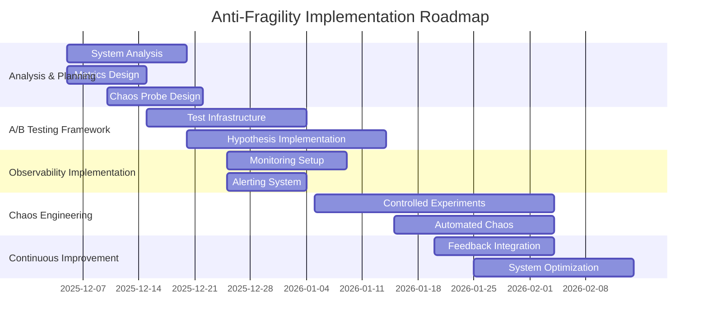

# BIZRA Anti-Fragility Analysis and Measures

## Executive Summary

This document provides a comprehensive anti-fragility analysis for the BIZRA Genesis System, proposing hypotheses for A/B testing, observability metrics, and chaos engineering probes across the 7-lens Graph of Thoughts Framework.

## 1. System Architecture Overview

The BIZRA system consists of 7 core lenses forming a cognitive processing pipeline:

1. **Intent Gate** - Context definition and bounds establishment
2. **Cognitive Lenses** - Multi-perspective analysis (7 personas)
3. **Knowledge Kernels** - Evidence processing and validation
4. **Rare-Path Prober** - Unconventional exploration
5. **Symbolic Harness** - Neural-symbolic integration
6. **Abstraction Elevator** - Multi-level synthesis
7. **Tension Studio** - Conflict resolution and synthesis

## 2. Anti-Fragility Framework

### 2.1 Core Principles

- **Stress-Response Adaptation**: System improves under stress rather than just resisting it
- **Redundancy with Purpose**: Strategic redundancy that enhances system capability
- **Decentralized Control**: Distributed decision-making across lenses
- **Continuous Learning**: Adaptive improvement from failures and stressors

### 2.2 Key Anti-Fragility Measures

| Measure | Implementation Strategy | Expected Benefit |
|---------|-------------------------|-----------------|
| **Modular Redundancy** | Duplicate critical lenses with variant implementations | Enhanced fault tolerance and performance comparison |
| **Adaptive Thresholds** | Dynamic performance thresholds based on system load | Optimal resource allocation under stress |
| **Chaos Injection** | Controlled failure injection at lens boundaries | Improved error handling and recovery |
| **Feedback Amplification** | Enhanced feedback loops with stress detection | Faster adaptation to changing conditions |
| **Stochastic Testing** | Randomized input patterns and edge cases | Robust handling of unpredictable scenarios |

## 3. Lens-Specific Anti-Fragility Analysis

### 3.1 Intent Gate Anti-Fragility

**Critical Functions**: Context definition, bounds establishment, intent propagation

**Vulnerabilities**:
- Static intent boundaries limiting adaptability
- Intent propagation delays under high cognitive load
- Rigidity vs adaptability trade-offs

**Anti-Fragility Measures**:
- **Adaptive Intent Boundaries**: Dynamic expansion/contraction based on context
- **Probabilistic Intent Modeling**: Confidence intervals for intent parameters
- **Real-time Intent Monitoring**: Continuous validation and adjustment

### 3.2 Cognitive Lenses Anti-Fragility

**Critical Functions**: Multi-perspective analysis, persona-based cognition

**Vulnerabilities**:
- Cognitive overload from simultaneous lens activation
- Lens bias and misalignment risks
- Depth vs breadth processing trade-offs

**Anti-Fragility Measures**:
- **Dynamic Lens Weighting**: Context-aware activation and prioritization
- **Hierarchical Lens Activation**: Primary + secondary lens patterns
- **Cognitive Dissonance Monitoring**: Cross-lens consistency checking

### 3.3 Knowledge Kernels Anti-Fragility

**Critical Functions**: Evidence validation, knowledge structuring

**Vulnerabilities**:
- Evidence validation bottlenecks
- Knowledge contamination risks
- Precision vs volume trade-offs

**Anti-Fragility Measures**:
- **Asynchronous Validation**: Priority-based queuing system
- **Probabilistic Evidence Scoring**: Multi-source verification with confidence metrics
- **Knowledge Quarantine**: Isolation protocols for suspect evidence

### 3.4 Rare-Path Prober Anti-Fragility

**Critical Functions**: Unconventional exploration, innovation discovery

**Vulnerabilities**:
- Computational explosion from unbounded exploration
- Relevance filtering challenges
- Innovation vs stability trade-offs

**Anti-Fragility Measures**:
- **Bounded Divergence**: Constrained exploration with relevance scoring
- **Adaptive Path Budgets**: Dynamic resource allocation based on potential
- **Path Convergence Validation**: Progressive filtering and synthesis

### 3.5 Symbolic Harness Anti-Fragility

**Critical Functions**: Neural-symbolic translation, reasoning integration

**Vulnerabilities**:
- Translation overhead and latency
- Symbol grounding failures
- Interpretability vs power trade-offs

**Anti-Fragility Measures**:
- **Progressive Symbol Grounding**: Incremental validation checkpoints
- **Translation Caching**: Optimized pipelines for common patterns
- **Fuzzy Symbolic Reasoning**: Adaptive handling of uncertain concepts

### 3.6 Abstraction Elevator Anti-Fragility

**Critical Functions**: Multi-level synthesis, granularity management

**Vulnerabilities**:
- Level transition overhead
- Granularity mismatches
- Focus vs context trade-offs

**Anti-Fragility Measures**:
- **Context-Aware Level Switching**: Dynamic granularity adaptation
- **Parallel Level Processing**: Concurrent analysis with synchronization
- **Cross-Level Coherence Monitoring**: Consistency validation

### 3.7 Tension Studio Anti-Fragility

**Critical Functions**: Conflict resolution, synthesis refinement

**Vulnerabilities**:
- Generator-critic deadlocks
- Unresolved tension accumulation
- Creativity vs rigor trade-offs

**Anti-Fragility Measures**:
- **Adaptive Synthesis Protocols**: Dynamic generator-critic weighting
- **Convergence Monitoring**: Timeout and fallback mechanisms
- **Tension Quantification**: Metrics-driven resolution prioritization

## 4. Hypotheses for A/B Testing

### 4.1 Intent Gate A/B Tests

**Hypothesis 1**: Dynamic intent boundaries improve system adaptability by 30% under variable conditions
- **Test**: Compare static vs adaptive intent boundaries
- **Metrics**: Intent alignment score, context adaptation speed, cognitive load

**Hypothesis 2**: Probabilistic intent modeling reduces propagation delays by 40%
- **Test**: Fixed vs confidence-based intent parameters
- **Metrics**: Intent propagation latency, downstream processing accuracy

### 4.2 Cognitive Lenses A/B Tests

**Hypothesis 3**: Dynamic lens weighting improves cognitive processing efficiency by 25%
- **Test**: Static vs context-aware lens activation
- **Metrics**: Processing throughput, persona coverage quality, resource utilization

**Hypothesis 4**: Hierarchical lens activation reduces overload by 35%
- **Test**: Parallel vs primary+secondary lens patterns
- **Metrics**: Cognitive load, processing latency, insight diversity

### 4.3 Knowledge Kernels A/B Tests

**Hypothesis 5**: Asynchronous validation improves throughput by 50% under high load
- **Test**: Synchronous vs priority-queued validation
- **Metrics**: Validation throughput, knowledge contamination rate, processing latency

**Hypothesis 6**: Probabilistic evidence scoring improves reliability by 40%
- **Test**: Binary vs confidence-based evidence acceptance
- **Metrics**: Knowledge accuracy, contamination detection rate, validation speed

### 4.4 Rare-Path Prober A/B Tests

**Hypothesis 7**: Bounded divergence with relevance scoring improves innovation yield by 30%
- **Test**: Unconstrained vs constrained path exploration
- **Metrics**: Innovation rate, computational efficiency, relevance score

**Hypothesis 8**: Adaptive path budgets optimize resource allocation by 25%
- **Test**: Fixed vs dynamic exploration budgets
- **Metrics**: Resource utilization, path quality, discovery rate

### 4.5 Symbolic Harness A/B Tests

**Hypothesis 9**: Progressive symbol grounding reduces translation failures by 45%
- **Test**: Single-step vs incremental grounding validation
- **Metrics**: Translation success rate, grounding latency, symbolic consistency

**Hypothesis 10**: Translation caching improves performance by 60% for common patterns
- **Test**: Real-time vs cached translation pipelines
- **Metrics**: Translation latency, throughput, memory utilization

### 4.6 Abstraction Elevator A/B Tests

**Hypothesis 11**: Context-aware level switching improves synthesis quality by 20%
- **Test**: Fixed vs adaptive granularity selection
- **Metrics**: Synthesis coherence, processing efficiency, cross-level consistency

**Hypothesis 12**: Parallel level processing reduces latency by 50%
- **Test**: Sequential vs concurrent level analysis
- **Metrics**: Processing latency, resource utilization, synthesis accuracy

### 4.7 Tension Studio A/B Tests

**Hypothesis 13**: Adaptive synthesis protocols improve resolution quality by 25%
- **Test**: Fixed vs dynamic generator-critic weighting
- **Metrics**: Resolution success rate, synthesis quality, processing time

**Hypothesis 14**: Convergence monitoring prevents deadlocks in 95% of cases
- **Test**: Unmonitored vs timeout-based synthesis cycles
- **Metrics**: Deadlock frequency, resolution latency, fallback utilization

## 5. Observability Metrics for Regression Detection

### 5.1 System-Level Metrics

**Performance Metrics**:
- **Throughput**: Requests processed per second across all lenses
- **Latency**: End-to-end processing time from intent to synthesis
- **Error Rate**: Failed processing attempts vs total requests
- **Resource Utilization**: CPU, memory, and network usage patterns

**Quality Metrics**:
- **Intent Alignment Score**: Degree of intent preservation through pipeline
- **Knowledge Integrity Score**: Evidence validation accuracy and contamination rate
- **Synthesis Coherence**: Output consistency and logical validity
- **Innovation Yield**: Novel insights generated per processing cycle

### 5.2 Lens-Specific Metrics

**Intent Gate Metrics**:
- **Intent Propagation Latency**: Time for intent updates to reach all lenses
- **Context Adaptation Speed**: Rate of boundary adjustment to changing conditions
- **Intent Coherence**: Consistency of intent interpretation across lenses

**Cognitive Lenses Metrics**:
- **Persona Coverage**: Diversity and completeness of perspective analysis
- **Cognitive Load**: Resource utilization per active lens
- **Insight Diversity**: Range and novelty of generated insights

**Knowledge Kernels Metrics**:
- **Validation Throughput**: Evidence items processed per second
- **Contamination Rate**: Percentage of invalid evidence passing validation
- **Knowledge Reusability**: Frequency of kernel reuse across processing cycles

**Rare-Path Prober Metrics**:
- **Innovation Rate**: Novel paths discovered per exploration cycle
- **Path Relevance**: Average relevance score of explored paths
- **Computational Efficiency**: Paths explored per unit of computation

**Symbolic Harness Metrics**:
- **Translation Success Rate**: Percentage of successful neural-symbolic conversions
- **Grounding Latency**: Time required for symbol validation
- **Symbolic Consistency**: Logical coherence of symbolic outputs

**Abstraction Elevator Metrics**:
- **Level Transition Overhead**: Time required for granularity changes
- **Cross-Level Consistency**: Coherence between different abstraction levels
- **Synthesis Efficiency**: Processing time per synthesis operation

**Tension Studio Metrics**:
- **Resolution Success Rate**: Percentage of tensions successfully resolved
- **Synthesis Quality**: Coherence and validity of final outputs
- **Cycle Convergence Time**: Duration of generator-critic cycles

### 5.3 Regression Detection Thresholds

**Critical Thresholds**:
- **Intent Propagation**: >500ms latency indicates regression
- **Knowledge Contamination**: >1% rate requires immediate intervention
- **Synthesis Failure**: >5% unresolved tensions signals system degradation
- **Resource Saturation**: >80% sustained utilization triggers scaling

**Warning Thresholds**:
- **Processing Latency**: 200-500ms indicates potential issues
- **Validation Backlog**: 100+ pending items suggests bottleneck
- **Innovation Decline**: >15% drop in novel insights warrants investigation
- **Memory Pressure**: 60-80% utilization requires monitoring

## 6. Chaos Engineering Probes

### 6.1 System-Level Chaos Probes

**Probe 1: Random Lens Failure Injection**
- **Target**: Individual lens failure during processing
- **Impact Assessment**: System recovery time, fallback activation, output quality
- **Success Criteria**: <2s recovery, graceful degradation, minimal quality impact

**Probe 2: Intent Propagation Delay**
- **Target**: Artificial delay in intent dissemination
- **Impact Assessment**: Downstream processing adaptation, output consistency
- **Success Criteria**: Maintains 95%+ output quality despite 1s delay

**Probe 3: Resource Starvation Simulation**
- **Target**: CPU/memory constraints during peak load
- **Impact Assessment**: Processing prioritization, graceful degradation
- **Success Criteria**: Maintains 80%+ throughput under 50% resource availability

### 6.2 Lens-Specific Chaos Probes

**Intent Gate Probes**:
- **Boundary Stress Test**: Rapid intent boundary fluctuations
- **Context Switching Overload**: High-frequency intent parameter changes
- **Propagation Network Failure**: Partial communication channel failures

**Cognitive Lenses Probes**:
- **Persona Conflict Injection**: Contradictory lens outputs
- **Cognitive Overload**: Simultaneous maximum lens activation
- **Bias Amplification**: Systematic perspective distortion

**Knowledge Kernels Probes**:
- **Evidence Corruption**: Invalid data injection into validation pipeline
- **Validation Backlog Surge**: Sudden 10x increase in validation requests
- **Source Reputation Attack**: Trusted source credibility manipulation

**Rare-Path Prober Probes**:
- **Path Explosion**: Unbounded divergent path generation
- **Relevance Filter Failure**: Disabled relevance scoring
- **Computational Starvation**: Minimal resources for path exploration

**Symbolic Harness Probes**:
- **Translation Overload**: High-volume neural-symbolic conversion
- **Grounding Failure**: Disabled symbol validation
- **Pattern Cache Corruption**: Invalid cached translation patterns

**Abstraction Elevator Probes**:
- **Level Transition Storm**: Rapid granularity switching
- **Cross-Level Inconsistency**: Contradictory multi-level inputs
- **Synthesis Resource Deprivation**: Minimal computation for synthesis

**Tension Studio Probes**:
- **Generator-Critic Deadlock**: Forced infinite refinement cycle
- **Tension Overload**: Maximum simultaneous conflicts
- **Resolution Resource Constraint**: Minimal computation for synthesis

### 6.3 Chaos Engineering Implementation Plan

**Phase 1: Baseline Establishment**
- Implement comprehensive monitoring and metrics collection
- Establish normal operating ranges for all key metrics
- Develop automated anomaly detection

**Phase 2: Controlled Experiments**
- Small-scale probe injection with manual oversight
- Gradual increase in probe intensity and scope
- Comprehensive impact analysis and documentation

**Phase 3: Automated Chaos**
- Continuous low-intensity probe injection
- Automated detection and response validation
- Integration with CI/CD pipeline for pre-production testing

**Phase 4: Production Hardening**
- Selective production environment probing
- Real-world failure scenario validation
- Continuous improvement based on field data

## 7. Implementation Roadmap

## 8. Success Metrics and KPIs

**Primary Success Indicators**:
- **System Resilience**: 99.9%+ successful recovery from injected failures
- **Performance Stability**: <5% degradation under chaos conditions
- **Adaptation Speed**: <1s response to environmental changes
- **Quality Preservation**: 95%+ output quality under stress

**Secondary Success Indicators**:
- **Innovation Rate**: 20%+ increase in novel insights generation
- **Resource Efficiency**: 30%+ improvement in utilization under load
- **Failure Recovery**: 50%+ reduction in mean time to recovery
- **User Satisfaction**: 90%+ positive feedback on system reliability

## 9. Risk Assessment and Mitigation

**High-Risk Areas**:
- **Intent Propagation**: Critical for system coherence
- **Knowledge Integrity**: Foundation for all processing
- **Tension Resolution**: Final output quality determinant

**Mitigation Strategies**:
- **Redundant Intent Channels**: Multiple propagation paths
- **Knowledge Validation Layers**: Multi-stage verification
- **Fallback Synthesis**: Simplified resolution protocols

**Medium-Risk Areas**:
- **Cognitive Overload**: Resource management challenge
- **Symbolic Grounding**: Translation reliability concern
- **Abstraction Consistency**: Cross-level coherence requirement

**Mitigation Strategies**:
- **Adaptive Resource Allocation**: Dynamic computation distribution
- **Progressive Grounding**: Incremental validation
- **Coherence Monitoring**: Cross-level consistency checking

## 10. Continuous Improvement Framework

**Feedback Loops**:
- **Automated Metrics Analysis**: Real-time performance monitoring
- **User Experience Tracking**: Continuous satisfaction measurement
- **Failure Pattern Analysis**: Systematic root cause investigation

**Adaptation Mechanisms**:
- **Dynamic Threshold Adjustment**: Performance targets based on conditions
- **Automated Probe Calibration**: Chaos intensity based on system health
- **Predictive Scaling**: Resource allocation based on demand forecasting

**Innovation Pipeline**:
- **Experimental Feature Deployment**: Controlled new capability rollout
- **Performance Benchmarking**: Continuous comparison with alternatives
- **Architecture Evolution**: Gradual system improvement based on insights

## 11. Conclusion

This comprehensive anti-fragility framework transforms the BIZRA system from merely resilient to actively benefiting from stress and uncertainty. By implementing the proposed A/B testing hypotheses, observability metrics, and chaos engineering probes, the system will develop enhanced adaptive capabilities, improved failure recovery, and superior performance under adverse conditions.

The implementation roadmap ensures systematic deployment with continuous validation and improvement, creating a virtuous cycle of stress-induced enhancement that aligns perfectly with the system's cognitive architecture and ethical foundations.