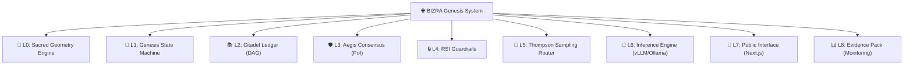
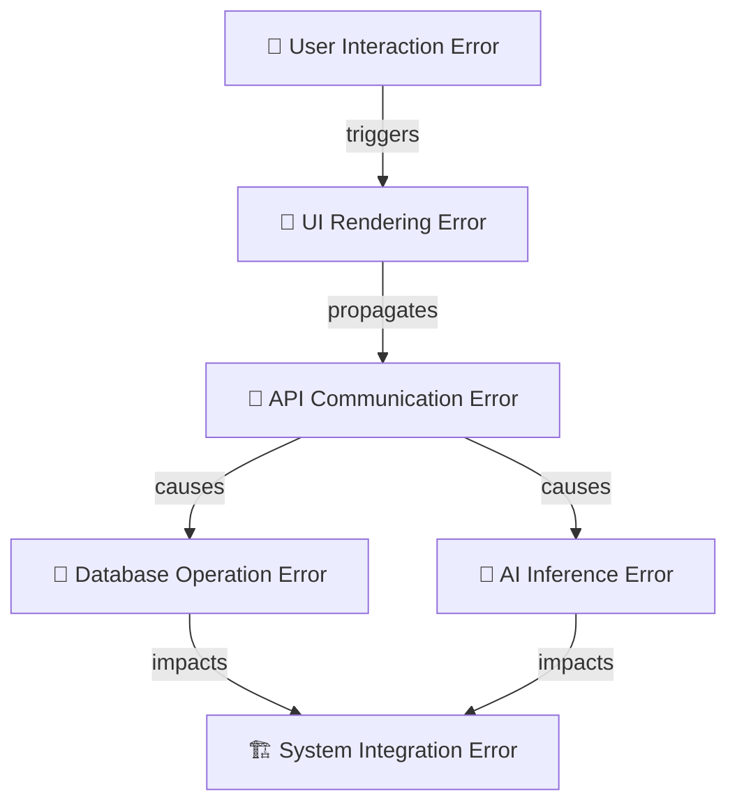
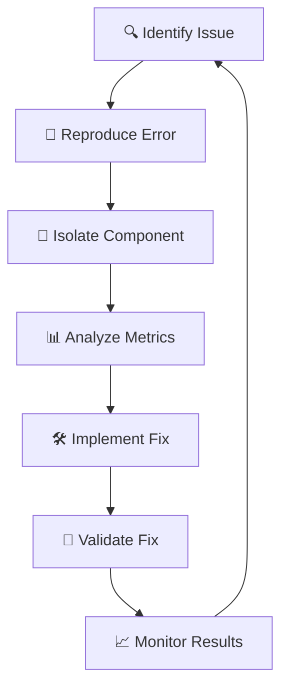
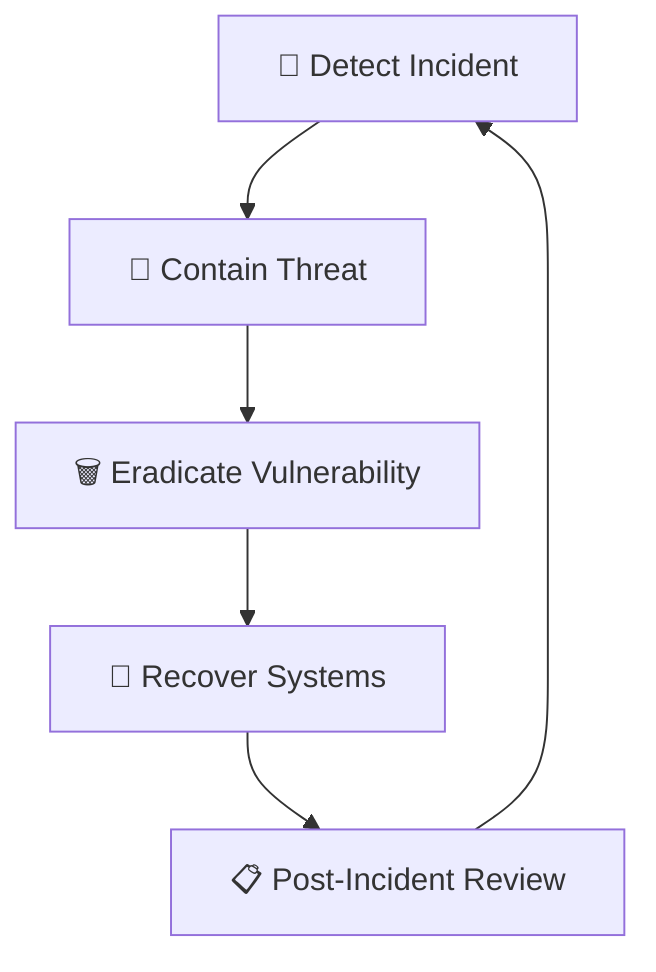
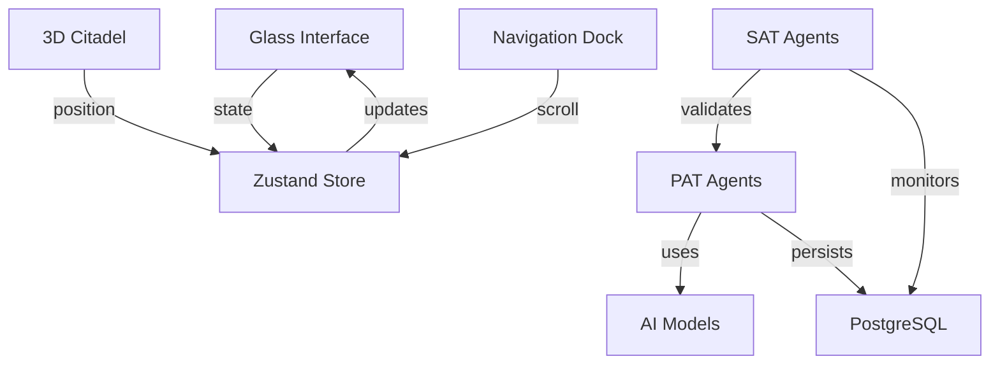
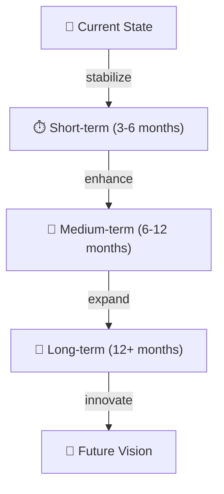
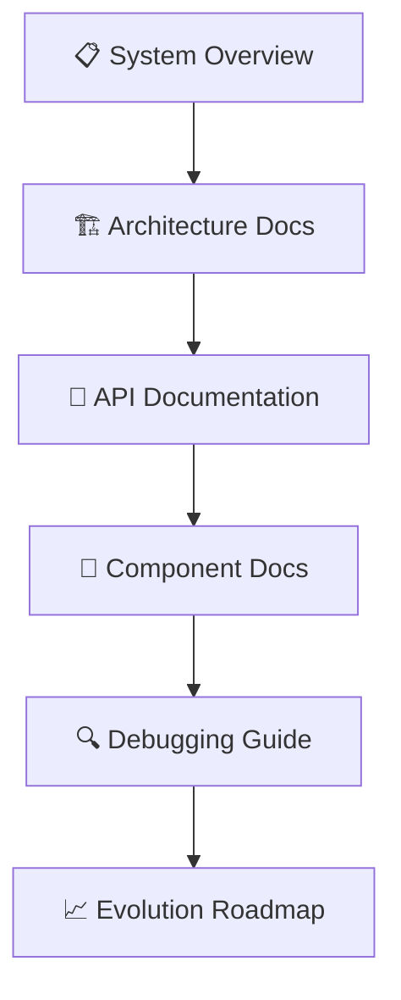
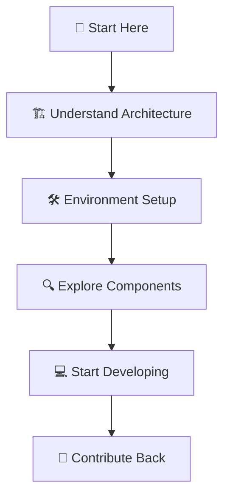

# BIZRA Genesis System - Complete System Hierarchy

## 🏆 Executive Summary

This document presents the definitive system hierarchy of the BIZRA Genesis platform, providing a comprehensive, navigable architecture map for rapid onboarding, error tracing, and system evolution. The analysis covers all layers from foundational components to user-facing interfaces, with detailed annotations of dependencies, error hotspots, and integration points.

## 🗺️ System Hierarchy Overview

### Layered Consciousness Stack (L0-L8)

## 📁 Detailed Component Hierarchy

### 1. Foundational Layer (L0)

**Sacred Geometry Engine**
- **Purpose**: Mathematical consciousness foundation
- **Components**:
  - Golden Ratio calculations
  - Seed of Life patterns
  - Cryptographic seed generation
- **Dependencies**: None (base layer)
- **Error Hotspots**: Mathematical precision validation
- **Debugging**: Unit tests for geometric calculations

### 2. State Management Layer (L1)

**Genesis State Machine**
- **Purpose**: System state orchestration
- **Components**:
  - Phase transitions (VOID → GENESIS → CITADEL)
  - Core metrics tracking
  - Event processing
- **Dependencies**: L0 (initialization)
- **Error Hotspots**: State race conditions
- **Debugging**: State transition logging

### 3. Data Persistence Layer (L2)

**Citadel Ledger (DAG Structure)**
- **Purpose**: Immutable event recording
- **Components**:
  - PoI (Proof-of-Impact) ledger
  - User profile storage
  - Resource allocation tracking
- **Dependencies**: L1 (state persistence)
- **Error Hotspots**: Database connection failures
- **Debugging**: SQL query logging

### 4. Consensus Layer (L3)

**Aegis Consensus (Proof-of-Impact)**
- **Purpose**: Ethical validation framework
- **Components**:
  - Ihsan score calculation
  - Impact validation
  - Consensus algorithms
- **Dependencies**: L1 (state validation), L2 (ledger integrity)
- **Error Hotspots**: Validation logic errors
- **Debugging**: Consensus trace logging

### 5. Safety Layer (L4)

**RSI Guardrails**
- **Purpose**: Ethical bounds enforcement
- **Components**:
  - Ihsan threshold monitoring
  - Safety gate implementation
  - Ethical compliance checks
- **Dependencies**: L3 (consensus enforcement)
- **Error Hotspots**: Threshold miscalculations
- **Debugging**: Safety audit logging

### 6. AI Orchestration Layer (L5-L6)

**MoE (Mixture of Experts) Cluster**
- **Purpose**: AI model routing and inference
- **Components**:
  - Thompson Sampling Router (L5)
  - vLLM/Ollama Inference Engine (L6)
  - Model selection logic
- **Dependencies**: L4 (safety gating)
- **Error Hotspots**: Model inference timeouts
- **Debugging**: AI response validation

### 7. User Interface Layer (L7)

**Public Interface (Next.js)**
- **Purpose**: User interaction platform
- **Components**:
  - Glass Interface (phase-based UI)
  - 3D Citadel Visualization
  - Navigation System
  - State Management
- **Dependencies**: L5-L6 (AI integration)
- **Error Hotspots**: 3D rendering failures
- **Debugging**: Browser console monitoring

### 8. Monitoring Layer (L8)

**Evidence Pack**
- **Purpose**: System observability
- **Components**:
  - Prometheus metrics collection
  - Grafana visualization
  - Performance monitoring
  - Alerting system
- **Dependencies**: All layers (metrics collection)
- **Error Hotspots**: Metrics collection failures
- **Debugging**: Monitoring dashboard analysis

## 🔗 Integration Points Matrix

| **Source Layer** | **Target Layer** | **Integration Type** | **Protocol** | **Error Handling** |
|-----------------|------------------|----------------------|--------------|---------------------|
| L7 (UI) | L5 (Router) | API Requests | HTTP/JSON | Error boundaries |
| L5 (Router) | L6 (Inference) | Model Routing | Internal | Circuit breaker |
| L6 (Inference) | L3 (Consensus) | Feedback Loop | Internal | Validation checks |
| L3 (Consensus) | L2 (Ledger) | Data Persistence | SQL | Transaction rollback |
| L2 (Ledger) | L8 (Monitoring) | Metrics Export | Prometheus | Retry logic |
| L1 (State) | L0 (Geometry) | Initialization | Internal | State validation |

## ⚠️ Error Hotspots Hierarchy

### Critical Error Pathways

### Error Handling Strategy

1. **Frontend Errors**: React error boundaries, console logging
2. **API Errors**: Axum error handling, structured responses
3. **Database Errors**: SQLx transaction management, retry logic
4. **AI Errors**: Circuit breaker pattern, fallback models
5. **System Errors**: Comprehensive tracing, alerting

## 🔍 Debugging Pathways Hierarchy

### Debugging Tools by Layer

| **Layer** | **Primary Tools** | **Secondary Tools** | **Key Metrics** |
|-----------|-------------------|--------------------|-----------------|
| L7 (UI) | React DevTools, Browser Console | Three.js Inspector, Performance Tab | FPS, Memory Usage |
| L5-L6 (AI) | Rust Tracing, Ollama Logs | Circuit Breaker Metrics | Latency, Token Usage |
| L3-L4 (Core) | SQLx Logging, Rust Tests | Consensus Trace | Ihsan Score, Validation Rate |
| L8 (Monitoring) | Prometheus, Grafana | Alert Manager | Error Rates, Response Times |

### Debugging Workflow

## 📊 Performance Hierarchy

### Performance Metrics by Layer

| **Layer** | **Critical Metrics** | **Target Values** | **Monitoring Tools** |
|-----------|----------------------|-------------------|----------------------|
| L7 (UI) | FPS, Memory Usage | 60fps, <200MB | Chrome DevTools |
| L6 (AI) | Inference Latency | <1000ms | Prometheus |
| L3 (Core) | Validation Speed | <50ms | Rust Tracing |
| L2 (Data) | Query Performance | <100ms | SQLx Logging |
| L8 (Monitoring) | Metrics Collection | <1s intervals | Prometheus |

### Performance Optimization Strategy

1. **Frontend**: Three.js instanced meshes, WebGL optimization
2. **Backend**: Async Rust, connection pooling
3. **Database**: Query optimization, indexing
4. **AI**: Model caching, batch processing
5. **Monitoring**: Efficient metrics collection

## 🛡️ Security Hierarchy

### Security Measures by Layer

| **Layer** | **Security Controls** | **Implementation** | **Monitoring** |
|-----------|------------------------|---------------------|----------------|
| L7 (UI) | CSP Headers, Input Validation | Next.js middleware | Browser console |
| L5-L6 (AI) | Rate Limiting, JWT Auth | Axum middleware | Tracing logs |
| L2 (Data) | SQL Injection Protection | SQLx parameterization | Query logging |
| L8 (Monitoring) | Access Control, Audit Logging | Prometheus RBAC | Alert manager |

### Security Incident Response

## 🧩 Component Dependency Hierarchy

### Core Component Relationships

### Dependency Resolution Strategy

1. **Frontend**: Component-based dependency injection
2. **Backend**: Service locator pattern
3. **Database**: Connection pooling
4. **AI**: Model routing abstraction
5. **Monitoring**: Metrics aggregation

## 🎯 System Evolution Hierarchy

### Evolution Roadmap

### Evolution Priorities

1. **Short-term**: API stabilization, performance optimization
2. **Medium-term**: Feature expansion, user experience enhancement
3. **Long-term**: Autonomous capabilities, cross-platform deployment

## 📋 Documentation Hierarchy

### Documentation Structure

### Documentation Maintenance Strategy

1. **Automated**: API docs from code comments
2. **Manual**: Architecture diagrams, decision records
3. **Versioned**: Release-specific documentation
4. **Interactive**: Live system visualization

## 🎓 Onboarding Hierarchy

### Rapid Onboarding Path

### Onboarding Resources

1. **Architecture Diagrams**: Visual system maps
2. **API Playground**: Interactive endpoint testing
3. **Component Catalog**: Detailed module documentation
4. **Debugging Guide**: Step-by-step troubleshooting
5. **Contribution Guide**: Development workflows

## 🔮 Conclusion

This complete system hierarchy provides a comprehensive, actionable architecture map for the BIZRA Genesis System. The documentation establishes clear pathways for:

- **Rapid Onboarding**: Visual diagrams and structured documentation
- **Error Tracing**: Detailed error hotspot mapping and debugging pathways
- **System Evolution**: Layered evolution roadmap with clear priorities
- **Performance Optimization**: Metrics-driven improvement strategy
- **Security Management**: Comprehensive security controls and incident response

The hierarchy demonstrates a sophisticated balance between mathematical consciousness safety and practical system implementation, with navigable architecture for both human developers and AI-driven analysis.