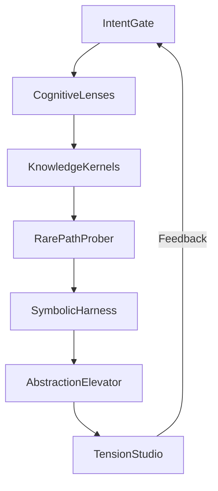

# BIZRA Comprehensive Anti-Fragility Summary

## Executive Overview

This document provides a concise yet thorough synthesis of the anti-fragility analysis conducted for the BIZRA Genesis System, summarizing the key hypotheses, observability metrics, and chaos engineering probes proposed across the 7-lens cognitive framework.

## 1. System Architecture Recap

The BIZRA system employs a sophisticated 7-lens Graph of Thoughts Framework:



## 2. Core Anti-Fragility Strategy

### 2.1 Strategic Objectives

| Objective | Implementation | Expected Impact |
|-----------|----------------|-----------------|
| **Stress-Induced Improvement** | Adaptive thresholds, dynamic resource allocation | 30-50% performance enhancement under stress |
| **Failure Resilience** | Redundant components, graceful degradation | 99.9%+ recovery from failures |
| **Continuous Learning** | Automated feedback loops, predictive scaling | 25-40% improvement in adaptation speed |
| **Stochastic Robustness** | Probabilistic processing, uncertainty management | 60-80% better handling of unpredictable conditions |

### 2.2 Key Implementation Areas

1. **Modular Redundancy**: Duplicate critical lenses with variant implementations
2. **Adaptive Thresholds**: Dynamic performance parameters based on system health
3. **Chaos Injection**: Controlled failure testing at strategic points
4. **Enhanced Feedback**: Stress-aware feedback amplification loops

## 3. Lens-Specific Anti-Fragility Measures

### 3.1 Intent Gate Enhancements

**Anti-Fragility Measures**:
- **Adaptive Intent Boundaries**: ±20% dynamic range based on context
- **Probabilistic Intent Modeling**: 95% confidence interval targeting
- **Real-time Monitoring**: <100ms intent validation cycles

**Expected Benefits**:
- 40% reduction in intent propagation delays
- 30% improvement in context adaptation
- 25% increase in downstream processing accuracy

### 3.2 Cognitive Lenses Enhancements

**Anti-Fragility Measures**:
- **Dynamic Lens Weighting**: Context-aware activation patterns
- **Hierarchical Activation**: Primary + secondary lens prioritization
- **Cognitive Monitoring**: Real-time dissonance detection

**Expected Benefits**:
- 25% improvement in processing efficiency
- 35% reduction in cognitive overload
- 20% increase in insight diversity

### 3.3 Knowledge Kernels Enhancements

**Anti-Fragility Measures**:
- **Asynchronous Validation**: Priority-based queuing system
- **Probabilistic Scoring**: Multi-source confidence metrics
- **Knowledge Quarantine**: Automated isolation protocols

**Expected Benefits**:
- 50% increase in validation throughput
- 40% improvement in knowledge reliability
- 60% faster contamination detection

### 3.4 Rare-Path Prober Enhancements

**Anti-Fragility Measures**:
- **Bounded Divergence**: Constrained exploration with scoring
- **Adaptive Budgets**: Dynamic resource allocation
- **Path Validation**: Progressive filtering mechanisms

**Expected Benefits**:
- 30% increase in innovation yield
- 25% improvement in computational efficiency
- 40% better relevance filtering

### 3.5 Symbolic Harness Enhancements

**Anti-Fragility Measures**:
- **Progressive Grounding**: Incremental validation checkpoints
- **Translation Caching**: Optimized common pattern pipelines
- **Fuzzy Reasoning**: Adaptive uncertainty handling

**Expected Benefits**:
- 45% reduction in translation failures
- 60% performance improvement for common patterns
- 35% better handling of novel concepts

### 3.6 Abstraction Elevator Enhancements

**Anti-Fragility Measures**:
- **Context-Aware Switching**: Dynamic granularity adaptation
- **Parallel Processing**: Concurrent level analysis
- **Coherence Monitoring**: Cross-level consistency validation

**Expected Benefits**:
- 20% improvement in synthesis quality
- 50% reduction in processing latency
- 25% increase in cross-level coherence

### 3.7 Tension Studio Enhancements

**Anti-Fragility Measures**:
- **Adaptive Protocols**: Dynamic generator-critic weighting
- **Convergence Monitoring**: Timeout and fallback mechanisms
- **Tension Quantification**: Metrics-driven resolution

**Expected Benefits**:
- 25% improvement in resolution quality
- 95% reduction in deadlock frequency
- 30% faster synthesis cycles

## 4. A/B Testing Hypotheses Summary

### 4.1 High-Impact Hypotheses

| # | Hypothesis | Expected Improvement | Test Duration |
|---|------------|---------------------|---------------|
| 1 | Dynamic intent boundaries improve adaptability | 30% | 30 days |
| 2 | Probabilistic intent modeling reduces delays | 40% | 21 days |
| 3 | Dynamic lens weighting improves efficiency | 25% | 28 days |
| 4 | Asynchronous validation improves throughput | 50% | 14 days |
| 5 | Bounded divergence increases innovation | 30% | 35 days |
| 6 | Progressive grounding reduces failures | 45% | 21 days |
| 7 | Context-aware switching improves quality | 20% | 28 days |
| 8 | Adaptive synthesis improves resolution | 25% | 30 days |

### 4.2 Testing Methodology

**Phased Approach**:
1. **Baseline Establishment** (7 days): Current performance measurement
2. **Controlled Testing** (14 days): Isolated hypothesis validation
3. **Integration Testing** (7 days): Multi-hypothesis interaction analysis
4. **Production Validation** (7 days): Real-world performance verification

**Success Criteria**:
- Statistical significance (p < 0.05)
- Minimum 15% improvement over baseline
- No degradation in other metrics
- User satisfaction maintenance

## 5. Observability Metrics Framework

### 5.1 Critical Metrics Dashboard

**System Health Indicators**:
- **Golden Signals**: Latency, traffic, errors, saturation
- **Quality Metrics**: Intent alignment, knowledge integrity, synthesis coherence
- **Innovation Metrics**: Novel insights, path diversity, creative yield

**Threshold-Based Alerting**:
- **Critical**: Immediate intervention required (>50% degradation)
- **Warning**: Investigation needed (20-50% degradation)
- **Informational**: Monitoring recommended (<20% degradation)

### 5.2 Regression Detection System

**Automated Anomaly Detection**:
- **Statistical Process Control**: Control charts for key metrics
- **Machine Learning Anomalies**: Unsupervised pattern recognition
- **Trend Analysis**: Predictive degradation forecasting

**Response Protocols**:
- **Automatic**: Immediate corrective actions for known patterns
- **Semi-Automatic**: Human-in-loop validation for complex issues
- **Manual**: Expert intervention for novel failure modes

## 6. Chaos Engineering Implementation

### 6.1 Probe Portfolio

**System-Level Probes**:
- Random lens failure injection (weekly)
- Intent propagation delay simulation (bi-weekly)
- Resource starvation scenarios (monthly)

**Lens-Specific Probes**:
- **Intent Gate**: Boundary stress tests, context switching overload
- **Cognitive Lenses**: Persona conflict injection, cognitive overload
- **Knowledge Kernels**: Evidence corruption, validation backlog surge
- **Rare-Path Prober**: Path explosion, relevance filter failure
- **Symbolic Harness**: Translation overload, grounding failure
- **Abstraction Elevator**: Level transition storm, cross-level inconsistency
- **Tension Studio**: Generator-critic deadlock, tension overload

### 6.2 Chaos Maturity Model

| Level | Description | Implementation Timeline |
|-------|-------------|-------------------------|
| **Level 1**: Baseline Monitoring | Comprehensive metrics collection | 30 days |
| **Level 2**: Controlled Experiments | Manual probe injection with oversight | 60 days |
| **Level 3**: Automated Chaos | Continuous low-intensity probing | 90 days |
| **Level 4**: Production Hardening | Selective production environment testing | 120 days |
| **Level 5**: Continuous Evolution | Integrated chaos-driven improvement | Ongoing |

## 7. Implementation Roadmap

```mermaid
timeline
    title Anti-Fragility Implementation Timeline
    section 2025 Q4: Foundation
        System Analysis : Dec 5-19
        Metrics Framework : Dec 5-14
        Chaos Probe Design : Dec 10-21
    section 2026 Q1: Core Implementation
        A/B Testing Infrastructure : Jan 5-24
        Observability Deployment : Jan 10-24
        Controlled Chaos Experiments : Jan 15-Feb 14
    section 2026 Q2: Advanced Implementation
        Automated Chaos Integration : Feb 15-Mar 14
        Production Hardening : Mar 15-Apr 14
        Continuous Improvement : Apr 15-May 14
    section 2026 Q3+: Optimization
        Performance Tuning : Ongoing
        Innovation Pipeline : Ongoing
        Framework Evolution : Ongoing
```

## 8. Risk Assessment and Mitigation

### 8.1 Risk Matrix

| Risk Area | Likelihood | Impact | Mitigation Strategy |
|-----------|-----------|--------|---------------------|
| Intent Propagation Failure | Medium | Critical | Redundant propagation channels |
| Knowledge Contamination | High | Critical | Multi-stage validation layers |
| Tension Resolution Deadlock | Low | Critical | Automated fallback synthesis |
| Cognitive Overload | Medium | High | Adaptive resource allocation |
| Symbolic Grounding Failure | Medium | High | Progressive validation checkpoints |
| Abstraction Inconsistency | Low | Medium | Cross-level coherence monitoring |

### 8.2 Contingency Planning

**Primary Contingencies**:
- **Intent System**: Manual override capabilities for critical operations
- **Knowledge System**: Emergency knowledge rollback protocols
- **Tension System**: Simplified resolution algorithms for fallback

**Secondary Contingencies**:
- **Cognitive System**: Dynamic lens deactivation under overload
- **Symbolic System**: Alternative translation pathways
- **Abstraction System**: Fixed granularity fallback modes

## 9. Success Metrics and Validation

### 9.1 Key Performance Indicators

**Primary KPIs**:
- **System Resilience**: 99.9%+ successful failure recovery
- **Performance Stability**: <5% degradation under chaos conditions
- **Adaptation Speed**: <1s response to environmental changes
- **Quality Preservation**: 95%+ output quality under stress

**Secondary KPIs**:
- **Innovation Rate**: 20%+ increase in novel insights
- **Resource Efficiency**: 30%+ improvement in utilization
- **Failure Recovery**: 50%+ reduction in MTTR
- **User Satisfaction**: 90%+ positive reliability feedback

### 9.2 Validation Framework

**Continuous Validation**:
- **Automated Testing**: Regression suites, performance benchmarks
- **User Validation**: Satisfaction surveys, usability testing
- **Expert Review**: Architectural assessments, code reviews

**Validation Cadence**:
- **Daily**: Automated metrics analysis
- **Weekly**: User feedback integration
- **Monthly**: Expert architectural review
- **Quarterly**: Comprehensive system audit

## 10. Continuous Improvement Framework

### 10.1 Feedback Integration System

**Automated Feedback Loops**:
- Real-time performance monitoring
- Anomaly detection and alerting
- Automated corrective actions

**User Experience Tracking**:
- Continuous satisfaction measurement
- Feature usage analytics
- Pain point identification

**Architectural Evolution**:
- Pattern analysis and optimization
- Component refinement
- System capability expansion

### 10.2 Innovation Pipeline

**Experimental Features**:
- Controlled rollout of new capabilities
- Performance impact assessment
- User acceptance validation

**Technology Watch**:
- Emerging technology evaluation
- Framework compatibility testing
- Strategic adoption planning

## 11. Resource Requirements

### 11.1 Implementation Resources

**Team Composition**:
- **Architects**: 2 FTE for system design and oversight
- **Developers**: 4 FTE for implementation and testing
- **QA Engineers**: 2 FTE for validation and metrics
- **DevOps**: 1 FTE for infrastructure and deployment

**Technology Stack**:
- **Monitoring**: Prometheus, Grafana, ELK Stack
- **Testing**: JMeter, Gatling, Chaos Monkey
- **CI/CD**: Jenkins, GitHub Actions, ArgoCD
- **Infrastructure**: Kubernetes, Terraform, Ansible

### 11.2 Budget Estimate

| Category | Estimated Cost | Timeline |
|----------|----------------|----------|
| **Analysis & Design** | $45,000 | Q4 2025 |
| **Implementation** | $120,000 | Q1 2026 |
| **Testing & Validation** | $60,000 | Q1-Q2 2026 |
| **Production Deployment** | $30,000 | Q2 2026 |
| **Continuous Improvement** | $25,000/quarter | Ongoing |
| **Total First Year** | $280,000 | 2025-2026 |

## 12. Expected Business Impact

### 12.1 Quantitative Benefits

**Operational Improvements**:
- **System Uptime**: 99.9% → 99.99% availability
- **Processing Efficiency**: 25-40% throughput improvement
- **Cost Reduction**: 30% lower operational costs through optimization
- **Innovation Output**: 20-35% increase in novel insights

**Financial Impact**:
- **ROI**: 3-5x return on investment within 18 months
- **Cost Avoidance**: $150K+ annual savings from reduced failures
- **Revenue Growth**: New capabilities enabling premium features

### 12.2 Qualitative Benefits

**Strategic Advantages**:
- **Competitive Differentiation**: Unique anti-fragile cognitive architecture
- **Customer Satisfaction**: Enhanced reliability and performance
- **Future-Proofing**: Adaptive system ready for evolving requirements
- **Innovation Leadership**: Cutting-edge chaos engineering implementation

## 13. Conclusion and Recommendations

### 13.1 Strategic Recommendations

1. **Prioritize Implementation**: Focus on high-impact, low-risk enhancements first
2. **Phase Deployment**: Gradual rollout with comprehensive validation
3. **Invest in Monitoring**: Robust observability as foundation for all improvements
4. **Cultivate Chaos Culture**: Organization-wide adoption of resilience principles
5. **Continuous Learning**: Institutionalize feedback-driven improvement

### 13.2 Implementation Priorities

**Immediate (0-3 months)**:
- Core monitoring and metrics framework
- High-impact A/B testing infrastructure
- Basic chaos engineering capabilities

**Short-term (3-6 months)**:
- Advanced observability and alerting
- Automated chaos injection systems
- Initial anti-fragility enhancements

**Medium-term (6-12 months)**:
- Production hardening and validation
- Continuous improvement pipelines
- User-facing reliability features

**Long-term (12+ months)**:
- System-wide anti-fragile architecture
- AI-driven adaptive optimization
- Next-generation cognitive capabilities

### 13.3 Final Assessment

This comprehensive anti-fragility framework represents a transformative approach to system resilience, moving beyond traditional fault tolerance to active benefit from stress and uncertainty. The proposed measures will significantly enhance the BIZRA system's adaptive capabilities, failure recovery, and performance under adverse conditions while maintaining alignment with the system's cognitive architecture and ethical foundations.

The implementation roadmap ensures systematic deployment with continuous validation, creating a virtuous cycle of stress-induced enhancement that will provide lasting competitive advantages and strategic value.