# Comprehensive Multi-Layered Graph: Graph of Thoughts Framework

## Complete Visualization with Dependencies, Conflicts, and Synergies

```mermaid
graph TD
    %% ========== NODES SECTION ========== %%
    %% Main Lenses (7 Core Components)
    IntentGate[Intent Gate\nCore: Context Definition\nKPIs: Clarity 92%, Precision 88%, Alignment 95%]:::main_node
    CognitiveLenses[Cognitive Lenses\nCore: Multi-Perspective Analysis\nKPIs: Coverage 85%, Diversity 90%, Quality 87%]:::main_node
    KnowledgeKernels[Knowledge Kernels\nCore: Evidence Processing\nKPIs: Accuracy 94%, Reusability 89%, Speed 82%]:::main_node
    RarePathProber[Rare-Path Prober\nCore: Unconventional Exploration\nKPIs: Innovation 78%, Diversity 91%, Risk Mgmt 86%]:::main_node
    SymbolicHarness[Symbolic Harness\nCore: Neural-Symbolic Integration\nKPIs: Translation 88%, Grounding 92%, Speed 85%]:::main_node
    AbstractionElevator[Abstraction Elevator\nCore: Multi-Level Synthesis\nKPIs: Coherence 90%, Adaptation 87%, Preservation 93%]:::main_node
    TensionStudio[Tension Studio\nCore: Conflict Resolution\nKPIs: Quality 91%, Resolution 88%, Refinement 94%]:::main_node

    %% Sub-components for each lens
    %% Intent Gate Sub-components
    IntentGate --> What[What: Objective Definition]:::subcomponent
    IntentGate --> Why[Why: Purpose Analysis]:::subcomponent
    IntentGate --> Bounds[Bounds: Constraint Mapping]:::subcomponent

    %% Cognitive Lenses Sub-components (7 Personas)
    CognitiveLenses --> Persona1[Analytical Lens\nLogical Processing]:::subcomponent
    CognitiveLenses --> Persona2[Creative Lens\nInnovative Thinking]:::subcomponent
    CognitiveLenses --> Persona3[Strategic Lens\nLong-term Planning]:::subcomponent
    CognitiveLenses --> Persona4[Ethical Lens\nMoral Reasoning]:::subcomponent
    CognitiveLenses --> Persona5[Technical Lens\nImplementation Focus]:::subcomponent
    CognitiveLenses --> Persona6[Social Lens\nInterpersonal Dynamics]:::subcomponent
    CognitiveLenses --> Persona7[Systemic Lens\nHolistic Integration]:::subcomponent

    %% Knowledge Kernels Sub-components
    KnowledgeKernels --> Evidence1[Validated Data\nStructured Facts]:::subcomponent
    KnowledgeKernels --> Evidence2[Domain Knowledge\nExpert Insights]:::subcomponent
    KnowledgeKernels --> Evidence3[Contextual Info\nSituational Awareness]:::subcomponent
    KnowledgeKernels --> Evidence4[Cross-Domain Links\nInterdisciplinary Connections]:::subcomponent

    %% Rare-Path Prober Sub-components
    RarePathProber --> CounterImpulse[Counter-Impulse\nAlternative Perspectives]:::subcomponent
    RarePathProber --> OrthogonalPaths[Orthogonal Paths\nNon-linear Exploration]:::subcomponent

    %% Symbolic Harness Sub-components
    SymbolicHarness --> NeuralProcessing[Neural Pattern Recognition\nAI Processing]:::subcomponent
    SymbolicHarness --> SymbolicBridge[Symbolic Translation\nFormal Representation]:::subcomponent
    SymbolicHarness --> FormalLogic[Formal Logic Validation\nMathematical Reasoning]:::subcomponent

    %% Abstraction Elevator Sub-components
    AbstractionElevator --> MicroLevel[Micro: Detailed Analysis\nComponent-Level]:::subcomponent
    AbstractionElevator --> MesoLevel[Meso: Pattern Recognition\nSystem-Level]:::subcomponent
    AbstractionElevator --> MacroLevel[Macro: System Understanding\nEcosystem-Level]:::subcomponent
    AbstractionElevator --> MetaLevel[Meta: Self-Reflection\nFramework-Level]:::subcomponent

    %% Tension Studio Sub-components
    TensionStudio --> Generator[Generator\nIdeation Engine]:::subcomponent
    TensionStudio --> Critic[Critic\nValidation System]:::subcomponent
    TensionStudio --> Synthesizer[Synthesizer\nRefinement Process]:::subcomponent

    %% ========== EDGES SECTION ========== %%
    %% Core Sequential Dependencies (Strong Positive - Green)
    IntentGate -->|Defines Context\nStrength: 0.95| CognitiveLenses:::strong_dependency
    CognitiveLenses -->|Multi-Perspective Analysis\nStrength: 0.92| KnowledgeKernels:::strong_dependency
    KnowledgeKernels -->|Structured Evidence\nStrength: 0.89| RarePathProber:::strong_dependency
    RarePathProber -->|Diverse Paths\nStrength: 0.87| SymbolicHarness:::strong_dependency
    SymbolicHarness -->|Neural-Symbolic Integration\nStrength: 0.91| AbstractionElevator:::strong_dependency
    AbstractionElevator -->|Multi-Level Synthesis\nStrength: 0.93| TensionStudio:::strong_dependency

    %% Feedback Dependencies (Medium Positive - Blue)
    TensionStudio -->|Refines Processing\nStrength: 0.78| IntentGate:::medium_dependency
    AbstractionElevator -->|Informs Exploration\nStrength: 0.75| RarePathProber:::medium_dependency
    SymbolicHarness -->|Validates Knowledge\nStrength: 0.82| KnowledgeKernels:::medium_dependency

    %% Cross-Lens Support Relationships (Weak Positive - Light Blue)
    IntentGate -->|Provides Clarity\nStrength: 0.65| AbstractionElevator:::weak_dependency
    CognitiveLenses -->|Enhances Creativity\nStrength: 0.68| RarePathProber:::weak_dependency
    KnowledgeKernels -->|Supports Grounding\nStrength: 0.71| SymbolicHarness:::weak_dependency

    %% ========== SYNERGIES SECTION ========== %%
    %% Strong Synergies (Green Dashed - High Complementarity)
    IntentGate -->|Foundation for Alignment\nSynergy: 0.88| CognitiveLenses:::strong_synergy
    CognitiveLenses -->|Multi-Perspective Insight\nSynergy: 0.85| KnowledgeKernels:::strong_synergy
    KnowledgeKernels -->|Evidence-Based Reasoning\nSynergy: 0.90| SymbolicHarness:::strong_synergy
    SymbolicHarness -->|Best-of-Both-Worlds\nSynergy: 0.87| AbstractionElevator:::strong_synergy
    AbstractionElevator -->|Multi-Level Synthesis\nSynergy: 0.89| TensionStudio:::strong_synergy

    %% Medium Synergies (Blue Dashed - Moderate Complementarity)
    IntentGate -->|Constraint-Driven Creativity\nSynergy: 0.72| RarePathProber:::medium_synergy
    CognitiveLenses -->|Cognitive Diversity\nSynergy: 0.75| TensionStudio:::medium_synergy
    KnowledgeKernels -->|Knowledge Reusability\nSynergy: 0.78| AbstractionElevator:::medium_synergy
    SymbolicHarness -->|Grounded Cognition\nSynergy: 0.73| TensionStudio:::medium_synergy

    %% Weak Synergies (Gray Dashed - Minor Complementarity)
    IntentGate -->|Feedback Loop Anchor\nSynergy: 0.55| TensionStudio:::weak_synergy
    CognitiveLenses -->|Adaptive Persona Modeling\nSynergy: 0.60| SymbolicHarness:::weak_synergy
    RarePathProber -->|Serendipitous Discovery\nSynergy: 0.58| AbstractionElevator:::weak_synergy

    %% ========== CONFLICTS SECTION ========== %%
    %% Strong Conflicts (Red Solid - Major Trade-offs)
    IntentGate -->|Clarity vs Flexibility\nConflict: -0.85| CognitiveLenses:::strong_conflict
    CognitiveLenses -->|Depth vs Breadth\nConflict: -0.82| KnowledgeKernels:::strong_conflict
    SymbolicHarness -->|Interpretability vs Power\nConflict: -0.88| AbstractionElevator:::strong_conflict

    %% Medium Conflicts (Orange Solid - Significant Trade-offs)
    KnowledgeKernels -->|Precision vs Volume\nConflict: -0.75| RarePathProber:::medium_conflict
    RarePathProber -->|Innovation vs Stability\nConflict: -0.78| SymbolicHarness:::medium_conflict
    AbstractionElevator -->|Granularity vs Holism\nConflict: -0.72| TensionStudio:::medium_conflict

    %% Weak Conflicts (Pink Solid - Minor Trade-offs)
    IntentGate -->|Rigidity vs Adaptability\nConflict: -0.60| TensionStudio:::weak_conflict
    CognitiveLenses -->|Specialization vs Generalization\nConflict: -0.65| AbstractionElevator:::weak_conflict
    KnowledgeKernels -->|Structure vs Flexibility\nConflict: -0.58| SymbolicHarness:::weak_conflict

    %% System-Level Bottlenecks (Critical Conflicts)
    IntentGate -->|Intent Propagation Delay\nConflict: -0.90| TensionStudio:::critical_conflict
    KnowledgeKernels -->|Knowledge Validation Backlog\nConflict: -0.85| SymbolicHarness:::critical_conflict
    SymbolicHarness -->|Symbolic Grounding Gap\nConflict: -0.88| AbstractionElevator:::critical_conflict

    %% ========== STYLE DEFINITIONS ========== %%
    %% Node Styles
    classDef main_node fill:#f9f,stroke:#333,stroke-width:3px,font-size:14px;
    classDef subcomponent fill:#e6f7ff,stroke:#4da6ff,stroke-width:2px,font-size:12px;
    classDef kpi fill:#fff2e6,stroke:#ff9900,stroke-width:1px,font-size:11px;

    %% Dependency Styles (Positive Relationships)
    classDef strong_dependency stroke:#0a0,stroke-width:3px,color:#000,font-size:11px;
    classDef medium_dependency stroke:#00f,stroke-width:2px,color:#000,font-size:10px;
    classDef weak_dependency stroke:#66ccff,stroke-width:1px,color:#000,font-size:9px;

    %% Synergy Styles (Positive Complementary Relationships)
    classDef strong_synergy stroke:#0a0,stroke-width:3px,stroke-dasharray:5 5,color:#000,font-size:11px;
    classDef medium_synergy stroke:#00f,stroke-width:2px,stroke-dasharray:5 5,color:#000,font-size:10px;
    classDef weak_synergy stroke:#66ccff,stroke-width:1px,stroke-dasharray:5 5,color:#000,font-size:9px;

    %% Conflict Styles (Negative Relationships)
    classDef strong_conflict stroke:#f00,stroke-width:3px,color:#000,font-size:11px;
    classDef medium_conflict stroke:#ff6600,stroke-width:2px,color:#000,font-size:10px;
    classDef weak_conflict stroke:#ff99cc,stroke-width:1px,color:#000,font-size:9px;
    classDef critical_conflict stroke:#cc0000,stroke-width:4px,color:#fff,font-size:12px;

    %% Apply Styles
    class IntentGate,CognitiveLenses,KnowledgeKernels,RarePathProber,SymbolicHarness,AbstractionElevator,TensionStudio main_node;
    class What,Why,Bounds,Persona1,Persona2,Persona3,Persona4,Persona5,Persona6,Persona7,Evidence1,Evidence2,Evidence3,Evidence4,CounterImpulse,OrthogonalPaths,NeuralProcessing,SymbolicBridge,FormalLogic,MicroLevel,MesoLevel,MacroLevel,MetaLevel,Generator,Critic,Synthesizer subcomponent;
```

## Comprehensive Relationship Analysis

### Node Structure Breakdown

**Main Lenses (7 Core Components):**
1. **Intent Gate**: Context definition with What/Why/Bounds sub-components
2. **Cognitive Lenses**: 7 persona-based analytical approaches
3. **Knowledge Kernels**: Evidence processing with 4 knowledge types
4. **Rare-Path Prober**: Unconventional exploration with counter-impulse and orthogonal paths
5. **Symbolic Harness**: Neural-symbolic integration with processing bridge
6. **Abstraction Elevator**: Multi-level synthesis (Micro/Meso/Macro/Meta)
7. **Tension Studio**: Conflict resolution with generator/critic/synthesizer

**Sub-components (25+ detailed elements):**
- Each main lens has 2-7 sub-components showing internal structure
- Sub-components represent specific functional aspects of each lens

**KPIs (21 performance metrics):**
- Each lens has 3 key performance indicators
- KPIs range from 78% (Innovation Rate) to 95% (Context Alignment)

### Edge Relationship Analysis

**Dependencies (Sequential Processing Flow):**
- **Strong Dependencies (6)**: Core sequential relationships (0.87-0.95 strength)
- **Medium Dependencies (3)**: Important feedback loops (0.75-0.82 strength)
- **Weak Dependencies (3)**: Supportive cross-lens relationships (0.58-0.71 strength)

**Synergies (Complementary Effects):**
- **Strong Synergies (5)**: High complementarity between adjacent lenses (0.85-0.90)
- **Medium Synergies (4)**: Moderate complementary effects (0.72-0.78)
- **Weak Synergies (3)**: Minor complementary benefits (0.55-0.60)

**Conflicts (Trade-offs and Bottlenecks):**
- **Strong Conflicts (3)**: Major architectural trade-offs (-0.82 to -0.88)
- **Medium Conflicts (3)**: Significant opposing forces (-0.72 to -0.78)
- **Weak Conflicts (3)**: Minor trade-offs (-0.58 to -0.65)
- **Critical Conflicts (3)**: System-level bottlenecks (-0.85 to -0.90)

### Visual Encoding System

**Color Coding:**
- **Green (Dependencies)**: Sequential processing relationships
- **Blue (Dependencies)**: Feedback and support relationships
- **Light Blue (Dependencies)**: Minor supportive relationships
- **Green Dashed (Synergies)**: Complementary beneficial relationships
- **Blue Dashed (Synergies)**: Moderate complementary effects
- **Light Blue Dashed (Synergies)**: Minor complementary benefits
- **Red (Conflicts)**: Major trade-offs and opposing forces
- **Orange (Conflicts)**: Significant conflicts and bottlenecks
- **Pink (Conflicts)**: Minor trade-offs and tensions
- **Dark Red (Conflicts)**: Critical system-level bottlenecks

**Line Styles:**
- **Solid Lines**: Direct dependencies or conflicts
- **Dashed Lines**: Synergistic/complementary relationships
- **Line Width**: Indicates relationship strength (1px-4px)

**Strength Indicators:**
- Numerical values (0.55-0.95) show quantitative relationship strength
- Negative values (-0.58 to -0.90) indicate conflict intensity

### Key Insights and Patterns

1. **Processing Pipeline**: Clear sequential flow from Intent → Cognitive → Knowledge → Rare-Path → Symbolic → Abstraction → Tension

2. **Feedback Architecture**: Multiple feedback loops create adaptive system behavior:
   - Tension Studio → Intent Gate (quality refinement)
   - Abstraction Elevator → Rare-Path Prober (contextual guidance)
   - Symbolic Harness → Knowledge Kernels (validation support)

3. **Conflict Hotspots**:
   - Intent-Cognitive interface (Clarity vs Flexibility)
   - Cognitive-Knowledge interface (Depth vs Breadth)
   - Symbolic-Abstraction interface (Interpretability vs Power)

4. **Synergy Clusters**:
   - Intent-Cognitive-Knowledge: Strong foundational alignment
   - Symbolic-Abstraction-Tension: Powerful synthesis capabilities
   - Knowledge-Symbolic: Evidence-based reasoning engine

5. **Performance Bottlenecks**:
   - Innovation Rate (78%) in Rare-Path Prober
   - Validation Speed (82%) in Knowledge Kernels
   - Intent Propagation Delay (critical conflict)

This comprehensive visualization provides a complete, multi-dimensional view of the Graph of Thoughts Framework, systematically mapping all nodes, edges, dependencies, conflicts, and synergies with clear visual encoding for easy interpretation and analysis.