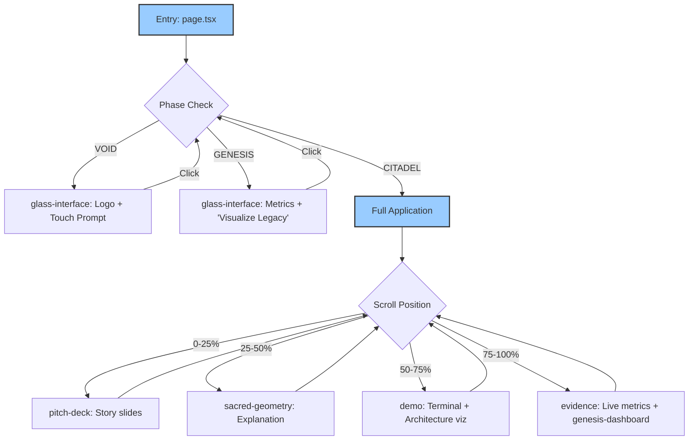

# BIZRA Frontend Architecture (v2.0)

## System Overview
**Project**: award-winner-design - BIZRA Public Interface (L7)
**Framework**: Next.js 16 (App Router) + React 19
**Purpose**: Interactive 3D Presentation Platform for Mathematical Consciousness Safety System
**Target**: Single-page web application with scroll-based navigation and 3D visualization

---

## 🏗️ Architecture Hierarchy

### **L7: Public Interface Layer**

#### **1. Application Foundation**
```
app/
├── page.tsx           # Main entry component - orchestrates phases and sections
├── layout.tsx         # Root layout with fonts and metadata
└── globals.css        # Global styles and Tailwind configuration
```

#### **2. State Management**
```
store/
└── use-bizra-store.ts # Zustand store managing:
    ├── Phase transitions (VOID → GENESIS → CITADEL)
    ├── Core metrics (POI, Ihsan, Hours)
    ├── UX state (devMode, animations)
    └── Actions: addImpact, setPhase, setHours, toggleDevMode
```

#### **3. Component Hierarchy**

##### **Core UX Components**
```
components/
├── glass-interface.tsx      # Phase-based overlay UI (VOID/GENESIS/CITADEL phases)
│   └── 🔗 Dependencies: store, hooks, animated logo component
├── nav-dock.tsx             # Bottom navigation dock
│   └── 🔗 Dependencies: lucide-react icons, scroll detection
└── loading-screen.tsx       # Initial loading animation
```

##### **3D Visualization Layer**
```
components/
├── citadel.tsx               # Main 3D tower visualization (15k blocks)
│   └── 🔗 Dependencies: @react-three/fiber, @react-three/drei, store
├── cosmic-background.tsx     # Animated space background
└── glass-interface.tsx       # inceracts with Citadel positioning
```

##### **Content Sections**
```
components/
├── pitch-deck/
│   └── deck-container.tsx    # Scroll-controlled presentation slides
├── sacred-geometry-interface.tsx  # Sacred geometry explanation
├── genesis-dashboard.tsx     # System dashboard view
├── evidence/
│   └── metrics-display.tsx   # Real-time metrics visualization
└── demo/
    └── terminal-simulation.tsx  # Terminal simulation interface
```

##### **System Architecture Visualization**
```
components/architecture/
├── layer-visualizer.tsx      # Interactive L0-L7 layer inspector
│   └── 🔗 Features: Click-to-inspect, error hotspots, debug commands
├── system-diagram.tsx        # L7 system diagram component
└── tree-visualization.tsx    # Metaphorical tree representation
    └── 🔗 Features: Canvas animation, swarm simulation, scroll sections
```

##### **UI Component Library**
```
components/ui/                # Radix UI wrapper components (80+ components)
├── button.tsx, input.tsx, dialog.tsx, etc.
└── theme-provider.tsx       # next-themes wrapper
```

---

## 🔗 Dependency Mapping

### **External Dependencies (Production)**
```
{
  "next": "16.0.3",
  "react": "19.2.0",
  "react-dom": "19.2.0",
  "@Next.js Ecosystem": [
    "@vercel/analytics": "1.3.1",
    "next-themes": "^0.4.6"
  ],
  "@3D Graphics": [
    "three": "latest",
    "@react-three/fiber": "latest",
    "@react-three/drei": "^9.99.0",
    "@react-three/postprocessing": "latest",
    "@types/three": "^0.160.0"
  ],
  "@UI Components": [
    "@radix-ui/*": "v1.1-2.2" (15 components),
    "class-variance-authority": "^0.7.1",
    "lucide-react": "^0.454.0"
  ],
  "@Forms & State": [
    "react-hook-form": "^7.60.0",
    "@hookform/resolvers": "^3.10.0",
    "zod": "3.25.76",
    "zustand": "latest"
  ],
  "@Animation & Interaction": [
    "framer-motion": "latest",
    "use-sync-external-store": "latest",
    "date-fns": "4.1.0"
  ],
  "@Styling": [
    "tailwindcss": "^4.1.9",
    "tailwind-merge": "^2.5.5",
    "tailwin-animations": "1.0.7"
  ]
}
```

### **Internal Component Dependencies**
```
Phase Management Flow:
store/use-bizra-store.ts
    ↓ (phase state)
glass-interface.tsx
    ↓ (conditional rendering)
page.tsx → [pitch-deck, demo, evidence sections]

3D Rendering Pipeline:
store/use-bizra-store.ts (metrics)
    ↓ (breathing animation)
Citadel ← cosmic-background
    ↓ (three.js canvas)
page.tsx (fixed background layer)

Navigation Flow:
useState(scrollPosition)
    ↓ (activeSection detection)
nav-dock.tsx
    ↓ (smooth scrolling)
[sections].tsx (id-based navigation)
```

---

## 🚨 Error Hotspots & Debugging

### **Critical Failure Points**

#### **1. 3D Rendering Failures**
- **Location**: `citadel.tsx:84-91` (GPU matrix updates)
- **Risk**: InstancedMesh GPU memory overflow with 15k instances
- **Debug**: Three.js warnings in console, performance drops
- **Mitigation**: `meshRef.current` null checks, error boundaries
- **Monitoring**: FPS drops, memory warnings

#### **2. Phase State Race Conditions**
- **Location**: `glass-interface.tsx:19-33` (useEffect dependencies)
- **Risk**: Stale closures during rapid phase transitions
- **Debug**: Dev tools → Components → State changes
- **Mitigation**: Proper cleanup, useCallback for event handlers

#### **3. Scroll-based Navigation**
- **Location**: `nav-dock.tsx:15-40` (throttled scroll handler)
- **Risk**: Passive event listener warnings, jank on slow devices
- **Debug**: Chrome DevTools → Performance → Frames
- **Mitigation**: `requestAnimationFrame` throttling

#### **4. Post-processing Effects**
- **Location**: `page.tsx:30-35` (@react-three/postprocessing)
- **Risk**: WebGL context loss, mobile compatibility
- **Debug**: WebGL errors, Bloom effect failures
- **Mitigation**: Fallback rendering, effect disable flags

---

## 🔍 Debugging Pathways

### **Development Mode Features**
```typescript
// Toggle via store - enables debug overlays
const isDevMode = useBizraStore(s => s.isDevMode)
// Features: Block highlighting, performance metrics, state logging
```

### **Performance Monitoring**
```typescript
// useFrame hook provides timing
useFrame((state) => {
  if (isDevMode) {
    console.log('FPS:', 1/state.clock.getDelta())
  }
})
```

### **Common Debug Commands**
```
# 3D Debugging
- Chrome DevTools → Three.js → Scene graph inspection
- React DevTools → Profiler (component re-renders)
- Performance tab → WebGL context analysis

# State Debugging
- Zustand DevTools extension
- React DevTools → State inspector
- Console: store.getState() inspection

# Build Debugging
- next build --debug
- Analyze bundle: next build --analyze
- TypeScript: tsc --noEmit --strict
```

---

## 📍 Integration Points

### **External APIS/Domains**
```
NONE (Currently isolated frontend presentation)
Future: [
  "Backend API": "L1-L6 Rust services",
  "CDN Assets": "Vercel deployment",
  "Analytics": "@vercel/analytics",
  "Monitoring": "? (Grafana integration)"
]
```

### **Data Flow Architecture**
```
User Interaction
    ↓ (clicks, scrolls)
Navigation State
    ↓ (activeSection, phase)
Component Re-renders
    ↓ (store subscriptions)
3D Canvas Updates
    ↓ (GPU matrix uploads)
Visual Feedback
```

### **Build System Integration**
```
Next.js 16 Features Used:
- App Router (./app/ directory)
- Client/Server boundary (use client)
- TypeScript strict mode
- Image optimization (future-ready)
- Vercel deployment config
```

---

## 🧭 Navigation & User Flow



### **Key User Journeys**
1. **First Visit**: VOID → touch logo → GENESIS (metrics) → click CTA → CITADEL (full scroll)
2. **Return Visits**: Direct to CITADEL phase with stored state
3. **Architecture Exploration**: DEMO section → Layer Visualizer → Tree Visualization
4. **Mobile Access**: Glass interface prioritizes touch, reduced 3D complexity

---

## 📊 Performance Characteristics

### **Bundle Analysis**
```
Core Bundle: Next.js + React (~200KB gzipped)
3D Libraries: Three.js ecosystem (~500KB)
UI Components: Radix UI (~300KB)
State Management: Zustand (~10KB)
Animations: Framer Motion (~200KB)
TOTAL: ~1.2MB (Preload critical path)
```

### **Runtime Performance**
```
Target FPS: 60fps (3D animations)
Memory Budget: <200MB (15k instanced meshes)
Core Web Vitals: Optimize for FCP <1.5s, LCP <3s
Mobile Compatibility: Reduced effects, but functional 3D
```

---

## 🔮 Future Evolution Paths

### **Immediate (v2.1)**
- [ ] Backend integration (L1-L6 API endpoints)
- [ ] Real-time metrics streaming
- [ ] User authentication flow
- [ ] Progressive enhancement for slow connections

### **Advanced (v3.0)**
- [ ] VR/XR interface integration
- [ ] Real-time collaboration features
- [ ] Advanced analytics dashboard
- [ ] Multi-language support (Arabic/English)

### **Infrastructure Evolution**
- [ ] CDN optimization for 3D assets
- [ ] Service worker for offline capability
- [ ] WebAssembly acceleration for heavy computations
- [ ] Database integration for user journeys

---

*Last Updated: 2025-01-01 | Next.js 16 | React 19 | Three.js r160*
