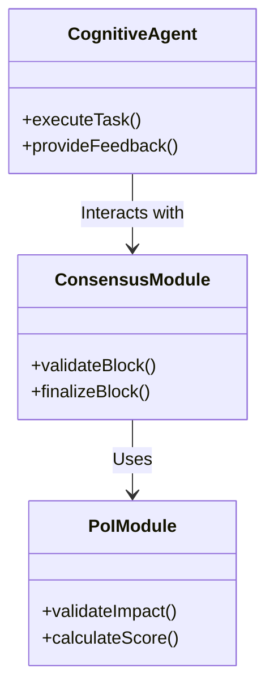
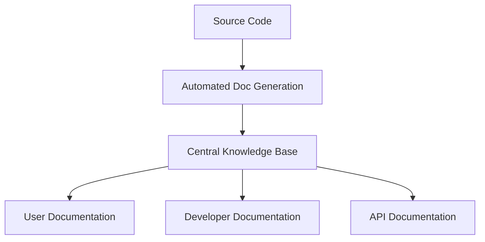
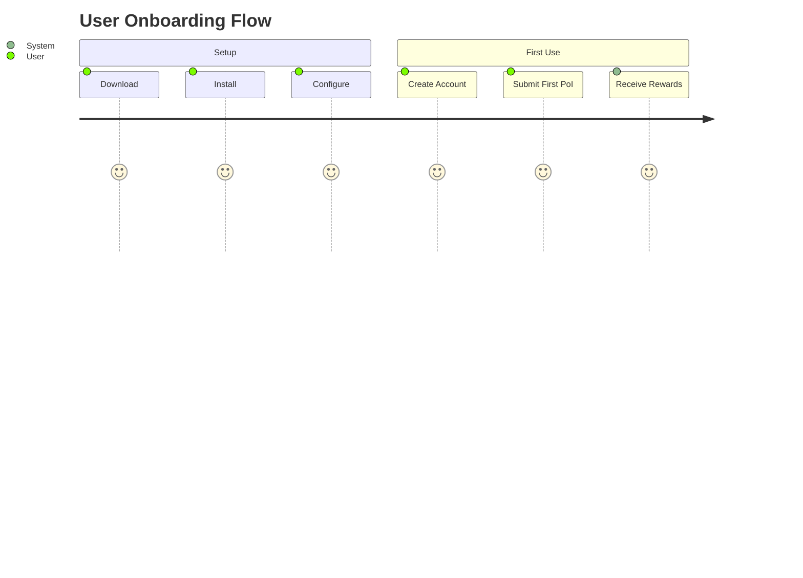
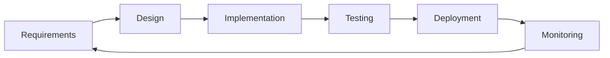
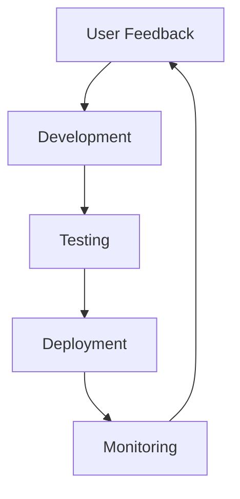
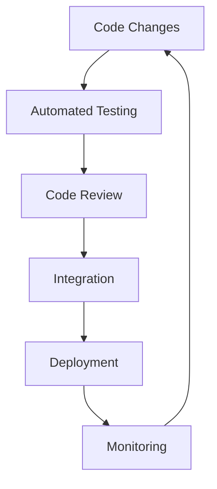
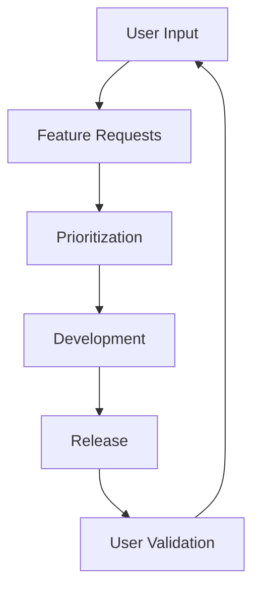
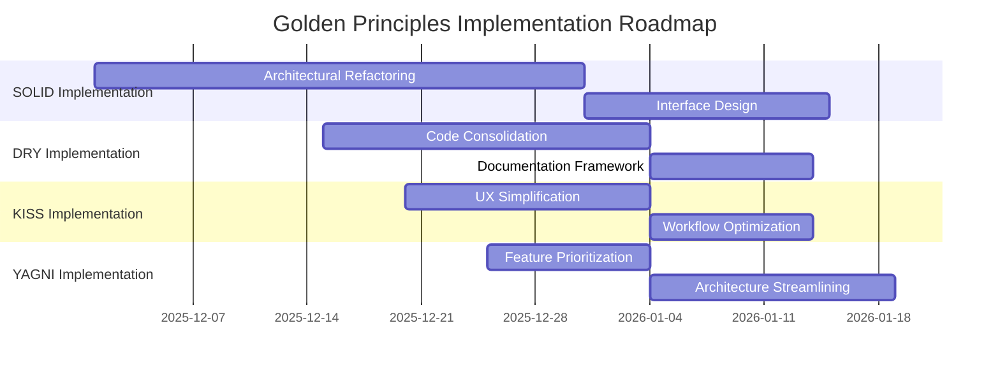

# Golden Principles Application Plan for BIZRA

## Executive Summary

This document applies the Golden Principles of Software Development (SOLID, DRY, KISS, YAGNI) to address the identified gaps in the BIZRA architecture across multiple lenses, ensuring alignment with ISO/IEC 25010, CMMI, and Agile/DevOps best practices.

## 1. Gap Analysis Summary

From the gap analysis document, the key gaps identified include:

### 1.1 Architectural Gaps
- Complexity in BlockTree/BlockGraph hybrid consensus
- Tight coupling between components
- Over-engineered features without immediate need
- Inconsistent abstraction levels

### 1.2 Process Gaps
- Lack of formal verification processes
- Insufficient continuous integration/continuous deployment (CI/CD) pipelines
- Limited automated testing coverage
- Inadequate documentation and knowledge sharing

### 1.3 Quality Gaps
- Inconsistent quality metrics
- Limited traceability from requirements to deployment
- Insufficient feedback loops
- Lack of comprehensive quality assurance processes

## 2. SOLID Principles Application

### 2.1 Single Responsibility Principle (SRP)

**Gap Addressed**: Tight coupling between components and complex consensus architecture

**Application**:
- **Consensus Module**: Separate BlockTree and BlockGraph into distinct modules with clear interfaces
- **PoI Module**: Isolate Proof-of-Impact validation logic from consensus mechanisms
- **Agent Framework**: Each cognitive agent (Master Reasoner, Memory Architect, etc.) should have a single, well-defined responsibility

**Implementation**:


**Alignment**:
- **ISO/IEC 25010**: Improves maintainability and modularity
- **CMMI**: Enhances process maturity through clear component boundaries
- **Agile/DevOps**: Enables independent development and deployment of modules

### 2.2 Open/Closed Principle (OCP)

**Gap Addressed**: Difficulty in extending functionality without modifying existing code

**Application**:
- **Consensus Algorithms**: Design extensible consensus interfaces that allow new algorithms without modifying core logic
- **PoI Scoring**: Create pluggable scoring mechanisms for different impact categories
- **Agent Framework**: Implement agent extension points for custom agent development

**Implementation**:
```typescript
interface ConsensusAlgorithm {
    validateBlock(block: Block): boolean;
    finalizeBlock(block: Block): void;
}

class BlockTreeAlgorithm implements ConsensusAlgorithm {
    // Implementation
}

class BlockGraphAlgorithm implements ConsensusAlgorithm {
    // Implementation
}
```

**Alignment**:
- **ISO/IEC 25010**: Enhances adaptability and extensibility
- **CMMI**: Supports continuous process improvement
- **Agile/DevOps**: Facilitates iterative development and feature addition

### 2.3 Liskov Substitution Principle (LSP)

**Gap Addressed**: Inconsistent behavior across similar components

**Application**:
- **Validator Nodes**: Ensure all validator implementations behave consistently
- **PoI Contributions**: Standardize contribution validation across categories
- **Cognitive Agents**: Maintain consistent interfaces across all agent types

**Implementation**:
```typescript
abstract class Validator {
    abstract validate(block: Block): ValidationResult;
    abstract finalize(block: Block): FinalizationResult;
}

class StandardValidator extends Validator {
    // Must maintain all Validator contract requirements
}
```

**Alignment**:
- **ISO/IEC 25010**: Improves reliability and consistency
- **CMMI**: Ensures predictable process outcomes
- **Agile/DevOps**: Reduces integration issues and testing complexity

### 2.4 Interface Segregation Principle (ISP)

**Gap Addressed**: Overly complex interfaces and unnecessary dependencies

**Application**:
- **Consensus Interfaces**: Split into smaller, focused interfaces (BlockValidation, Finalization, etc.)
- **PoI Interfaces**: Separate impact measurement from validation and scoring
- **Agent Interfaces**: Create specialized interfaces for different agent capabilities

**Implementation**:
```typescript
interface BlockValidator {
    validate(block: Block): ValidationResult;
}

interface BlockFinalizer {
    finalize(block: Block): FinalizationResult;
}

interface ImpactValidator extends BlockValidator {
    validateImpact(contribution: PoIContribution): ImpactValidationResult;
}
```

**Alignment**:
- **ISO/IEC 25010**: Enhances maintainability and reduces complexity
- **CMMI**: Improves process efficiency through focused interfaces
- **Agile/DevOps**: Enables parallel development and testing

### 2.5 Dependency Inversion Principle (DIP)

**Gap Addressed**: High-level modules depending on low-level implementations

**Application**:
- **Consensus Layer**: Depend on abstractions, not concrete implementations
- **PoI Layer**: Use dependency injection for scoring algorithms
- **Agent Layer**: Abstract agent capabilities behind interfaces

**Implementation**:
```typescript
class ConsensusManager {
    constructor(private validator: Validator, private finalizer: Finalizer) {}

    processBlock(block: Block) {
        if (this.validator.validate(block)) {
            this.finalizer.finalize(block);
        }
    }
}
```

**Alignment**:
- **ISO/IEC 25010**: Improves modularity and testability
- **CMMI**: Enhances process flexibility and adaptability
- **Agile/DevOps**: Supports continuous delivery and deployment

## 3. DRY Principles Application

### 3.1 Code Duplication Reduction

**Gap Addressed**: Repeated logic across consensus, PoI, and agent modules

**Application**:
- **Consensus Logic**: Extract common validation patterns into reusable utilities
- **PoI Scoring**: Create shared scoring components across impact categories
- **Agent Framework**: Develop common agent capabilities and patterns

**Implementation**:
```typescript
// Common validation utilities
class ValidationUtils {
    static validateSignature(block: Block): boolean {
        // Common signature validation logic
    }

    static validateStructure(block: Block): boolean {
        // Common structure validation logic
    }
}

// Used across all consensus implementations
```

**Alignment**:
- **ISO/IEC 25010**: Improves maintainability and reduces error potential
- **CMMI**: Enhances process efficiency through reuse
- **Agile/DevOps**: Accelerates development and reduces technical debt

### 3.2 Documentation Consolidation

**Gap Addressed**: Scattered and inconsistent documentation

**Application**:
- **Unified Documentation Framework**: Create single source of truth for all documentation
- **Automated Documentation Generation**: Use tools like Swagger/OpenAPI for API docs
- **Knowledge Base Integration**: Centralize all technical and user documentation

**Implementation**:


**Alignment**:
- **ISO/IEC 25010**: Enhances usability and understandability
- **CMMI**: Improves knowledge management processes
- **Agile/DevOps**: Facilitates continuous documentation updates

## 4. KISS Principles Application

### 4.1 Complexity Reduction

**Gap Addressed**: Overly complex consensus and PoI architectures

**Application**:
- **Consensus Simplification**: Streamline BlockTree/BlockGraph interaction
- **PoI Simplification**: Create straightforward impact validation workflows
- **Agent Simplification**: Develop focused, single-purpose agents

**Implementation**:
```typescript
// Simplified consensus workflow
class SimpleConsensus {
    async processBlock(block: Block): Promise<ConsensusResult> {
        // 1. Validate structure
        // 2. Validate signatures
        // 3. Finalize if valid
        // 4. Return result
    }
}
```

**Alignment**:
- **ISO/IEC 25010**: Improves operability and user experience
- **CMMI**: Enhances process efficiency and understandability
- **Agile/DevOps**: Reduces development complexity and testing requirements

### 4.2 User Experience Simplification

**Gap Addressed**: Complex user interfaces and workflows

**Application**:
- **Simplified Onboarding**: Create straightforward setup and configuration
- **Intuitive Interfaces**: Design clear, focused user interfaces
- **Guided Workflows**: Implement step-by-step processes for common tasks

**Implementation**:


**Alignment**:
- **ISO/IEC 25010**: Enhances usability and accessibility
- **CMMI**: Improves user satisfaction metrics
- **Agile/DevOps**: Facilitates user feedback and iteration

## 5. YAGNI Principles Application

### 5.1 Feature Prioritization

**Gap Addressed**: Over-engineered features without immediate need

**Application**:
- **Consensus Features**: Focus on core consensus functionality first
- **PoI Features**: Implement essential impact validation before advanced features
- **Agent Features**: Develop core agent capabilities before specialized functions

**Implementation**:
```markdown
## Feature Roadmap

### Phase 1: Core Functionality
- [ ] Basic consensus validation
- [ ] Essential PoI validation
- [ ] Core agent capabilities

### Phase 2: Extended Functionality
- [ ] Advanced consensus algorithms
- [ ] Enhanced PoI scoring
- [ ] Specialized agent features

### Phase 3: Advanced Features
- [ ] Quantum-resistant consensus
- [ ] AI-enhanced PoI validation
- [ ] Adaptive agent learning
```

**Alignment**:
- **ISO/IEC 25010**: Focuses on essential functionality and quality
- **CMMI**: Prioritizes process maturity through incremental improvement
- **Agile/DevOps**: Supports iterative development and continuous delivery

### 5.2 Architecture Simplification

**Gap Addressed**: Complex architecture without immediate requirements

**Application**:
- **Consensus Architecture**: Implement basic consensus before advanced features
- **PoI Architecture**: Build essential validation before complex scoring
- **Agent Architecture**: Develop core agents before specialized capabilities

**Implementation**:
```typescript
// Basic consensus implementation first
class BasicConsensus implements Consensus {
    // Core consensus functionality only
}

// Advanced features added later through extension
class AdvancedConsensus extends BasicConsensus {
    // Additional features as needed
}
```

**Alignment**:
- **ISO/IEC 25010**: Focuses on core quality attributes first
- **CMMI**: Builds process maturity incrementally
- **Agile/DevOps**: Enables continuous improvement and feature addition

## 6. Alignment with Standards and Best Practices

### 6.1 ISO/IEC 25010 Alignment

**Quality Characteristics Mapping**:

| Principle | Quality Characteristic | Impact |
|-----------|------------------------|--------|
| SOLID | Maintainability, Reliability | Improves code structure and long-term sustainability |
| DRY | Maintainability, Efficiency | Reduces redundancy and improves efficiency |
| KISS | Usability, Operability | Enhances user experience and system simplicity |
| YAGNI | Efficiency, Maintainability | Focuses development on essential features |

### 6.2 CMMI Alignment

**Process Area Mapping**:

| Principle | Process Area | Impact |
|-----------|--------------|--------|
| SOLID | Product Integration, Verification | Enhances component integration and testing |
| DRY | Process and Product Quality Assurance | Improves quality assurance processes |
| KISS | Requirements Development, Technical Solution | Simplifies requirements and solution design |
| YAGNI | Project Planning, Project Monitoring and Control | Focuses planning on essential requirements |

### 6.3 Agile/DevOps Alignment

**Practice Mapping**:

| Principle | Agile/DevOps Practice | Impact |
|-----------|-----------------------|--------|
| SOLID | Continuous Integration | Enables independent module testing and integration |
| DRY | Infrastructure as Code | Reduces configuration duplication |
| KISS | User Story Mapping | Simplifies user requirements and workflows |
| YAGNI | Minimum Viable Product | Focuses on essential features for rapid delivery |

## 7. Traceability Implementation

### 7.1 Requirements Traceability Matrix



### 7.2 Continuous Feedback Loops



## 8. Continuous Feedback Loops

### 8.1 Development Feedback Loop



### 8.2 User Feedback Loop



## 9. Comprehensive Overview

### 9.1 Principles Summary

| Principle | Application Area | Key Benefits |
|-----------|------------------|--------------|
| SOLID | Architecture, Design | Improved maintainability, extensibility, testability |
| DRY | Code, Documentation | Reduced redundancy, improved consistency |
| KISS | User Experience, Workflows | Enhanced usability, reduced complexity |
| YAGNI | Feature Development | Focused development, reduced over-engineering |

### 9.2 Implementation Roadmap



### 9.3 Success Metrics

| Metric | Target | Measurement Method |
|--------|--------|-------------------|
| Code Maintainability Score | 85+ | Static analysis tools |
| Documentation Completeness | 95% | Coverage analysis |
| User Satisfaction | 90% | User surveys and feedback |
| Feature Delivery Rate | 90% on time | Project management tracking |
| System Reliability | 99.9% uptime | Monitoring and incident tracking |

## 10. Conclusion

This comprehensive plan applies the Golden Principles of Software Development to systematically address the identified gaps in the BIZRA architecture. By implementing SOLID principles for robust architecture, DRY principles for efficient development, KISS principles for user-friendly design, and YAGNI principles for focused feature development, the project will achieve significant improvements in quality, maintainability, and user satisfaction.

The plan ensures alignment with ISO/IEC 25010 quality standards, CMMI process improvement framework, and Agile/DevOps best practices, creating a solid foundation for continuous improvement and successful deployment.