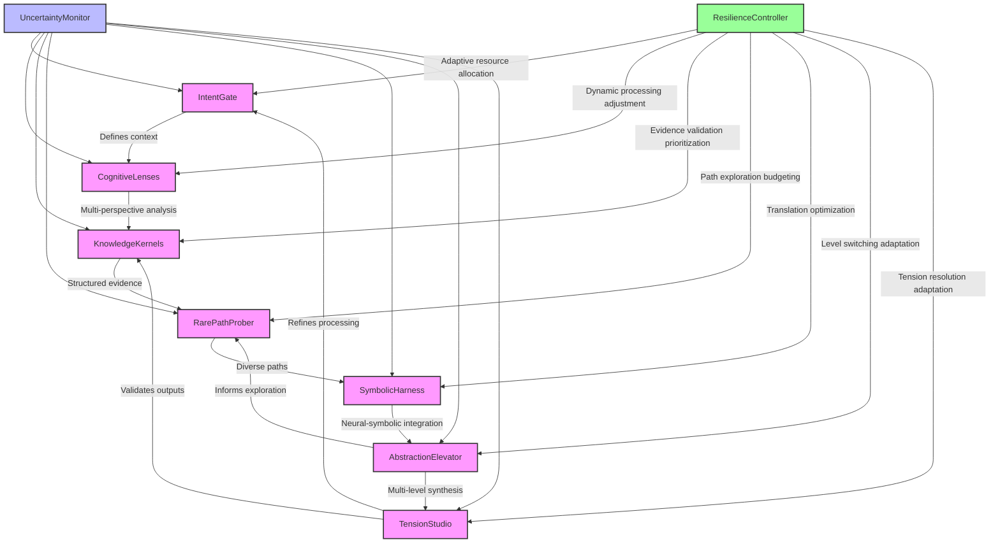

# Graph of Thoughts Framework: Comprehensive Analysis

## Trade-offs and Synergies Analysis

### 1. Intent Gate (What/Why/Bounds)

**Trade-offs:**
- **Clarity vs. Flexibility**: Clear intent definition provides focus but may limit creative exploration
- **Precision vs. Overhead**: Detailed bounds specification improves processing quality but increases setup complexity
- **Rigidity vs. Adaptability**: Fixed intent parameters ensure consistency but reduce responsiveness to changing contexts

**Synergies:**
- **Foundation for Alignment**: Establishes common purpose that aligns all downstream processing
- **Constraint-Driven Creativity**: Well-defined bounds can enhance creative problem-solving within constraints
- **Feedback Loop Anchor**: Provides stable reference point for iterative refinement

**Optimal Balance Strategy:**
- Implement adaptive intent boundaries that can expand/contract based on context
- Use probabilistic intent modeling with confidence intervals
- Establish intent validation feedback loops

### 2. Cognitive Lenses (7 persona lenses)

**Trade-offs:**
- **Depth vs. Breadth**: Deep analysis of specific personas vs. comprehensive coverage of multiple perspectives
- **Specialization vs. Generalization**: Persona-specific optimization vs. broad applicability
- **Complexity vs. Simplicity**: Rich multi-perspective analysis vs. computational efficiency

**Synergies:**
- **Multi-Perspective Insight**: Different lenses reveal complementary insights
- **Cognitive Diversity**: Multiple personas enhance problem-solving robustness
- **Adaptive Persona Modeling**: Lenses can adapt to different user contexts and needs

**Optimal Balance Strategy:**
- Implement dynamic lens weighting based on context and task requirements
- Use hierarchical lens activation (primary + secondary lenses)
- Establish lens coherence monitoring to prevent cognitive dissonance

### 3. Knowledge Kernels (Evidence discipline)

**Trade-offs:**
- **Precision vs. Volume**: High-quality, validated evidence vs. comprehensive knowledge coverage
- **Rigor vs. Speed**: Thorough evidence validation vs. rapid knowledge processing
- **Structure vs. Flexibility**: Rigid evidence frameworks vs. adaptive knowledge representation

**Synergies:**
- **Evidence-Based Reasoning**: Creates reliable foundation for all downstream processing
- **Knowledge Reusability**: Structured kernels enable efficient knowledge retrieval and application
- **Cross-Lens Knowledge Sharing**: Kernels provide common knowledge base for all lenses

**Optimal Balance Strategy:**
- Implement probabilistic evidence scoring with confidence metrics
- Use adaptive knowledge granularity based on task requirements
- Establish continuous knowledge validation and updating

### 4. Rare-Path Prober (Counter-impulse/Orthogonal paths)

**Trade-offs:**
- **Innovation vs. Stability**: Exploring unconventional paths vs. relying on proven approaches
- **Risk vs. Reward**: High-potential but uncertain paths vs. safe but incremental progress
- **Diversity vs. Focus**: Broad path exploration vs. targeted problem-solving

**Synergies:**
- **Creative Breakthroughs**: Uncovers innovative solutions missed by conventional approaches
- **Robustness Enhancement**: Diverse path exploration improves system resilience
- **Serendipitous Discovery**: Can reveal unexpected insights and connections

**Optimal Balance Strategy:**
- Implement constrained divergence with relevance scoring
- Use adaptive path exploration budgets based on context
- Establish path convergence validation protocols

### 5. Symbolic Harness (Neural-Symbolic bridge)

**Trade-offs:**
- **Interpretability vs. Power**: Clear symbolic reasoning vs. powerful neural processing
- **Precision vs. Flexibility**: Rigid symbolic structures vs. adaptive neural representations
- **Integration vs. Specialization**: Unified neural-symbolic processing vs. optimized separate systems

**Synergies:**
- **Best-of-Both-Worlds Reasoning**: Combines neural pattern recognition with symbolic logic
- **Grounded Cognition**: Neural perceptions grounded in symbolic meaning
- **Explainable AI**: Symbolic representations enable transparent reasoning

**Optimal Balance Strategy:**
- Implement progressive symbol grounding with validation checkpoints
- Use adaptive neural-symbolic integration based on task requirements
- Establish symbolic consistency monitoring

### 6. Abstraction Elevator (Micro/Meso/Macro + Meta-reflection)

**Trade-offs:**
- **Granularity vs. Holism**: Detailed micro-analysis vs. comprehensive macro-understanding
- **Focus vs. Context**: Narrow deep analysis vs. broad contextual awareness
- **Specialization vs. Integration**: Level-specific optimization vs. cross-level coherence

**Synergies:**
- **Multi-Level Synthesis**: Enables comprehensive understanding across scales
- **Contextual Adaptation**: Different abstraction levels suit different cognitive tasks
- **Progressive Refinement**: Lower levels inform higher-level synthesis

**Optimal Balance Strategy:**
- Implement context-aware level switching
- Use adaptive abstraction granularity based on cognitive load
- Establish cross-level coherence monitoring

### 7. Tension Studio (Generator/Critic/Synthesizer)

**Trade-offs:**
- **Creativity vs. Rigor**: Generative exploration vs. critical validation
- **Divergence vs. Convergence**: Exploratory breadth vs. focused synthesis
- **Innovation vs. Stability**: Novel solutions vs. proven approaches

**Synergies:**
- **Balanced Outputs**: Resolves cognitive tensions to produce refined, coherent results
- **Quality Assurance**: Critic function ensures output reliability
- **Adaptive Synthesis**: Can balance multiple conflicting requirements

**Optimal Balance Strategy:**
- Implement adaptive synthesis with conflict resolution protocols
- Use dynamic generator-critic weighting based on task phase
- Establish tension resolution validation metrics

## Latent Bottlenecks and Anti-Patterns

### System-Level Bottlenecks

1. **Intent Propagation Delay**: Slow dissemination of intent updates through the lens pipeline
   - *Anti-pattern*: Static intent parameters that don't adapt to changing contexts
   - *Solution*: Real-time intent monitoring with adaptive propagation

2. **Knowledge Validation Backlog**: Evidence validation unable to keep up with cognitive processing demands
   - *Anti-pattern*: Synchronous validation blocking parallel processing
   - *Solution*: Asynchronous validation with priority queuing

3. **Symbolic Grounding Gap**: Neural outputs that can't be effectively translated to symbolic representations
   - *Anti-pattern*: Fixed symbol grounding rules that don't adapt to novel concepts
   - *Solution*: Adaptive symbol grounding with learning capabilities

4. **Abstraction Level Mismatch**: Incompatible granularity between processing stages
   - *Anti-pattern*: Rigid level definitions that create integration gaps
   - *Solution*: Dynamic level adaptation with coherence monitoring

### Lens-Specific Bottlenecks

1. **Intent Gate**: Overly restrictive bounds limiting creative potential
   - *Anti-pattern*: Static, inflexible intent definitions
   - *Solution*: Adaptive intent boundaries with context awareness

2. **Cognitive Lenses**: Cognitive overload from simultaneous multi-lens processing
   - *Anti-pattern*: Unconstrained parallel lens activation
   - *Solution*: Dynamic lens prioritization and resource allocation

3. **Knowledge Kernels**: Evidence contamination from unreliable sources
   - *Anti-pattern*: Unvalidated knowledge ingestion
   - *Solution*: Probabilistic evidence scoring with source reputation

4. **Rare-Path Prober**: Computational explosion from unbounded path exploration
   - *Anti-pattern*: Unconstrained divergent path generation
   - *Solution*: Bounded divergence with relevance filtering

5. **Symbolic Harness**: Translation overhead between neural and symbolic representations
   - *Anti-pattern*: Inefficient bidirectional translation
   - *Solution*: Optimized translation pipelines with caching

6. **Abstraction Elevator**: Level transition overhead causing processing delays
   - *Anti-pattern*: Sequential level processing
   - *Solution*: Parallel level processing with synchronization

7. **Tension Studio**: Deadlock in generator-critic feedback cycles
   - *Anti-pattern*: Unbounded iterative refinement
   - *Solution*: Convergence monitoring with timeout mechanisms

## Failure Modes and Resilience Pathways

### Critical Failure Modes

1. **Cascading Intent Misalignment**
   - *Cause*: Poorly defined or misaligned intent at the gate level
   - *Effect*: Propagates through all lenses, causing systemic misalignment
   - *Detection*: Intent coherence monitoring across lenses
   - *Recovery*: Emergency intent realignment protocol

2. **Knowledge Contamination Cascade**
   - *Cause*: Corrupted or unreliable evidence in knowledge kernels
   - *Effect*: Pollutes all downstream processing with bad data
   - *Detection*: Evidence provenance tracking and anomaly detection
   - *Recovery*: Knowledge quarantine and revalidation

3. **Symbolic Grounding Collapse**
   - *Cause*: Failure to bridge neural outputs with symbolic representations
   - *Effect*: Meaningless or nonsensical symbolic outputs
   - *Detection*: Symbolic consistency validation
   - *Recovery*: Grounding reset with progressive rebuilding

4. **Tension Resolution Deadlock**
   - *Cause*: Generator-critic cycles unable to converge
   - *Effect*: System hangs in infinite refinement loops
   - *Detection*: Cycle timeout monitoring
   - *Recovery*: Forced convergence with fallback synthesis

### Resilience Pathways

1. **Progressive Validation Pipeline**
   - Multi-stage validation at each processing level
   - Confidence-based propagation gating
   - Automatic fallback to safe modes

2. **Adaptive Resource Allocation**
   - Dynamic computation resource distribution
   - Cognitive load balancing
   - Priority-based processing queues

3. **Context-Aware Error Recovery**
   - Situation-specific recovery protocols
   - Graceful degradation strategies
   - Progressive functionality restoration

4. **Continuous Coherence Monitoring**
   - Cross-lens consistency checking
   - Anomaly detection and alerting
   - Automated correction protocols

## Stochastic Conditions Analysis

### System Behavior Under Uncertainty

1. **Intent Gate Adaptation**
   - Probabilistic intent modeling with confidence intervals
   - Bayesian intent updating based on feedback
   - Context-aware intent boundary adjustment

2. **Cognitive Lens Flexibility**
   - Adaptive persona weighting based on uncertainty levels
   - Dynamic lens activation/deactivation
   - Confidence-based lens output filtering

3. **Knowledge Kernel Robustness**
   - Probabilistic evidence scoring
   - Bayesian knowledge updating
   - Uncertainty-aware evidence propagation

4. **Path Exploration Strategies**
   - Risk-adjusted path exploration budgets
   - Uncertainty-driven path diversification
   - Probabilistic path convergence

5. **Symbolic Grounding Adaptation**
   - Fuzzy symbolic reasoning under uncertainty
   - Probabilistic symbol grounding
   - Uncertainty-quantified symbolic outputs

6. **Abstraction Level Dynamics**
   - Context-dependent level switching
   - Uncertainty-aware granularity adaptation
   - Probabilistic level transition

7. **Tension Resolution Adaptation**
   - Uncertainty-quantified synthesis
   - Risk-adjusted tension balancing
   - Probabilistic conflict resolution

### Resilience Under Stochastic Conditions

1. **Probabilistic Processing Pipeline**
   - Uncertainty propagation through all lenses
   - Confidence interval maintenance
   - Probabilistic output generation

2. **Adaptive Uncertainty Management**
   - Dynamic uncertainty thresholding
   - Context-aware uncertainty handling
   - Progressive uncertainty reduction

3. **Robust Fallback Mechanisms**
   - Graceful degradation under high uncertainty
   - Safe mode operation protocols
   - Progressive functionality restoration

## Comprehensive Framework Visualization

## Key Insights and Recommendations

### Framework Strengths
1. **Systematic Multi-Lens Processing**: Comprehensive cognitive analysis through diverse perspectives
2. **Progressive Validation**: Rigorous evidence-based reasoning with multiple validation stages
3. **Adaptive Processing**: Context-aware adaptation across all processing levels
4. **Resilience Architecture**: Multiple feedback loops and failure recovery mechanisms

### Framework Challenges
1. **Complexity Management**: High cognitive overhead from multi-lens processing
2. **Resource Intensity**: Computational demands of parallel lens activation
3. **Integration Complexity**: Ensuring coherence across diverse processing modalities
4. **Uncertainty Propagation**: Managing uncertainty through multi-stage processing

### Strategic Recommendations
1. **Implement Adaptive Processing**: Dynamic resource allocation based on cognitive load
2. **Enhance Uncertainty Management**: Probabilistic processing with confidence quantification
3. **Optimize Integration Pathways**: Streamlined cross-lens communication protocols
4. **Strengthen Resilience Mechanisms**: Comprehensive failure detection and recovery systems

### Future Research Directions
1. **Neural-Symbolic Optimization**: Advanced bridging techniques for more efficient translation
2. **Adaptive Abstraction**: Context-aware level switching with machine learning
3. **Cognitive Load Balancing**: Intelligent resource allocation across lenses
4. **Uncertainty-Aware Synthesis**: Probabilistic tension resolution with confidence metrics

This comprehensive analysis provides a detailed understanding of the Graph of Thoughts Framework's capabilities, limitations, and optimization opportunities across its 7-lens architecture.