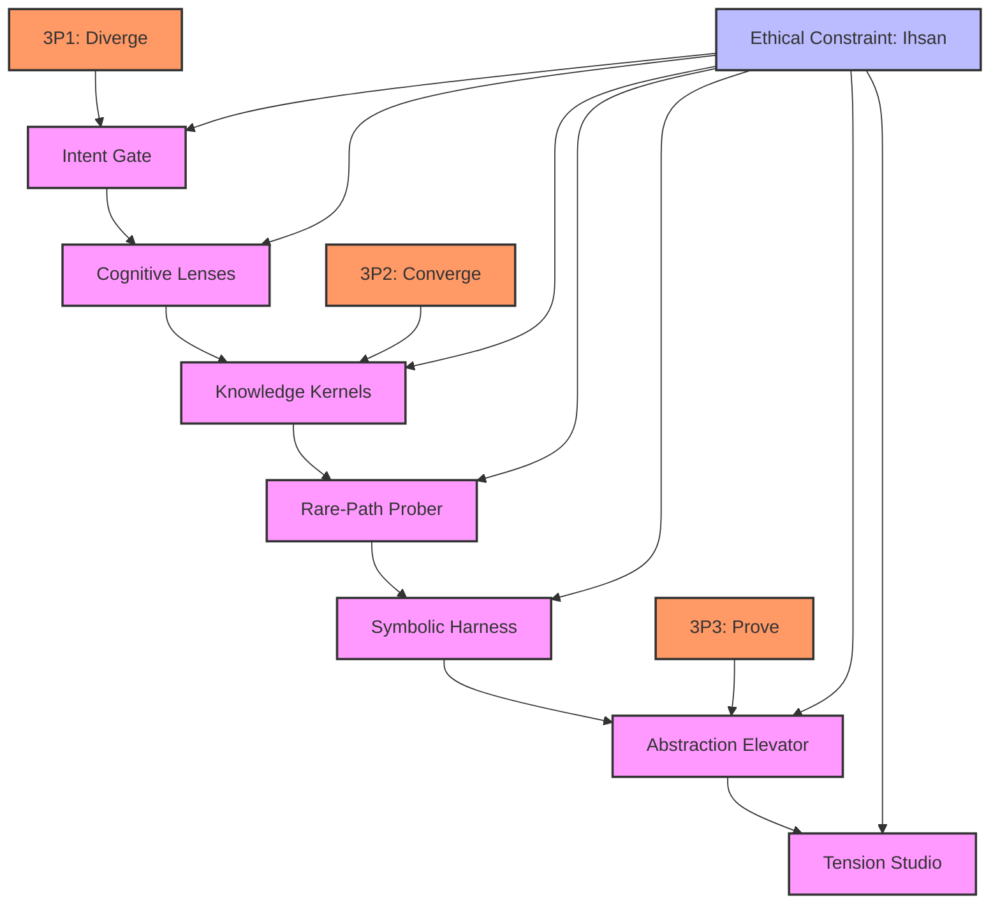
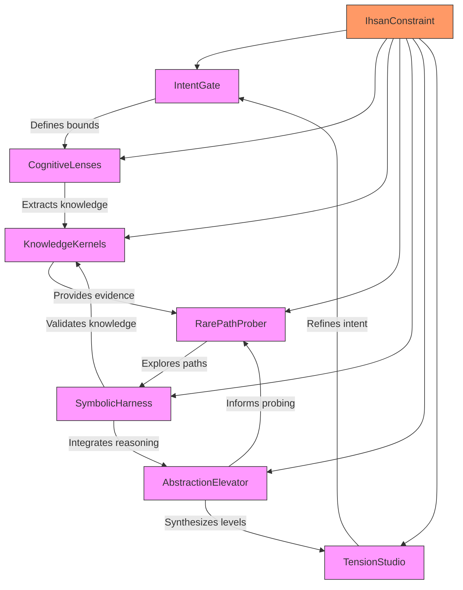

# Graph of Thoughts (GoT) Framework: Directed Acyclic Graph (DAG) Analysis

## Overview of the 7 Lenses in SAPE Framework

Based on the analysis document, I've identified the 7 lenses as part of the SAPE (Synaptic Activation Prompt Engine) framework:

1. **Intent Gate** (What/Why/Bounds)
2. **Cognitive Lenses** (7 persona lenses)
3. **Knowledge Kernels** (Evidence discipline)
4. **Rare-Path Prober** (Counter-impulse/Orthogonal paths)
5. **Symbolic Harness** (Neural-Symbolic bridge)
6. **Abstraction Elevator** (Micro/Meso/Macro + Meta-reflection)
7. **Tension Studio** (Generator/Critic/Synthesizer)

## Directed Acyclic Graph (DAG) Structure

## Detailed Analysis of Each Lens

### 1. Intent Gate (What/Why/Bounds)
**Dependencies**: None (Root node)
**Trade-offs**: Clarity vs. Overhead - Provides clear intent but requires upfront definition
**Synergies**: Sets foundation for all other lenses to operate within defined bounds
**Latent Bottlenecks**: Overly restrictive bounds can limit creative exploration
**Failure Modes**: Poorly defined intent leads to misaligned downstream processing
**Resilience Pathways**: Iterative refinement of intent through feedback loops

### 2. Cognitive Lenses (7 persona lenses)
**Dependencies**: Intent Gate (requires defined intent to focus cognitive processing)
**Trade-offs**: Depth vs. Breadth - Deep analysis of specific personas vs. broad coverage
**Synergies**: Enables multi-perspective analysis that enriches knowledge kernels
**Latent Bottlenecks**: Cognitive overload when processing too many lenses simultaneously
**Failure Modes**: Lens bias or misalignment with actual user personas
**Resilience Pathways**: Dynamic lens weighting and adaptive persona modeling

### 3. Knowledge Kernels (Evidence discipline)
**Dependencies**: Cognitive Lenses (requires persona-based knowledge extraction)
**Trade-offs**: Precision vs. Volume - High-quality evidence vs. comprehensive coverage
**Synergies**: Creates structured knowledge base that feeds into symbolic reasoning
**Latent Bottlenecks**: Evidence validation bottlenecks under high cognitive load
**Failure Modes**: Knowledge contamination from unreliable sources
**Resilience Pathways**: Multi-source verification and probabilistic evidence scoring

### 4. Rare-Path Prober (Counter-impulse/Orthogonal paths)
**Dependencies**: Knowledge Kernels (requires evidence base to probe)
**Trade-offs**: Innovation vs. Stability - Exploring unconventional paths vs. proven approaches
**Synergies**: Uncovers hidden insights that enhance symbolic reasoning
**Latent Bottlenecks**: Computational complexity of exploring multiple rare paths
**Failure Modes**: Path divergence leading to irrelevant or counterproductive exploration
**Resilience Pathways**: Constrained divergence with relevance scoring

### 5. Symbolic Harness (Neural-Symbolic bridge)
**Dependencies**: Rare-Path Prober (requires diverse paths for symbolic integration)
**Trade-offs**: Interpretability vs. Complexity - Symbolic reasoning clarity vs. neural network power
**Synergies**: Bridges neural processing with formal symbolic logic
**Latent Bottlenecks**: Translation overhead between neural and symbolic representations
**Failure Modes**: Symbol grounding failures leading to meaningless outputs
**Resilience Pathways**: Progressive symbol grounding with validation checkpoints

### 6. Abstraction Elevator (Micro/Meso/Macro + Meta-reflection)
**Dependencies**: Symbolic Harness (requires integrated neural-symbolic outputs)
**Trade-offs**: Granularity vs. Holism - Detailed micro-analysis vs. comprehensive macro-understanding
**Synergies**: Enables multi-level synthesis that informs tension resolution
**Latent Bottlenecks**: Abstraction mismatch between levels causing integration gaps
**Failure Modes**: Level confusion leading to inappropriate analysis granularity
**Resilience Pathways**: Context-aware level switching with coherence monitoring

### 7. Tension Studio (Generator/Critic/Synthesizer)
**Dependencies**: Abstraction Elevator (requires multi-level inputs for tension analysis)
**Trade-offs**: Creativity vs. Rigor - Generative exploration vs. critical validation
**Synergies**: Resolves cognitive tensions to produce refined, balanced outputs
**Latent Bottlenecks**: Deadlock in generator-critic cycles
**Failure Modes**: Unresolved tensions leading to inconsistent outputs
**Resilience Pathways**: Adaptive synthesis with conflict resolution protocols

## Cross-Lens Dependencies and Interactions

## Failure Modes and Resilience Analysis

### Systemic Failure Modes
1. **Cascading Intent Misalignment**: Poor intent definition propagates through all lenses
2. **Knowledge Contamination Cascade**: Bad evidence corrupts downstream processing
3. **Symbolic Grounding Collapse**: Failure to bridge neural-symbolic representations
4. **Tension Resolution Deadlock**: Generator-critic cycles fail to converge

### Resilience Strategies
1. **Intent Validation Loops**: Continuous intent refinement through feedback
2. **Evidence Probabilistic Scoring**: Multi-source verification with confidence metrics
3. **Progressive Symbol Grounding**: Incremental validation of symbolic representations
4. **Adaptive Synthesis Protocols**: Dynamic tension resolution with fallback mechanisms

## Stochastic Conditions Analysis

Under stochastic conditions (variable inputs, uncertain environments):

1. **Intent Gate**: Becomes probabilistic intent modeling with confidence intervals
2. **Cognitive Lenses**: Implements adaptive persona weighting based on context
3. **Knowledge Kernels**: Uses Bayesian evidence updating
4. **Rare-Path Prober**: Employs Monte Carlo path exploration
5. **Symbolic Harness**: Implements probabilistic symbolic reasoning
6. **Abstraction Elevator**: Uses fuzzy logic for level transitions
7. **Tension Studio**: Implements stochastic synthesis with uncertainty quantification

## Comprehensive Summary

The Graph of Thoughts Framework's 7 lenses form a sophisticated cognitive processing pipeline where:

1. **Intent Gate** establishes the foundational purpose and constraints
2. **Cognitive Lenses** provide multi-perspective analysis
3. **Knowledge Kernels** create structured evidence bases
4. **Rare-Path Prober** explores unconventional solutions
5. **Symbolic Harness** bridges neural and symbolic reasoning
6. **Abstraction Elevator** synthesizes across granularity levels
7. **Tension Studio** resolves cognitive conflicts

**Key Insights**:
- The framework is inherently resilient through multiple feedback loops
- Ethical constraints (Ihsan) permeate all lenses ensuring alignment with principles
- Stochastic conditions are handled through probabilistic approaches at each lens
- Failure modes are mitigated through progressive validation and adaptive synthesis

**Critical Dependencies**:
- Intent quality directly impacts all downstream processing
- Knowledge kernel integrity is essential for reliable outputs
- Symbolic harness effectiveness determines reasoning quality
- Tension studio resolution quality defines final output coherence

This DAG structure enables the Graph of Thoughts Framework to process complex cognitive tasks with systematic rigor while maintaining adaptability to stochastic conditions.