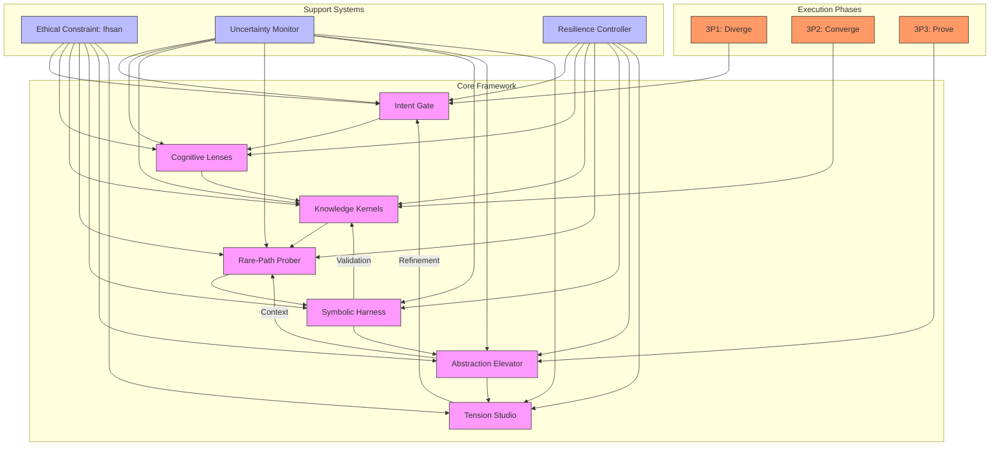
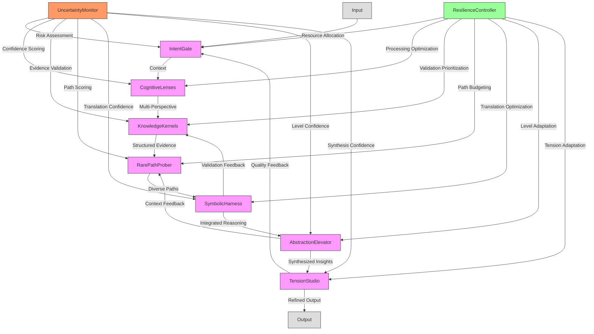
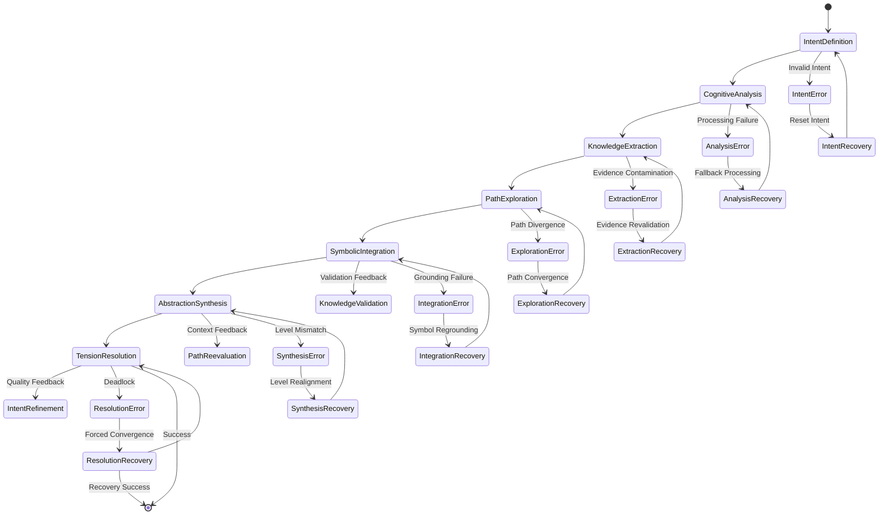
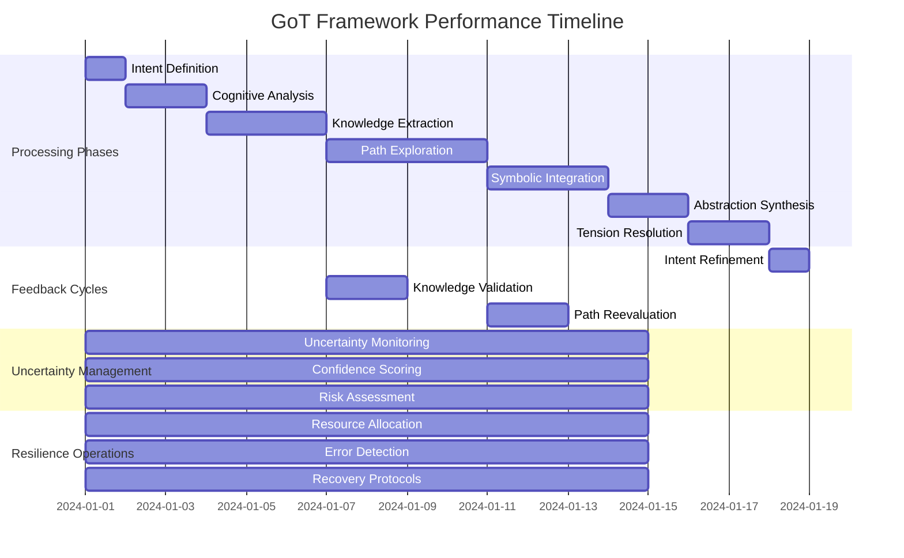

# Graph of Thoughts Framework: Comprehensive Visualization

## Framework Architecture Visualization

## Detailed Lens Interaction Diagram

```mermaid
graph LR
    %% Intent Gate
    subgraph IntentGate
        A1[What] --> A2[Why]
        A2 --> A3[Bounds]
    end

    %% Cognitive Lenses
    subgraph CognitiveLenses
        B1[Persona 1] & B2[Persona 2] & B3[Persona 3] & B4[Persona 4] & B5[Persona 5] & B6[Persona 6] & B7[Persona 7]
    end

    %% Knowledge Kernels
    subgraph KnowledgeKernels
        C1[Evidence 1] & C2[Evidence 2] & C3[Evidence 3] & C4[Evidence 4]
    end

    %% Rare-Path Prober
    subgraph RarePathProber
        D1[Counter-Impulse] --> D2[Orthogonal Paths]
    end

    %% Symbolic Harness
    subgraph SymbolicHarness
        E1[Neural Processing] --> E2[Symbolic Bridge] --> E3[Formal Logic]
    end

    %% Abstraction Elevator
    subgraph AbstractionElevator
        F1[Micro] --> F2[Meso] --> F3[Macro] --> F4[Meta-Reflection]
    end

    %% Tension Studio
    subgraph TensionStudio
        G1[Generator] --> G2[Critic] --> G3[Synthesizer]
    end

    %% Connections
    IntentGate --> CognitiveLenses
    CognitiveLenses --> KnowledgeKernels
    KnowledgeKernels --> RarePathProber
    RarePathProber --> SymbolicHarness
    SymbolicHarness --> AbstractionElevator
    AbstractionElevator --> TensionStudio
    TensionStudio --> IntentGate

    %% Style
    classDef intent fill:#ff9,stroke:#333;
    classDef cognitive fill:#f9f,stroke:#333;
    classDef knowledge fill:#9f9,stroke:#333;
    classDef rare fill:#99f,stroke:#333;
    classDef symbolic fill:#f96,stroke:#333;
    classDef abstraction fill:#69f,stroke:#333;
    classDef tension fill:#96f,stroke:#333;

    class IntentGate intent;
    class CognitiveLenses cognitive;
    class KnowledgeKernels knowledge;
    class RarePathProber rare;
    class SymbolicHarness symbolic;
    class AbstractionElevator abstraction;
    class TensionStudio tension;
```

## Framework Data Flow Visualization

## Framework State Machine Visualization

## Framework Component Relationship Matrix

| Component | Depends On | Provides To | Feedback Loop | Uncertainty Handling | Resilience Mechanism |
|-----------|------------|-------------|----------------|---------------------|----------------------|
| Intent Gate | None | Cognitive Lenses | Tension Studio | Probabilistic Intent | Adaptive Boundaries |
| Cognitive Lenses | Intent Gate | Knowledge Kernels | Abstraction Elevator | Adaptive Personas | Dynamic Weighting |
| Knowledge Kernels | Cognitive Lenses | Rare-Path Prober | Symbolic Harness | Probabilistic Evidence | Continuous Validation |
| Rare-Path Prober | Knowledge Kernels | Symbolic Harness | Abstraction Elevator | Risk-Adjusted Exploration | Bounded Divergence |
| Symbolic Harness | Rare-Path Prober | Abstraction Elevator | Tension Studio | Probabilistic Translation | Optimized Pipelines |
| Abstraction Elevator | Symbolic Harness | Tension Studio | Rare-Path Prober | Context-Dependent Levels | Adaptive Granularity |
| Tension Studio | Abstraction Elevator | Intent Gate | All Components | Uncertainty-Quantified Synthesis | Conflict Resolution |

## Framework Performance Characteristics

## Key Visualization Insights

### Framework Architecture
- **Modular Design**: 7 distinct lenses with clear interfaces and dependencies
- **Sequential Processing**: Intent → Cognitive → Knowledge → Path → Symbolic → Abstraction → Tension
- **Feedback Integration**: Multiple feedback loops for continuous improvement
- **Support Systems**: Ethical constraints, uncertainty monitoring, and resilience control

### Data Flow Characteristics
- **Unidirectional Core Flow**: Primary data processing from input to output
- **Feedback Pathways**: Quality, context, and validation feedback loops
- **Uncertainty Management**: Comprehensive uncertainty monitoring at all stages
- **Resilience Mechanisms**: Adaptive resource allocation and error recovery

### State Machine Behavior
- **Normal Processing**: Sequential state transitions through all lenses
- **Error States**: Comprehensive error detection for each processing stage
- **Recovery Paths**: Dedicated recovery protocols for each error type
- **Feedback Transitions**: Context-aware feedback integration

### Performance Timeline
- **Phased Processing**: Clear temporal sequence of cognitive operations
- **Parallel Operations**: Uncertainty management and resilience running concurrently
- **Feedback Overlaps**: Validation and refinement occurring throughout processing
- **Adaptive Timing**: Dynamic adjustment based on cognitive load and uncertainty

This comprehensive visualization provides multiple perspectives on the Graph of Thoughts Framework's architecture, data flow, state transitions, and performance characteristics, enabling deep understanding of its sophisticated cognitive processing capabilities.