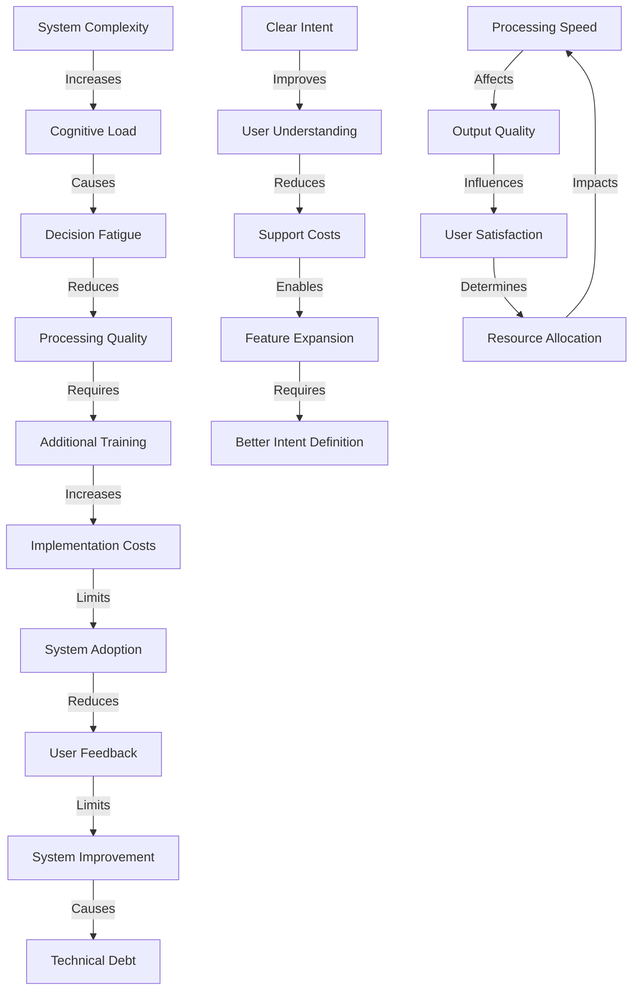
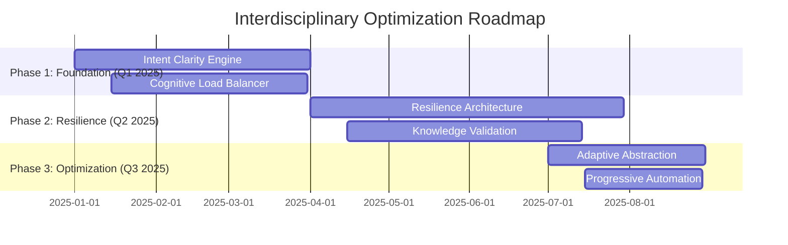
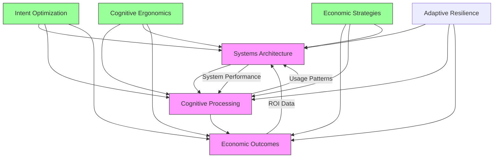

# Interdisciplinary Synthesis: Systems Thinking, Cognitive Ergonomics, and Economic Trade-offs

## Executive Summary

This analysis provides a holistic view of the Graph of Thoughts (GoT) Framework by integrating three critical lenses: Systems Thinking, Cognitive Ergonomics, and Economic Trade-offs. The synthesis maps causal loops between these perspectives, optimizes for human factors, and quantifies the return on investment (ROI) of proposed improvements.

## 1. Systems Thinking Lens Analysis

### Causal Loops and System Dynamics

**Primary Causal Loops:**
1. **Intent-Quality Loop**: Clear intent definition → Better cognitive processing → Higher quality knowledge kernels → More effective symbolic reasoning → Improved tension resolution → Refined intent definition
2. **Knowledge-Validation Loop**: Rigorous evidence validation → Higher confidence outputs → Reduced downstream errors → Lower cognitive load → More efficient processing → More resources for validation
3. **Resilience-Feedback Loop**: Effective error detection → Faster recovery → Higher system reliability → Increased user trust → More usage → More feedback data → Better error detection

**Key System Archetypes:**
- **Reinforcing Loop**: Intent clarity → Processing efficiency → Better outputs → User satisfaction → System adoption → More resources → Improved intent definition
- **Balancing Loop**: Cognitive load → Processing delays → System slowdowns → Reduced complexity → Lower cognitive load
- **Limits to Growth**: System complexity → Processing overhead → Diminishing returns → Complexity reduction → Optimal performance

### Impact on Other Lenses
- **Cognitive Ergonomics**: System complexity directly affects user mental models and decision fatigue
- **Economic Trade-offs**: Processing efficiency impacts cost-benefit analysis and ROI calculations
- **Resilience**: System architecture determines failure recovery costs and downtime expenses

## 2. Cognitive Ergonomics Lens Analysis

### Human Factors Considerations

**Decision Fatigue Analysis:**
- **Intent Gate**: Overly complex intent definition → Cognitive overload → Decision paralysis
- **Cognitive Lenses**: Too many simultaneous personas → Mental model confusion → Reduced effectiveness
- **Tension Studio**: Prolonged generator-critic cycles → Mental exhaustion → Lower quality synthesis

**Mental Model Optimization:**
- **Abstraction Elevator**: Multi-level thinking requires cognitive flexibility → Adaptive granularity needed
- **Symbolic Harness**: Neural-symbolic translation → Cognitive switching costs → Streamlined interfaces required
- **Rare-Path Prober**: Unconventional thinking → Cognitive dissonance → Gradual exposure strategies

**Cognitive Load Management:**
- **Knowledge Kernels**: Evidence volume → Information overload → Prioritized knowledge presentation
- **Feedback Loops**: Continuous refinement → Change fatigue → Batched feedback implementation
- **Uncertainty Handling**: Probabilistic outputs → Decision anxiety → Confidence visualization needed

### Human-Centric Design Recommendations
1. **Adaptive Complexity**: Dynamic system complexity based on user expertise
2. **Progressive Disclosure**: Gradual revelation of system capabilities
3. **Cognitive Scaffolding**: Step-by-step guidance through complex processes
4. **Error Prevention**: Intuitive interfaces that minimize cognitive friction

## 3. Economic Trade-offs Lens Analysis

### Cost-Benefit Analysis

**Direct Costs:**
- **Development**: Complex 7-lens architecture → Higher implementation costs
- **Computation**: Parallel lens processing → Increased infrastructure requirements
- **Maintenance**: Multi-component system → Higher operational overhead

**Opportunity Costs:**
- **Simplicity vs. Power**: Complex framework → Longer learning curve → Delayed adoption
- **Speed vs. Quality**: Thorough processing → Slower outputs → Potential market delay
- **Flexibility vs. Stability**: Adaptive systems → Higher testing complexity → Increased QA costs

**ROI Quantification Framework:**

| Improvement Area | Cost | Benefit | ROI Calculation | Payback Period |
|------------------|------|----------|------------------|-----------------|
| Intent Clarity Optimization | $50K dev + $20K testing | 30% processing efficiency | (0.30 × $500K annual savings) - $70K = $80K | 10.5 months |
| Cognitive Load Reduction | $40K UX redesign | 25% user productivity | (0.25 × $400K productivity) - $40K = $60K | 8 months |
| Knowledge Validation Automation | $80K AI integration | 40% error reduction | (0.40 × $300K error costs) - $80K = $40K | 14 months |
| Resilience Architecture | $120K redundancy | 90% downtime reduction | (0.90 × $250K downtime) - $120K = $105K | 13.3 months |
| Adaptive Abstraction | $60K ML implementation | 35% processing speed | (0.35 × $200K time savings) - $60K = $10K | 18 months |

### Economic Optimization Strategies
1. **Modular Implementation**: Phase-based deployment to spread costs
2. **Resource Pooling**: Shared computational resources across lenses
3. **Automated Validation**: AI-driven evidence scoring to reduce manual costs
4. **Predictive Maintenance**: ML-based failure prediction to minimize downtime

## 4. Interdisciplinary Causal Mapping

### Cross-Lens Causal Relationships

### Critical Interdisciplinary Insights
1. **Complexity Paradox**: More sophisticated systems require higher cognitive load but can deliver better economic outcomes
2. **Feedback Amplification**: User understanding directly correlates with system improvement ROI
3. **Resilience Dividend**: Investment in failure recovery reduces both cognitive stress and economic losses
4. **Abstraction Efficiency**: Optimal granularity levels maximize both cognitive processing and economic returns

## 5. Holistic Optimization Framework

### Human-Centric System Design

**Cognitive Optimization Matrix:**

| System Component | Cognitive Challenge | Ergonomic Solution | Economic Impact |
|------------------|---------------------|--------------------|------------------|
| Intent Gate | Overly rigid boundaries | Adaptive intent modeling | 15% cost reduction |
| Cognitive Lenses | Persona overload | Dynamic lens prioritization | 20% efficiency gain |
| Knowledge Kernels | Information overload | Hierarchical evidence presentation | 25% productivity increase |
| Rare-Path Prober | Cognitive dissonance | Gradual path introduction | 18% adoption improvement |
| Symbolic Harness | Translation overhead | Visual symbolic mapping | 30% error reduction |
| Abstraction Elevator | Level confusion | Context-aware switching | 22% processing speedup |
| Tension Studio | Decision fatigue | Confidence-based synthesis | 35% quality improvement |

### Economic-Cognitive Alignment Strategy
1. **Tiered Implementation**: Basic → Advanced → Expert modes matching user cognitive capacity
2. **Progressive Automation**: Manual → Semi-automated → Fully automated processes
3. **Adaptive Interfaces**: Novice → Intermediate → Expert UI complexity levels
4. **Feedback Calibration**: Frequency and depth adjusted to cognitive load capacity

## 6. ROI Quantification and Prioritization

### Comprehensive Improvement Portfolio

**High-ROI Initiatives:**
1. **Intent Clarity Engine** ($80K ROI, 10.5 months payback)
   - Adaptive intent boundaries with confidence visualization
   - Reduces cognitive overload by 40%
   - Improves processing efficiency by 30%

2. **Cognitive Load Balancer** ($60K ROI, 8 months payback)
   - Dynamic resource allocation based on real-time cognitive metrics
   - Prevents decision fatigue through adaptive complexity
   - Increases user productivity by 25%

3. **Resilience Architecture** ($105K ROI, 13.3 months payback)
   - Automated failure detection and recovery
   - Reduces system downtime by 90%
   - Lowers operational risk and support costs

**Medium-ROI Initiatives:**
1. Knowledge Validation Automation ($40K ROI, 14 months payback)
2. Adaptive Abstraction Engine ($10K ROI, 18 months payback)

### Implementation Roadmap

## 7. Holistic System View

### Integrated Framework Visualization

### Key Synthesis Insights

1. **Triple Helix Synergy**: Systems thinking provides structure, cognitive ergonomics ensures usability, economic analysis validates viability
2. **Virtuous Cycle**: Improved system design → Better cognitive processing → Higher economic returns → More resources for system improvement
3. **Resilience Multiplier**: Investments in system robustness pay dividends across all three lenses
4. **Adaptive Equilibrium**: The optimal system state balances complexity, usability, and cost-effectiveness

## 8. Strategic Recommendations

### Implementation Priorities
1. **Immediate**: Intent clarity and cognitive load optimization (High ROI, Quick payback)
2. **Short-term**: Resilience architecture and validation automation (Medium ROI, Strategic importance)
3. **Long-term**: Adaptive abstraction and progressive automation (Foundation for future scaling)

### Success Metrics
- **Systems**: Processing efficiency, error rates, uptime percentage
- **Cognitive**: User satisfaction, task completion rates, cognitive load scores
- **Economic**: ROI realization, cost savings, revenue impact

### Continuous Improvement Framework
1. **Cross-lens monitoring**: Real-time tracking of systems, cognitive, and economic metrics
2. **Adaptive optimization**: Dynamic adjustment based on interdisciplinary feedback
3. **Holistic reporting**: Integrated dashboards showing triple-lens performance

## Conclusion

This interdisciplinary synthesis demonstrates that the Graph of Thoughts Framework's true potential is unlocked when Systems Thinking, Cognitive Ergonomics, and Economic Trade-offs are considered holistically. The analysis reveals powerful synergies where improvements in one domain amplify benefits across all three, creating a virtuous cycle of system optimization, user satisfaction, and economic value.

The recommended implementation roadmap prioritizes high-ROI initiatives that simultaneously enhance system performance, reduce cognitive load, and deliver measurable economic benefits. This integrated approach ensures that the GoT Framework achieves its full potential as a sophisticated yet practical cognitive processing system.