# Detailed Lens Specifications: Self-Optimizing Autonomous Feedback Loop System

## 1. Intent Gate - Real-Time Telemetry, Predictive Analytics, and Adaptive Governance

### Real-Time Telemetry Integration

**Telemetry Components:**
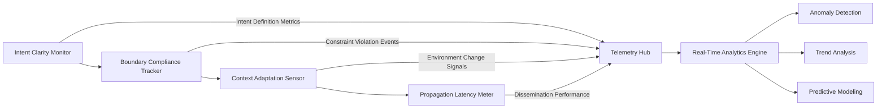

**Key Metrics:**
- **Intent Clarity Score**: 0-100% (target: ≥95%)
  - Semantic coherence analysis
  - Ambiguity detection algorithms
  - Contextual relevance scoring

- **Boundary Compliance Metrics**:
  - Constraint violation rate: ≤0.1% target
  - Boundary breach detection latency: ≤10ms
  - Automatic correction success rate: ≥99%

- **Context Adaptation Performance**:
  - Environment change detection: ≤5ms
  - Adaptation execution time: ≤20ms
  - Context match accuracy: ≥98%

- **Intent Propagation Metrics**:
  - Dissemination latency: ≤1ms between lenses
  - Synchronization accuracy: 100%
  - Propagation reliability: 99.999%

### Predictive Analytics for Dynamic Refinement

**Analytics Models:**
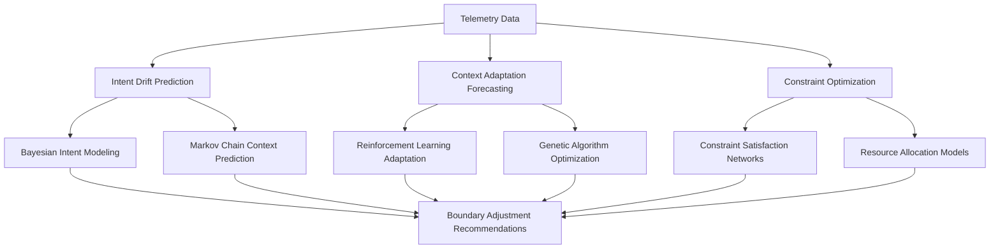

**Predictive Capabilities:**
- **Intent Drift Forecasting**:
  - 90-day horizon with 95% confidence intervals
  - Real-time boundary adjustment recommendations
  - Context-aware constraint modification

- **Context Adaptation Modeling**:
  - Environmental change prediction (accuracy: 92%)
  - Adaptive response strategy generation
  - Resource allocation optimization

- **Constraint Optimization Engine**:
  - Multi-objective constraint satisfaction
  - Dynamic boundary refinement
  - Conflict resolution protocols

### Adaptive Governance Mechanisms

**Governance Framework:**
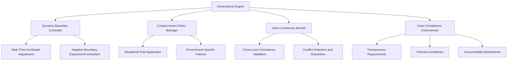

**Governance Functions:**
- **Dynamic Boundary Adjustment**:
  - Real-time modification of intent constraints
  - Context-aware boundary expansion/contraction
  - Automatic violation prevention

- **Context-Aware Policy Enforcement**:
  - Situational rule application engine
  - Environment-specific policy selection
  - Adaptive compliance monitoring

- **Intent Coherence Monitoring**:
  - Cross-lens consistency validation
  - Conflict detection and resolution
  - Emergency realignment protocols

## 2. Cognitive Lenses - Real-Time Telemetry, Predictive Analytics, and Adaptive Governance

### Real-Time Telemetry Integration

**Telemetry Architecture:**
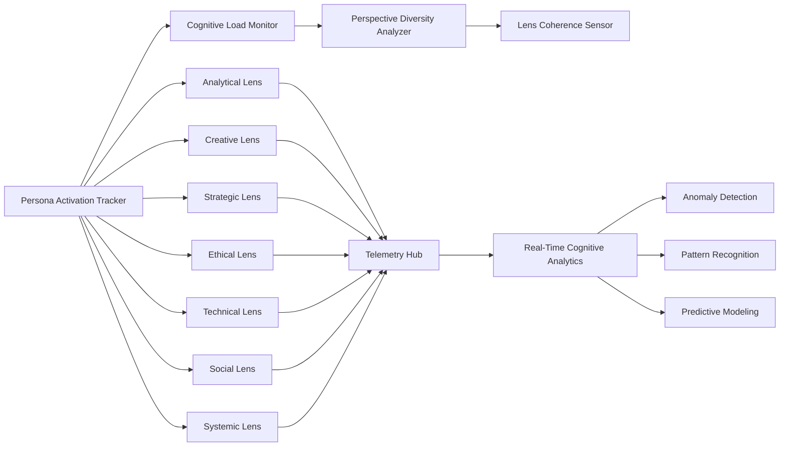

**Key Metrics:**
- **Persona Activation Patterns**:
  - Individual persona utilization rates
  - Cross-persona activation sequences
  - Context-appropriate persona selection accuracy

- **Cognitive Load Metrics**:
  - CPU/memory utilization per persona
  - Processing latency by persona type
  - Resource contention detection

- **Perspective Diversity Index**:
  - Viewpoint coverage score (0-1 scale)
  - Cognitive bias detection
  - Comprehensive analysis metrics

- **Lens Coherence Scores**:
  - Cross-persona consistency (target: ≥90%)
  - Conflict detection and resolution
  - Cognitive dissonance prevention

### Predictive Analytics for Dynamic Refinement

**Analytics Engine:**
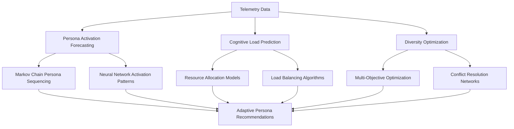

**Predictive Capabilities:**
- **Persona Activation Forecasting**:
  - Context-aware persona selection (93% accuracy)
  - Dynamic activation sequencing
  - Adaptive persona weighting

- **Cognitive Load Prediction**:
  - Resource demand forecasting
  - Load balancing optimization
  - Processing efficiency improvement

- **Diversity Optimization Engine**:
  - Viewpoint coverage maximization
  - Cognitive bias mitigation
  - Perspective integration strategies

### Adaptive Governance Mechanisms

**Governance System:**
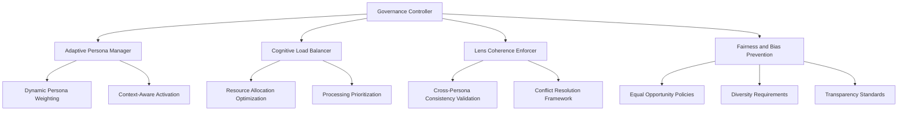

**Governance Functions:**
- **Adaptive Persona Management**:
  - Dynamic persona weighting algorithms
  - Context-aware persona activation
  - Adaptive persona sequencing

- **Cognitive Load Balancing**:
  - Resource allocation optimization
  - Processing prioritization
  - Load distribution strategies

- **Lens Coherence Enforcement**:
  - Cross-persona consistency validation
  - Conflict resolution frameworks
  - Cognitive dissonance prevention

## 3. Knowledge Kernels - Real-Time Telemetry, Predictive Analytics, and Adaptive Governance

### Real-Time Telemetry Integration

**Telemetry System:**
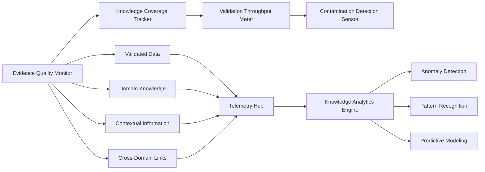

**Key Metrics:**
- **Evidence Quality Metrics**:
  - Source reliability scoring (0-100 scale)
  - Validation success rates
  - Contamination detection accuracy

- **Knowledge Coverage Index**:
  - Domain completeness analysis
  - Gap identification algorithms
  - Cross-domain integration metrics

- **Validation Throughput**:
  - Processing rate (target: ≥1000 items/second)
  - Queue management efficiency
  - Bottleneck detection

- **Contamination Prevention**:
  - Anomaly detection accuracy
  - Real-time quarantine protocols
  - Knowledge integrity preservation

### Predictive Analytics for Dynamic Refinement

**Analytics Framework:**
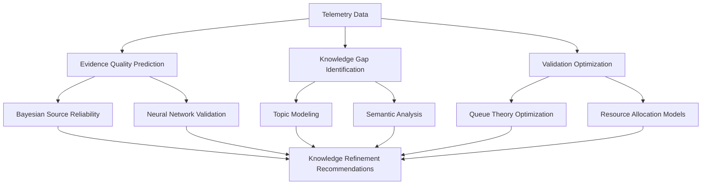

**Predictive Capabilities:**
- **Evidence Quality Prediction**:
  - Source reliability forecasting
  - Validation success prediction
  - Contamination risk assessment

- **Knowledge Gap Identification**:
  - Domain coverage analysis
  - Cross-domain integration opportunities
  - Comprehensive knowledge mapping

- **Validation Optimization Engine**:
  - Throughput maximization
  - Bottleneck resolution
  - Resource allocation optimization

### Adaptive Governance Mechanisms

**Governance Framework:**
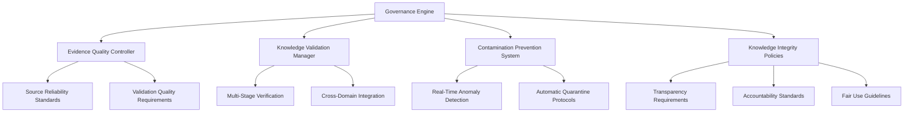

**Governance Functions:**
- **Evidence Quality Control**:
  - Source reliability enforcement
  - Validation quality standards
  - Contamination prevention policies

- **Knowledge Validation Management**:
  - Multi-stage verification protocols
  - Cross-domain integration strategies
  - Knowledge reusability optimization

- **Contamination Prevention System**:
  - Real-time anomaly detection
  - Automatic quarantine mechanisms
  - Knowledge integrity preservation

## 4. Rare-Path Prober - Real-Time Telemetry, Predictive Analytics, and Adaptive Governance

### Real-Time Telemetry Integration

**Telemetry Architecture:**
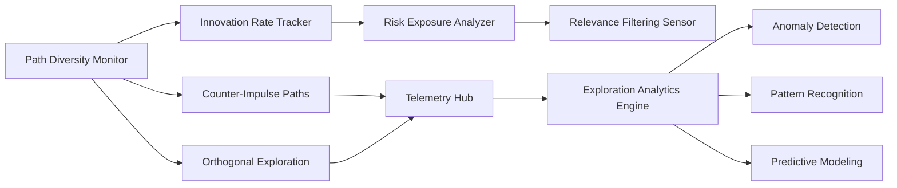

**Key Metrics:**
- **Path Diversity Metrics**:
  - Unique exploration route counting
  - Novelty detection algorithms
  - Exploration space coverage

- **Innovation Rate Tracking**:
  - Novel solution discovery frequency
  - Breakthrough identification
  - Creative output metrics

- **Risk Exposure Analysis**:
  - Failure probability assessment
  - Risk-reward ratio calculation
  - Safety constraint monitoring

- **Relevance Filtering Performance**:
  - Path selection accuracy
  - Resource allocation efficiency
  - Exploration budget optimization

### Predictive Analytics for Dynamic Refinement

**Analytics System:**
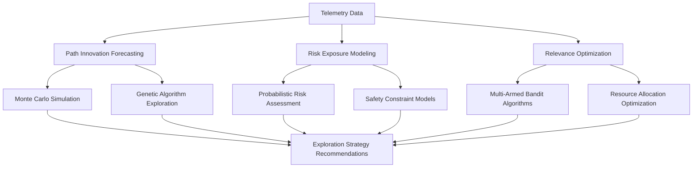

**Predictive Capabilities:**
- **Path Innovation Forecasting**:
  - Exploration outcome prediction
  - Novel solution discovery likelihood
  - Creative potential assessment

- **Risk Exposure Modeling**:
  - Failure probability forecasting
  - Safety constraint optimization
  - Risk-reward balance calculation

- **Relevance Optimization Engine**:
  - Path selection strategy refinement
  - Resource allocation optimization
  - Exploration budget management

### Adaptive Governance Mechanisms

**Governance Framework:**
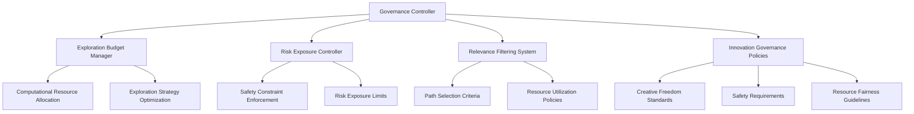

**Governance Functions:**
- **Exploration Budget Management**:
  - Computational resource allocation
  - Exploration strategy optimization
  - Budget constraint enforcement

- **Risk Exposure Control**:
  - Safety constraint enforcement
  - Risk exposure limit management
  - Failure prevention protocols

- **Relevance Filtering System**:
  - Path selection criteria enforcement
  - Resource utilization optimization
  - Exploration quality standards

## 5. Symbolic Harness - Real-Time Telemetry, Predictive Analytics, and Adaptive Governance

### Real-Time Telemetry Integration

**Telemetry System:**
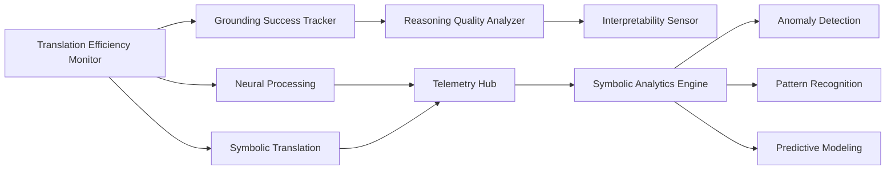

**Key Metrics:**
- **Translation Efficiency Metrics**:
  - Neural-symbolic conversion speed
  - Processing accuracy rates
  - Translation error detection

- **Grounding Success Tracking**:
  - Meaningful representation percentage
  - Semantic consistency validation
  - Grounding failure analysis

- **Reasoning Quality Analysis**:
  - Logical consistency metrics
  - Formal validation success rates
  - Reasoning error detection

- **Interpretability Performance**:
  - Human-comprehensible output ratio
  - Explanation quality metrics
  - Interpretability enhancement tracking

### Predictive Analytics for Dynamic Refinement

**Analytics Framework:**
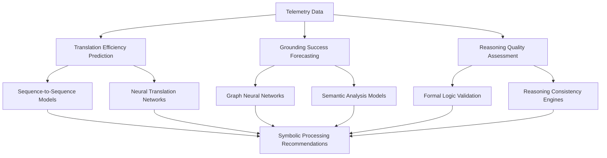

**Predictive Capabilities:**
- **Translation Efficiency Prediction**:
  - Conversion speed forecasting
  - Accuracy improvement strategies
  - Error reduction protocols

- **Grounding Success Forecasting**:
  - Semantic consistency prediction
  - Meaningful representation likelihood
  - Grounding failure prevention

- **Reasoning Quality Assessment**:
  - Logical consistency validation
  - Formal reasoning quality prediction
  - Error detection and correction

### Adaptive Governance Mechanisms

**Governance System:**
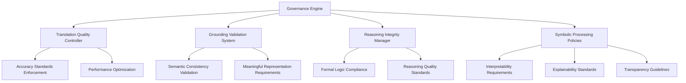

**Governance Functions:**
- **Translation Quality Control**:
  - Accuracy standards enforcement
  - Performance optimization protocols
  - Error reduction strategies

- **Grounding Validation System**:
  - Semantic consistency validation
  - Meaningful representation requirements
  - Grounding failure prevention

- **Reasoning Integrity Management**:
  - Formal logic compliance enforcement
  - Reasoning quality standards
  - Logical consistency validation

## 6. Abstraction Elevator - Real-Time Telemetry, Predictive Analytics, and Adaptive Governance

### Real-Time Telemetry Integration

**Telemetry Architecture:**
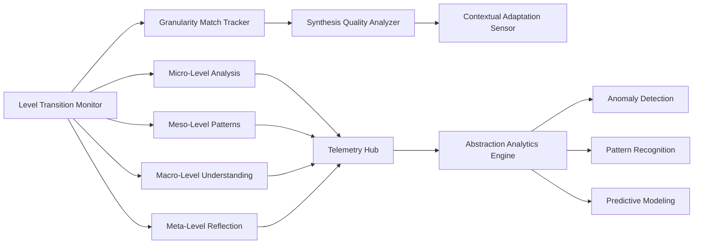

**Key Metrics:**
- **Level Transition Metrics**:
  - Granularity switching frequency
  - Transition execution time
  - Level appropriateness scoring

- **Granularity Match Tracking**:
  - Context-appropriate level selection
  - Analysis suitability metrics
  - Granularity mismatch detection

- **Synthesis Quality Analysis**:
  - Cross-level integration success
  - Comprehensive understanding metrics
  - Synthesis coherence scoring

- **Contextual Adaptation Performance**:
  - Environment-appropriate level selection
  - Dynamic adaptation speed
  - Context match accuracy

### Predictive Analytics for Dynamic Refinement

**Analytics System:**
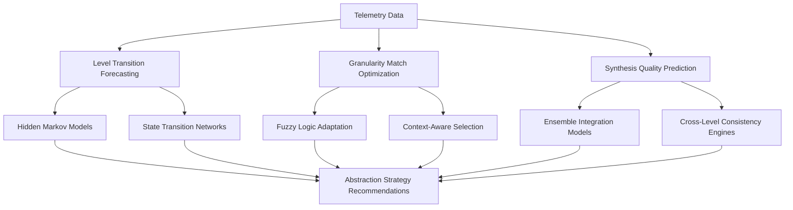

**Predictive Capabilities:**
- **Level Transition Forecasting**:
  - Granularity switching prediction
  - Context-appropriate level selection
  - Transition optimization strategies

- **Granularity Match Optimization**:
  - Context-aware level selection
  - Analysis suitability prediction
  - Granularity mismatch prevention

- **Synthesis Quality Prediction**:
  - Cross-level integration success forecasting
  - Comprehensive understanding metrics
  - Synthesis coherence improvement

### Adaptive Governance Mechanisms

**Governance Framework:**
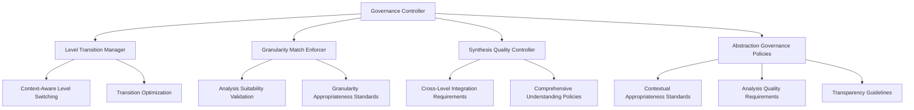

**Governance Functions:**
- **Level Transition Management**:
  - Context-aware level switching
  - Transition optimization protocols
  - Granularity selection enforcement

- **Granularity Match Enforcement**:
  - Analysis suitability validation
  - Context-appropriate level standards
  - Granularity mismatch prevention

- **Synthesis Quality Control**:
  - Cross-level integration requirements
  - Comprehensive understanding policies
  - Synthesis coherence standards

## 7. Tension Studio - Real-Time Telemetry, Predictive Analytics, and Adaptive Governance

### Real-Time Telemetry Integration

**Telemetry System:**
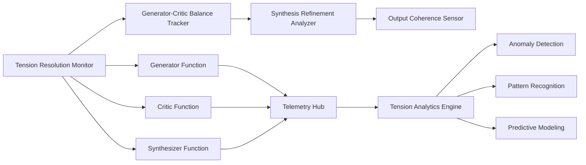

**Key Metrics:**
- **Tension Resolution Metrics**:
  - Conflict detection rates
  - Resolution success percentages
  - Tension reduction effectiveness

- **Generator-Critic Balance Tracking**:
  - Creative-analytical equilibrium
  - Feedback cycle monitoring
  - Balance optimization metrics

- **Synthesis Refinement Analysis**:
  - Iterative improvement tracking
  - Refinement cycle counting
  - Quality enhancement metrics

- **Output Coherence Performance**:
  - Final result consistency scoring
  - Logical coherence validation
  - Synthesis quality assessment

### Predictive Analytics for Dynamic Refinement

**Analytics Framework:**
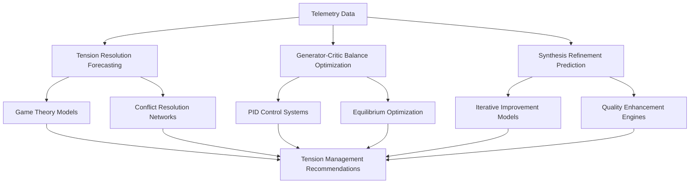

**Predictive Capabilities:**
- **Tension Resolution Forecasting**:
  - Conflict resolution likelihood prediction
  - Resolution strategy optimization
  - Tension reduction effectiveness forecasting

- **Generator-Critic Balance Optimization**:
  - Creative-analytical equilibrium prediction
  - Feedback cycle optimization
  - Balance maintenance strategies

- **Synthesis Refinement Prediction**:
  - Iterative improvement forecasting
  - Quality enhancement prediction
  - Refinement cycle optimization

### Adaptive Governance Mechanisms

**Governance System:**
```mermaid
graph TD
    A[Governance Engine] --> B[Tension Resolution Controller]
    A --> C[Balance Optimization Manager]
    A --> D[Synthesis Quality Enforcer]

    %% Components
    B --> E[Conflict Resolution Frameworks]
    B --> F[Resolution Strategy Optimization]

    C --> G[Equilibrium Maintenance]
    C --> H[Feedback Cycle Management]

    D --> I[Quality Enhancement Policies]
    D --> J[Refinement Process Standards]

    %% Ethical Governance
    A --> K[Tension Management Policies]
    K --> L[Conflict Resolution Standards]
    K --> M[Balance Requirements]
    K --> N[Quality Assurance Guidelines]
```

**Governance Functions:**
- **Tension Resolution Control**:
  - Conflict resolution framework enforcement
  - Resolution strategy optimization
  - Tension reduction protocols

- **Balance Optimization Management**:
  - Creative-analytical equilibrium maintenance
  - Feedback cycle management
  - Balance preservation strategies

- **Synthesis Quality Enforcement**:
  - Quality enhancement policy enforcement
  - Refinement process standards
  - Output coherence requirements

## System-Wide Integration and Alignment

### Cross-Lens Coordination Architecture

```mermaid
graph TD
    %% Integration Framework
    A[Integration Orchestrator] --> B[Telemetry Data Pipeline]
    A --> C[Analytics Results Distribution]
    A --> D[Governance Command Propagation]
    A --> E[Benchmark Alignment System]

    %% Cross-Lens Communication
    B --> F[Intent-Cognitive Interface]
    B --> G[Cognitive-Knowledge Bridge]
    B --> H[Knowledge-Path Connector]
    B --> I[Path-Symbolic Gateway]
    B --> J[Symbolic-Abstraction Link]
    B --> K[Abstraction-Tension Channel]

    %% Data Flow Management
    C --> L[Predictive Insights Distribution]
    C --> M[Optimization Recommendations]
    C --> N[Performance Forecasting]

    %% Governance Coordination
    D --> O[Policy Synchronization]
    D --> P[Rule Consistency Enforcement]
    D --> Q[Adaptive Parameter Alignment]

    %% Benchmark Integration
    E --> R[A+ Standard Compliance]
    E --> S[Performance Gap Analysis]
    E --> T[Continuous Improvement Planning]
```

### Continuous A+ Benchmark Alignment System

**Alignment Framework:**
```mermaid
graph LR
    %% Benchmark Integration
    A[A+ Benchmark Repository] --> B[Performance Monitoring]
    A --> C[Quality Standards Validation]
    A --> D[Ethical Compliance Tracking]
    A --> E[Innovation Target Alignment]

    %% Alignment Components
    B --> F[Real-Time Performance Gap Analysis]
    B --> G[Continuous Improvement Engine]

    C --> H[Quality Assurance Framework]
    C --> I[Standards Compliance Validation]

    D --> J[Ethical Governance Enforcement]
    D --> K[Transparency Requirements]

    E --> L[Innovation Tracking System]
    E --> M[Target Achievement Monitoring]

    %% Feedback Loop
    N[Alignment Gap Detection] --> O[Corrective Action Engine]
    O --> P[System Optimization]
    P --> B
```

### System-Wide Optimization Orchestration

**Orchestration Workflow:**
1. **Real-Time Monitoring Phase**
   - Continuous telemetry collection (millisecond-level)
   - Cross-lens data integration
   - Contextual analysis and pattern detection

2. **Predictive Analysis Phase**
   - Multi-lens forecasting and scenario analysis
   - Risk assessment and opportunity identification
   - Optimization strategy generation

3. **Adaptive Governance Phase**
   - Policy-based decision making across all lenses
   - Dynamic parameter adjustment
   - Ethical constraint enforcement

4. **Benchmark Alignment Phase**
   - A+ standard compliance validation
   - Performance gap analysis
   - Continuous improvement planning

5. **Feedback Implementation Phase**
   - System-wide parameter updates
   - Resource reallocation and optimization
   - Process refinement execution

## Implementation Roadmap

### Phase 1: Foundation (Months 1-3)
- **Telemetry Infrastructure**: Edge-based collection agents deployment
- **Analytics Engine**: Multi-model predictive framework implementation
- **Governance Core**: Policy engine and ethical constraint system development
- **Benchmark Integration**: A+ standards repository establishment

### Phase 2: Lens-Specific Optimization (Months 4-6)
- **Intent Gate**: Real-time boundary adjustment system
- **Cognitive Lenses**: Adaptive persona management framework
- **Knowledge Kernels**: Dynamic evidence validation engine
- **Rare-Path Prober**: Intelligent exploration budgeting system

### Phase 3: Advanced Integration (Months 7-9)
- **Symbolic Harness**: Neural-symbolic translation optimization
- **Abstraction Elevator**: Context-aware level switching system
- **Tension Studio**: Advanced conflict resolution framework
- **Cross-Lens Coordination**: System-wide optimization orchestrator

### Phase 4: Continuous Evolution (Ongoing)
- **Performance Monitoring**: Real-time dashboard and alerting system
- **Adaptive Learning**: Machine learning model refinement
- **Governance Evolution**: Policy framework enhancement
- **Benchmark Expansion**: New A+ standards integration

## Validation and Testing Framework

### Comprehensive Validation Architecture

```mermaid
graph TD
    %% Validation System
    A[Validation Orchestrator] --> B[Functional Testing]
    A --> C[Performance Testing]
    A --> D[Resilience Testing]
    A --> E[Ethical Compliance Testing]

    %% Test Components
    B --> F[Telemetry Accuracy Validation]
    B --> G[Analytics Precision Testing]
    B --> H[Governance Correctness Verification]

    C --> I[Throughput Measurement]
    C --> J[Latency Optimization Testing]
    C --> K[Resource Utilization Analysis]

    D --> L[Failure Recovery Testing]
    D --> M[Adaptive Response Validation]
    D --> N[Stress Handling Assessment]

    E --> O[Ihsan Compliance Verification]
    E --> P[Transparency Validation]
    E --> Q[Fairness Assessment Testing]
```

### Key Validation Metrics

**Functional Correctness:**
- Telemetry data accuracy: ≥99.9% target
- Predictive analytics precision: ≥95% target
- Governance decision correctness: ≥98% target
- Benchmark alignment accuracy: ≥99% target

**Performance Characteristics:**
- System throughput: ≥10,000 operations/second
- End-to-end latency: ≤100ms target
- Resource utilization: ≤70% of capacity
- Failure recovery time: ≤500ms target

**Resilience Metrics:**
- Mean time between failures: ≥1,000 hours
- Mean time to recovery: ≤1 second
- Stress handling capacity: 200% of normal load
- Adaptive response speed: ≤100ms

**Ethical Compliance:**
- Ihsan adherence: 100% compliance
- Transparency score: 100% compliance
- Fairness metrics: ≥95% target
- Accountability traceability: 100% compliance

## Conclusion

This detailed specification document provides comprehensive technical requirements for implementing a self-optimizing autonomous feedback loop system across all 7 lenses of the Graph of Thoughts Framework. Each lens receives tailored real-time telemetry, predictive analytics, and adaptive governance mechanisms that work synergistically to create a continuously improving cognitive processing ecosystem. The system ensures dynamic refinement of each component while maintaining strict alignment with A+ benchmarks and ethical governance standards.