# Multi-Dimensional Resilience Framework for BIZRA

## Executive Summary

This document presents a comprehensive multi-dimensional resilience framework that embeds self-healing mechanisms, automated root-cause analysis, and proactive risk mitigation across the highest SNR (Signal-to-Noise Ratio) lenses identified in the BIZRA architecture. The framework strictly adheres to the Golden Principles of Software Development & Management Lifecycle.

## 1. Highest SNR Lenses Analysis

Based on the HIGH_SNR_PRIORITIZATION_ANALYSIS.md, the top 3 lenses with highest SNR scores are:

### 1.1 G8: Inadequate Documentation and Knowledge Sharing (SNR: 2.85)
- **Signal Components**: Strategic alignment (7/10), System impact (6/10), User experience (9/10), Maintainability (9/10), Compliance (6/10)
- **Noise Components**: Implementation complexity (3/10), Resource requirements (4/10), Integration challenges (2/10), Organizational resistance (3/10), Technical debt (1/10)
- **Priority Score**: 8.72 (Rank #1)

### 1.2 G11: Insufficient Feedback Loops (SNR: 2.31)
- **Signal Components**: Strategic alignment (8/10), System impact (8/10), User experience (7/10), Maintainability (8/10), Compliance (6/10)
- **Noise Components**: Implementation complexity (4/10), Resource requirements (4/10), Integration challenges (3/10), Organizational resistance (3/10), Technical debt (2/10)
- **Priority Score**: 7.85 (Rank #2)

### 1.3 G6: Insufficient CI/CD Pipelines (SNR: 1.80)
- **Signal Components**: Strategic alignment (9/10), System impact (8/10), User experience (4/10), Maintainability (8/10), Compliance (7/10)
- **Noise Components**: Implementation complexity (4/10), Resource requirements (5/10), Integration challenges (5/10), Organizational resistance (4/10), Technical debt (2/10)
- **Priority Score**: 7.68 (Rank #3)

## 2. Lens-Specific Resilience Framework

### 2.1 G8: Documentation and Knowledge Management Lens

#### Self-Healing Mechanisms
- **Automated Documentation Generation**: Real-time documentation generation from code comments and API specifications
- **Knowledge Base Auto-Update**: Continuous integration with code changes to maintain up-to-date documentation
- **Documentation Health Monitoring**: Automated detection of outdated or incomplete documentation sections

#### Automated Root-Cause Analysis
- **Documentation Gap Detection**: AI-powered analysis of missing or incomplete documentation areas
- **Knowledge Coverage Analysis**: Automated identification of undocumented code paths and features
- **Documentation Quality Metrics**: Real-time scoring of documentation completeness and accuracy

#### Proactive Risk Mitigation
- **Documentation Compliance Monitoring**: Continuous validation against documentation standards
- **Knowledge Base Redundancy**: Automated backup and versioning of documentation assets
- **Documentation Impact Analysis**: Predictive modeling of documentation gaps on system usability

### 2.2 G11: Feedback Loops Lens

#### Self-Healing Mechanisms
- **Automated Feedback Collection**: Real-time gathering of user feedback across all interaction points
- **Feedback Processing Pipeline**: Automated categorization and prioritization of feedback items
- **Feedback Response Automation**: AI-driven initial responses to common feedback patterns

#### Automated Root-Cause Analysis
- **Feedback Pattern Recognition**: Machine learning analysis of recurring feedback themes
- **User Satisfaction Analytics**: Real-time sentiment analysis and satisfaction scoring
- **Feedback Impact Correlation**: Automated linking of feedback to specific system components

#### Proactive Risk Mitigation
- **Feedback Trend Monitoring**: Continuous tracking of emerging user concerns and issues
- **User Experience Prediction**: AI modeling of potential user experience degradation
- **Feedback Loop Optimization**: Automated adjustment of feedback collection mechanisms

### 2.3 G6: CI/CD Pipelines Lens

#### Self-Healing Mechanisms
- **Pipeline Health Monitoring**: Real-time monitoring of CI/CD pipeline status and performance
- **Automated Pipeline Recovery**: Self-correcting mechanisms for failed pipeline stages
- **Resource Optimization**: Dynamic allocation of CI/CD resources based on workload

#### Automated Root-Cause Analysis
- **Pipeline Failure Analysis**: Automated diagnosis of build and deployment failures
- **Dependency Conflict Detection**: Real-time identification of dependency version conflicts
- **Performance Bottleneck Identification**: Automated detection of pipeline performance issues

#### Proactive Risk Mitigation
- **Pipeline Risk Assessment**: Continuous evaluation of pipeline failure probabilities
- **Deployment Safety Analysis**: Automated pre-deployment risk scoring
- **Pipeline Capacity Planning**: Predictive modeling of resource requirements

## 3. Golden Principles Adherence

### 3.1 SOLID Principles Integration

**Single Responsibility Principle (SRP):**
- Each resilience component has a single, well-defined responsibility
- Documentation, feedback, and CI/CD systems are modular and independent

**Open/Closed Principle (OCP):**
- Resilience mechanisms are extensible through well-defined interfaces
- New analysis and mitigation strategies can be added without modifying core systems

**Liskov Substitution Principle (LSP):**
- All resilience components maintain consistent interfaces and behaviors
- Substitution of analysis or mitigation strategies doesn't affect system stability

**Interface Segregation Principle (ISP):**
- Specialized interfaces for different resilience functions
- Separation of monitoring, analysis, and mitigation capabilities

**Dependency Inversion Principle (DIP):**
- High-level resilience systems depend on abstractions, not concrete implementations
- Dependency injection for analysis algorithms and mitigation strategies

### 3.2 DRY Principles Implementation

**Code Reuse:**
- Common resilience patterns and utilities shared across all lenses
- Standardized monitoring and analysis frameworks

**Documentation Consolidation:**
- Unified resilience documentation framework
- Centralized knowledge base for all resilience components

### 3.3 KISS Principles Application

**Simplified Architecture:**
- Straightforward resilience workflows and processes
- Clear separation of concerns between monitoring, analysis, and mitigation

**User-Friendly Design:**
- Intuitive interfaces for resilience monitoring and management
- Simple configuration and customization options

### 3.4 YAGNI Principles Compliance

**Focused Implementation:**
- Core resilience capabilities implemented first
- Advanced features added based on actual system needs and usage patterns

**Incremental Development:**
- Basic monitoring and self-healing first
- Advanced predictive analysis and mitigation added later

## 4. Cross-Lens Integration Architecture

```mermaid
graph TD
    %% Resilience Framework Architecture
    A[Resilience Orchestrator] --> B[Telemetry Data Pipeline]
    A --> C[Analysis Results Distribution]
    A --> D[Mitigation Command Propagation]

    %% Lens-Specific Integration
    B --> E[Documentation Monitoring]
    B --> F[Feedback Collection]
    B --> G[CI/CD Pipeline Monitoring]

    %% Analysis Coordination
    C --> H[Documentation Gap Analysis]
    C --> I[Feedback Pattern Recognition]
    C --> J[Pipeline Failure Analysis]

    %% Mitigation Coordination
    D --> K[Documentation Auto-Update]
    D --> L[Feedback Response Automation]
    D --> M[Pipeline Recovery]

    %% Governance Integration
    A --> N[Golden Principles Compliance]
    N --> O[SOLID Adherence Monitoring]
    N --> P[DRY Pattern Validation]
    N --> Q[KISS Simplification Analysis]
    N --> R[YAGNI Feature Prioritization]
```

## 5. Implementation Roadmap

### Phase 1: Foundation (Months 1-3)
- **Documentation Resilience**: Automated documentation generation and health monitoring
- **Feedback Resilience**: Basic feedback collection and processing pipeline
- **CI/CD Resilience**: Core pipeline monitoring and recovery mechanisms

### Phase 2: Advanced Capabilities (Months 4-6)
- **Documentation Analysis**: AI-powered gap detection and quality metrics
- **Feedback Analysis**: Pattern recognition and impact correlation
- **CI/CD Analysis**: Advanced failure diagnosis and bottleneck identification

### Phase 3: Proactive Systems (Months 7-9)
- **Documentation Mitigation**: Predictive modeling and compliance monitoring
- **Feedback Mitigation**: Trend monitoring and experience prediction
- **CI/CD Mitigation**: Risk assessment and capacity planning

### Phase 4: Continuous Evolution (Ongoing)
- **Golden Principles Validation**: Continuous compliance monitoring
- **Cross-Lens Optimization**: System-wide resilience coordination
- **Adaptive Learning**: Machine learning model refinement

## 6. Validation Framework

### Key Validation Metrics
- **Resilience Effectiveness**: 95%+ of issues automatically detected and resolved
- **System Availability**: 99.99% uptime across all lenses
- **Recovery Time**: ≤1 second mean time to recovery
- **Golden Principles Compliance**: 100% adherence to SOLID, DRY, KISS, YAGNI

### Continuous Monitoring
- Real-time resilience performance dashboards
- Automated compliance validation against Golden Principles
- Regular resilience capability assessments

## 7. Conclusion

This multi-dimensional resilience framework provides a comprehensive approach to embedding self-healing mechanisms, automated root-cause analysis, and proactive risk mitigation across the highest SNR lenses in the BIZRA architecture. By strictly adhering to the Golden Principles of Software Development & Management Lifecycle, the framework ensures robust, maintainable, and continuously improving resilience capabilities that evolve with the system's needs.