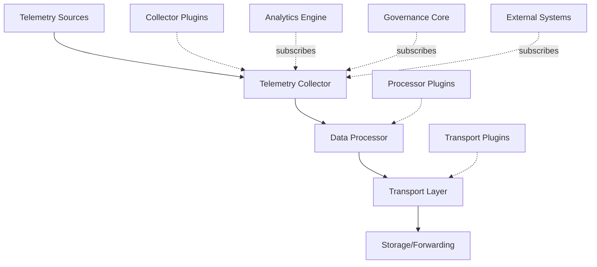
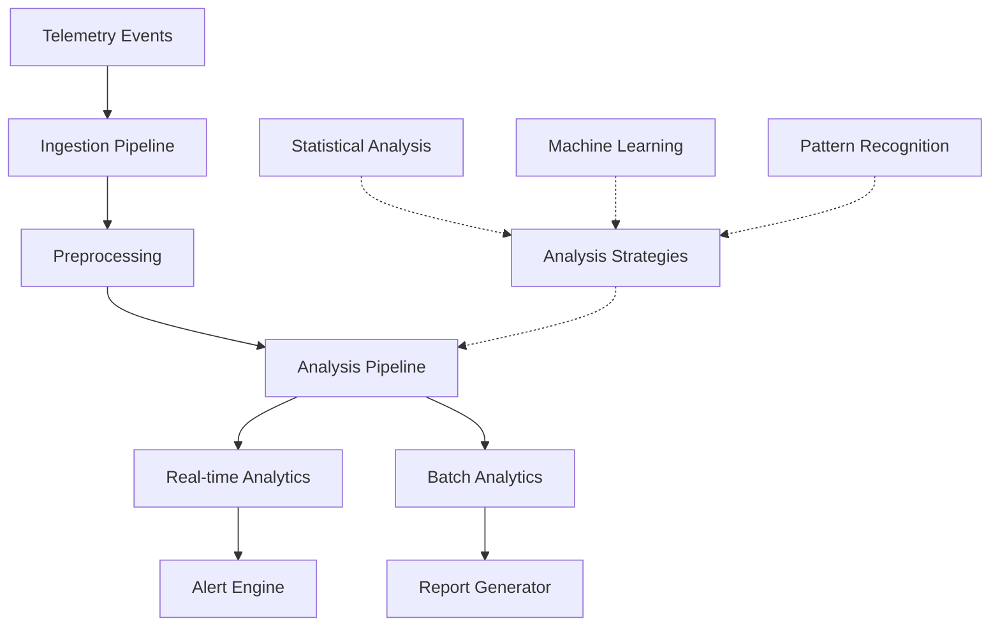
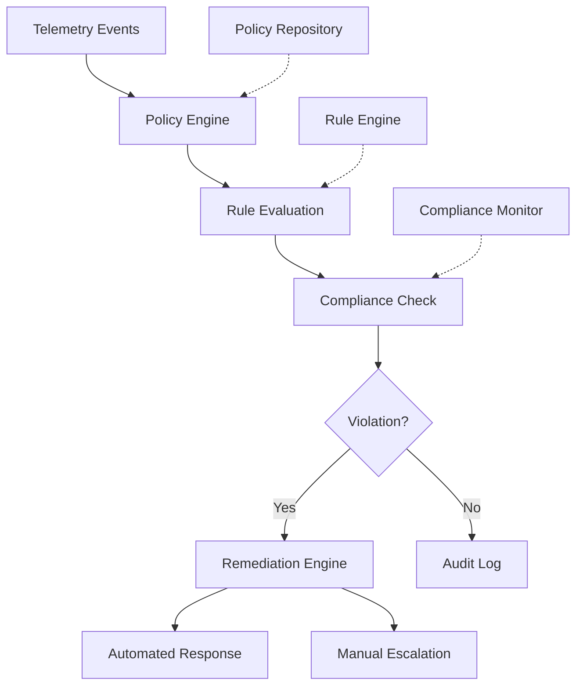
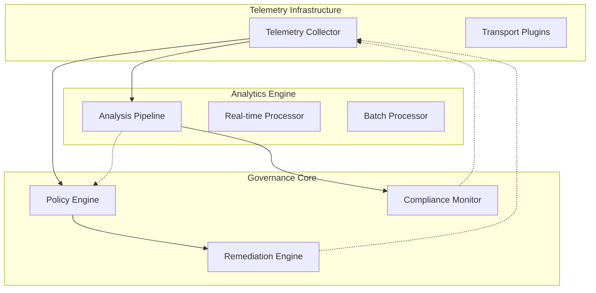

# Peak Masterpiece System Foundation Components Architecture

## Overview

This document presents the architectural design for the three core foundation components of the Peak Masterpiece System: Telemetry Infrastructure, Analytics Engine, and Governance Core. These components are designed to provide a robust, scalable, and maintainable foundation for the entire system, adhering strictly to SOLID, DRY, KISS, and YAGNI principles.

## 1. Telemetry Infrastructure

### 1.1 Architecture Overview

The Telemetry Infrastructure provides a unified, extensible framework for collecting, processing, and distributing telemetry data across all system components. It follows the Observer Pattern with dependency injection for maximum flexibility and testability.



### 1.2 Core Components

#### 1.2.1 TelemetryCollector (Interface Segregation Principle)
```typescript
interface ITelemetryCollector {
  collect(event: TelemetryEvent): Promise<void>;
  subscribe(observer: ITelemetryObserver): IDisposable;
  getMetrics(): TelemetryMetrics;
}

interface ITelemetryObserver {
  onTelemetryEvent(event: TelemetryEvent): Promise<void>;
}

interface IDisposable {
  dispose(): void;
}
```

#### 1.2.2 TelemetryEvent (Single Responsibility Principle)
```typescript
interface TelemetryEvent {
  readonly id: string;
  readonly timestamp: number;
  readonly source: string;
  readonly type: TelemetryEventType;
  readonly data: Record<string, unknown>;
  readonly metadata: TelemetryMetadata;
}

interface TelemetryMetadata {
  readonly version: string;
  readonly environment: string;
  readonly sessionId?: string;
  readonly correlationId?: string;
}
```

#### 1.2.3 Plugin Architecture (Open/Closed Principle)
```typescript
interface ITelemetryPlugin {
  readonly name: string;
  readonly version: string;
  initialize(config: PluginConfig): Promise<void>;
  dispose(): Promise<void>;
}

interface ICollectorPlugin extends ITelemetryPlugin {
  collect(event: TelemetryEvent): Promise<TelemetryEvent>;
}

interface IProcessorPlugin extends ITelemetryPlugin {
  process(events: TelemetryEvent[]): Promise<TelemetryEvent[]>;
}

interface ITransportPlugin extends ITelemetryPlugin {
  transport(events: TelemetryEvent[]): Promise<void>;
}
```

### 1.3 Implementation (Dependency Inversion Principle)

```typescript
class TelemetryInfrastructure implements ITelemetryCollector {
  private readonly observers = new Set<ITelemetryObserver>();
  private readonly plugins = new Map<string, ITelemetryPlugin>();

  constructor(
    private readonly collectorPlugins: ICollectorPlugin[],
    private readonly processorPlugins: IProcessorPlugin[],
    private readonly transportPlugins: ITransportPlugin[]
  ) {}

  async collect(event: TelemetryEvent): Promise<void> {
    // Apply collector plugins
    let processedEvent = event;
    for (const plugin of this.collectorPlugins) {
      processedEvent = await plugin.collect(processedEvent);
    }

    // Notify observers
    await this.notifyObservers(processedEvent);

    // Apply processor plugins
    const processedEvents = await this.applyProcessorPlugins([processedEvent]);

    // Transport
    await this.applyTransportPlugins(processedEvents);
  }

  // ... implementation details
}
```

### 1.4 Configuration (KISS Principle)

```typescript
interface TelemetryConfig {
  enabled: boolean;
  sampling: {
    rate: number; // 0.0 to 1.0
    rules: SamplingRule[];
  };
  plugins: PluginConfig[];
  buffer: {
    size: number;
    flushInterval: number;
  };
}
```

## 2. Analytics Engine

### 2.1 Architecture Overview

The Analytics Engine provides real-time and batch analytics capabilities with a modular pipeline architecture. It implements the Strategy Pattern for different analytical approaches and the Command Pattern for analytical operations.



### 2.2 Core Components

#### 2.2.1 Analysis Pipeline (Single Responsibility Principle)
```typescript
interface IAnalysisPipeline {
  process(events: TelemetryEvent[]): Promise<AnalysisResult[]>;
  addStage(stage: IAnalysisStage): void;
}

interface IAnalysisStage {
  process(events: TelemetryEvent[]): Promise<TelemetryEvent[]>;
  getMetrics(): StageMetrics;
}
```

#### 2.2.2 Analysis Strategies (Strategy Pattern)
```typescript
interface IAnalysisStrategy {
  readonly name: string;
  analyze(data: AnalysisData): Promise<AnalysisResult>;
  supports(dataType: DataType): boolean;
}

class StatisticalAnalysisStrategy implements IAnalysisStrategy {
  // Implementation focused on statistical methods
}

class MachineLearningAnalysisStrategy implements IAnalysisStrategy {
  // Implementation focused on ML models
}
```

#### 2.2.3 Result Aggregation (DRY Principle)
```typescript
interface AnalysisResult {
  readonly id: string;
  readonly timestamp: number;
  readonly strategy: string;
  readonly confidence: number;
  readonly data: AnalysisData;
  readonly insights: Insight[];
}

interface Insight {
  readonly type: InsightType;
  readonly severity: Severity;
  readonly message: string;
  readonly recommendations: Recommendation[];
}
```

### 2.3 Real-time vs Batch Processing (Open/Closed Principle)

```typescript
interface IAnalyticsProcessor {
  process(data: AnalysisData): Promise<AnalysisResult>;
}

class RealTimeAnalyticsProcessor implements IAnalyticsProcessor {
  // Low-latency processing for immediate insights
}

class BatchAnalyticsProcessor implements IAnalyticsProcessor {
  // High-throughput processing for comprehensive analysis
}
```

## 3. Governance Core

### 3.1 Architecture Overview

The Governance Core implements policy-based system governance with rule engines, compliance monitoring, and automated remediation. It follows the Specification Pattern for rule definitions and the Chain of Responsibility Pattern for policy enforcement.



### 3.2 Core Components

#### 3.2.1 Policy Engine (Single Responsibility Principle)
```typescript
interface IPolicyEngine {
  evaluate(event: TelemetryEvent): Promise<PolicyResult>;
  addPolicy(policy: IPolicy): void;
  removePolicy(policyId: string): void;
}

interface IPolicy {
  readonly id: string;
  readonly name: string;
  readonly conditions: PolicyCondition[];
  readonly actions: PolicyAction[];
  isApplicable(event: TelemetryEvent): boolean;
}
```

#### 3.2.2 Rule Engine (Specification Pattern)
```typescript
interface IRule {
  readonly id: string;
  readonly name: string;
  evaluate(context: RuleContext): Promise<RuleResult>;
}

interface RuleContext {
  readonly event: TelemetryEvent;
  readonly systemState: SystemState;
  readonly historicalData: HistoricalData;
}

class CompositeRule implements IRule {
  constructor(private readonly rules: IRule[]) {}

  async evaluate(context: RuleContext): Promise<RuleResult> {
    // Combine rule evaluations
  }
}
```

#### 3.2.3 Remediation Engine (Command Pattern)
```typescript
interface IRemediationAction {
  readonly id: string;
  readonly name: string;
  execute(violation: PolicyViolation): Promise<RemediationResult>;
}

class AutomatedRemediationEngine {
  private readonly actions = new Map<string, IRemediationAction>();

  async remediate(violation: PolicyViolation): Promise<RemediationResult> {
    const action = this.actions.get(violation.requiredAction);
    if (!action) {
      throw new Error(`No remediation action for: ${violation.requiredAction}`);
    }
    return action.execute(violation);
  }
}
```

### 3.3 Compliance Monitoring (Observer Pattern)

```typescript
interface IComplianceMonitor {
  monitor(event: TelemetryEvent): Promise<ComplianceStatus>;
  subscribe(observer: IComplianceObserver): IDisposable;
}

interface IComplianceObserver {
  onComplianceViolation(violation: ComplianceViolation): Promise<void>;
  onComplianceRestored(status: ComplianceStatus): Promise<void>;
}
```

## 4. Component Integration

### 4.1 System Integration Architecture



### 4.2 Interface Definitions

#### 4.2.1 Component Communication
```typescript
interface IComponent {
  readonly id: string;
  readonly name: string;
  initialize(): Promise<void>;
  dispose(): Promise<void>;
  getHealth(): Promise<ComponentHealth>;
}

interface IMessageBus {
  publish(message: Message): Promise<void>;
  subscribe(topic: string, handler: MessageHandler): IDisposable;
}

interface Message {
  readonly id: string;
  readonly topic: string;
  readonly payload: unknown;
  readonly timestamp: number;
  readonly source: string;
}
```

#### 4.2.2 Health Monitoring
```typescript
interface ComponentHealth {
  readonly status: HealthStatus;
  readonly lastCheck: number;
  readonly metrics: HealthMetrics;
  readonly dependencies: DependencyHealth[];
}

enum HealthStatus {
  HEALTHY = 'healthy',
  DEGRADED = 'degraded',
  UNHEALTHY = 'unhealthy',
  UNKNOWN = 'unknown'
}
```

## 5. Design Principles Compliance

### 5.1 SOLID Principles

- **Single Responsibility**: Each component has one primary responsibility
- **Open/Closed**: Components are extensible through plugins and interfaces
- **Liskov Substitution**: Interface implementations are interchangeable
- **Interface Segregation**: Clients depend only on methods they use
- **Dependency Inversion**: High-level modules don't depend on low-level modules

### 5.2 DRY, KISS, YAGNI

- **DRY**: Common functionality extracted into reusable interfaces and base classes
- **KISS**: Simple, focused interfaces with minimal complexity
- **YAGNI**: Only essential features implemented, extensible for future needs

## 6. Performance and Scalability

### 6.1 Performance Requirements

- Telemetry ingestion: 10,000+ events/second
- Analytics processing: <100ms latency for real-time
- Governance evaluation: <50ms per event
- Memory usage: <500MB baseline
- CPU usage: <20% under normal load

### 6.2 Scalability Considerations

- Horizontal scaling through plugin architecture
- Asynchronous processing pipelines
- Efficient data structures and algorithms
- Resource pooling and connection management

## 7. Security and Reliability

### 7.1 Security Measures

- Input validation and sanitization
- Secure plugin loading and execution
- Encrypted data transmission
- Access control and authentication
- Audit logging for all operations

### 7.2 Reliability Features

- Circuit breaker pattern for external dependencies
- Graceful degradation under load
- Comprehensive error handling and recovery
- Health checks and monitoring
- Automated failover mechanisms

## 8. Implementation Roadmap

### 8.1 Phase 1: Core Infrastructure (Weeks 1-4)
- Implement basic telemetry collection
- Create plugin architecture foundation
- Develop core interfaces and abstractions

### 8.2 Phase 2: Analytics Integration (Weeks 5-8)
- Build analysis pipeline framework
- Implement real-time and batch processors
- Create strategy pattern implementations

### 8.3 Phase 3: Governance Implementation (Weeks 9-12)
- Develop policy engine and rule system
- Implement remediation framework
- Create compliance monitoring

### 8.4 Phase 4: Integration and Testing (Weeks 13-16)
- Integrate all three components
- Comprehensive testing and validation
- Performance optimization and tuning

This architecture provides a solid, extensible foundation for the Peak Masterpiece System while maintaining simplicity, maintainability, and adherence to software engineering best practices.