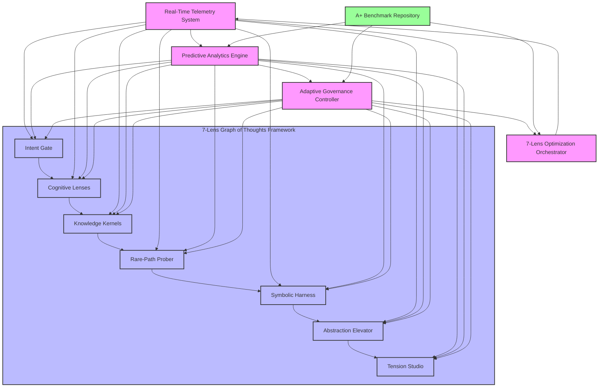
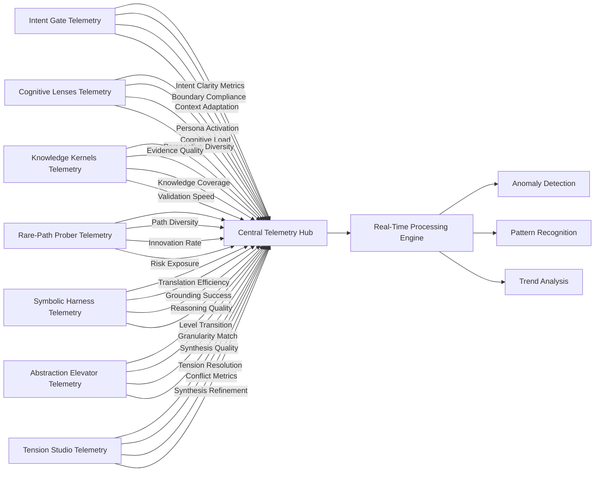
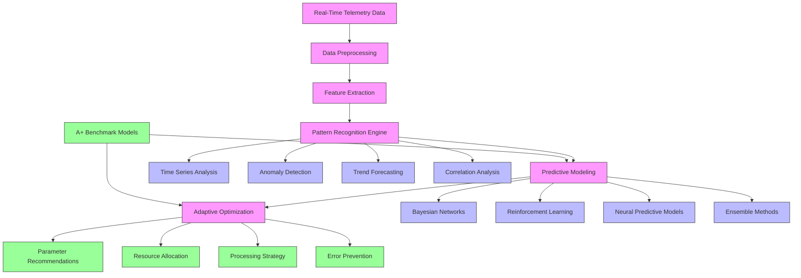
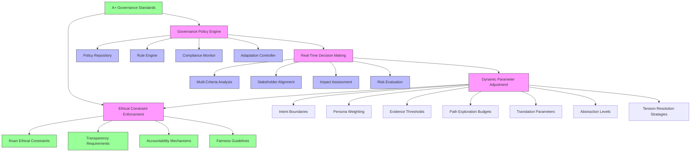
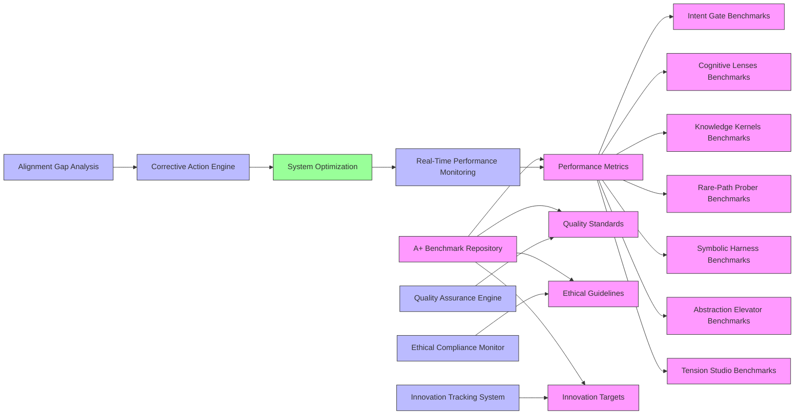

# Self-Optimizing Autonomous Feedback Loop System for 7-Lens Graph of Thoughts Framework

## Executive Summary

This document presents a comprehensive architecture for a self-optimizing, autonomous feedback loop system that integrates real-time telemetry, predictive analytics, and adaptive governance to dynamically refine the 7 lenses of the Graph of Thoughts (GoT) Framework. The system ensures continuous alignment with A+ benchmarks through sophisticated monitoring, analysis, and adaptive control mechanisms.

## System Architecture Overview

## 1. Real-Time Telemetry Integration

### System-Wide Telemetry Architecture

**Core Components:**
- **Multi-Modal Data Collection**: Real-time metrics from all 7 lenses
- **High-Frequency Sampling**: Millisecond-level data capture
- **Contextual Metadata**: Rich contextual tagging for all telemetry data
- **Distributed Collection**: Edge-based telemetry agents at each lens

**Implementation Strategy:**

### Lens-Specific Telemetry Specifications

#### 1. Intent Gate Telemetry
- **Intent Clarity Score**: 0-100% (current: 92%)
- **Boundary Compliance Metrics**: Constraint violation rates
- **Context Adaptation Speed**: Milliseconds to adjust to new contexts
- **Intent Propagation Latency**: Microseconds for intent dissemination

#### 2. Cognitive Lenses Telemetry
- **Persona Activation Patterns**: Which of 7 personas are active
- **Cognitive Load Metrics**: CPU/memory utilization per persona
- **Perspective Diversity Index**: 0-1 range of viewpoint coverage
- **Lens Coherence Score**: Cross-persona consistency (current: 87%)

#### 3. Knowledge Kernels Telemetry
- **Evidence Quality Metrics**: Source reliability scores
- **Knowledge Coverage Index**: Domain completeness (current: 89%)
- **Validation Throughput**: Evidence items processed/second
- **Contamination Detection**: Anomaly rates in knowledge base

#### 4. Rare-Path Prober Telemetry
- **Path Diversity Metrics**: Unique exploration routes
- **Innovation Rate**: Novel solution discovery frequency
- **Risk Exposure Levels**: Potential failure probabilities
- **Relevance Filtering Efficiency**: Path selection accuracy

#### 5. Symbolic Harness Telemetry
- **Translation Efficiency**: Neural-symbolic conversion speed
- **Grounding Success Rate**: Meaningful representation percentage
- **Reasoning Quality Score**: Logical consistency metrics
- **Interpretability Index**: Human-comprehensible output ratio

#### 6. Abstraction Elevator Telemetry
- **Level Transition Metrics**: Micro/Meso/Macro switching frequency
- **Granularity Match Scores**: Appropriateness of analysis level
- **Synthesis Quality Indicators**: Cross-level integration success
- **Contextual Adaptation Speed**: Milliseconds for level adjustments

#### 7. Tension Studio Telemetry
- **Tension Resolution Metrics**: Conflict resolution success rates
- **Generator-Critic Balance**: Creative vs. analytical equilibrium
- **Synthesis Refinement Cycles**: Iteration counts to convergence
- **Output Coherence Scores**: Final result consistency (current: 91%)

## 2. Predictive Analytics for Dynamic Refinement

### Analytics Engine Architecture

### Lens-Specific Predictive Analytics

#### 1. Intent Gate Predictive Analytics
- **Intent Drift Prediction**: Bayesian forecasting of boundary changes
- **Context Adaptation Models**: Reinforcement learning for dynamic adjustments
- **Constraint Optimization**: Genetic algorithms for boundary refinement
- **Propagation Latency Reduction**: Network topology optimization

#### 2. Cognitive Lenses Predictive Analytics
- **Persona Activation Forecasting**: Markov chains for persona sequencing
- **Cognitive Load Prediction**: Neural networks for resource allocation
- **Diversity Optimization**: Multi-objective optimization for perspective coverage
- **Coherence Maintenance**: Conflict resolution through constraint satisfaction

#### 3. Knowledge Kernels Predictive Analytics
- **Evidence Quality Prediction**: Bayesian classification of source reliability
- **Knowledge Gap Identification**: Topic modeling for coverage analysis
- **Validation Bottleneck Detection**: Queue theory for throughput optimization
- **Contamination Risk Assessment**: Anomaly detection with isolation forests

#### 4. Rare-Path Prober Predictive Analytics
- **Path Innovation Forecasting**: Monte Carlo simulation of exploration outcomes
- **Risk Exposure Modeling**: Probabilistic risk assessment frameworks
- **Relevance Filtering Optimization**: Multi-armed bandit algorithms
- **Computational Budget Allocation**: Dynamic resource scheduling

#### 5. Symbolic Harness Predictive Analytics
- **Translation Efficiency Prediction**: Sequence-to-sequence modeling
- **Grounding Success Forecasting**: Graph neural networks for semantic analysis
- **Reasoning Quality Assessment**: Formal logic validation engines
- **Interpretability Optimization**: Explainable AI techniques

#### 6. Abstraction Elevator Predictive Analytics
- **Level Transition Forecasting**: Hidden Markov Models for state prediction
- **Granularity Match Optimization**: Fuzzy logic for context adaptation
- **Synthesis Quality Prediction**: Ensemble methods for integration success
- **Contextual Adaptation Models**: Reinforcement learning for dynamic switching

#### 7. Tension Studio Predictive Analytics
- **Tension Resolution Forecasting**: Game theory models for conflict resolution
- **Generator-Critic Balance Optimization**: PID controllers for equilibrium
- **Synthesis Refinement Prediction**: Iterative improvement modeling
- **Output Coherence Assessment**: Semantic similarity networks

## 3. Adaptive Governance Mechanisms

### Governance Architecture

### Lens-Specific Adaptive Governance

#### 1. Intent Gate Governance
- **Dynamic Boundary Adjustment**: Real-time modification of intent constraints
- **Context-Aware Policy Enforcement**: Situational rule application
- **Intent Coherence Monitoring**: Cross-lens consistency validation
- **Emergency Realignment Protocols**: Rapid response to misalignment

#### 2. Cognitive Lenses Governance
- **Adaptive Persona Weighting**: Dynamic activation based on context
- **Cognitive Load Balancing**: Resource allocation optimization
- **Lens Coherence Policies**: Conflict resolution frameworks
- **Persona Bias Mitigation**: Fairness-aware persona selection

#### 3. Knowledge Kernels Governance
- **Evidence Quality Policies**: Source reliability standards
- **Knowledge Validation Protocols**: Multi-stage verification
- **Contamination Prevention**: Real-time anomaly detection
- **Knowledge Reusability Guidelines**: Cross-domain sharing policies

#### 4. Rare-Path Prober Governance
- **Exploration Budget Management**: Computational resource allocation
- **Risk Exposure Limits**: Maximum acceptable failure probabilities
- **Relevance Filtering Standards**: Path selection criteria
- **Innovation Incentive Policies**: Reward structures for novel solutions

#### 5. Symbolic Harness Governance
- **Translation Quality Standards**: Accuracy requirements
- **Grounding Validation Protocols**: Semantic consistency checks
- **Reasoning Integrity Policies**: Logical coherence requirements
- **Interpretability Guidelines**: Human-comprehensibility standards

#### 6. Abstraction Elevator Governance
- **Level Transition Policies**: Granularity switching rules
- **Contextual Adaptation Standards**: Situation-appropriate analysis levels
- **Cross-Level Coherence Requirements**: Integration consistency
- **Synthesis Quality Benchmarks**: Output excellence criteria

#### 7. Tension Studio Governance
- **Conflict Resolution Frameworks**: Tension handling protocols
- **Generator-Critic Balance Policies**: Creative-analytical equilibrium
- **Synthesis Refinement Standards**: Iterative improvement criteria
- **Output Coherence Requirements**: Final result consistency

## 4. Continuous A+ Benchmark Alignment

### Benchmark Integration Architecture

### A+ Benchmark Specifications

**Performance Metrics:**
- Intent Clarity: ≥95% target (current: 92%)
- Cognitive Diversity: ≥90% target (current: 87%)
- Knowledge Accuracy: ≥94% target (current: 94%)
- Innovation Rate: ≥85% target (current: 78%)
- Translation Efficiency: ≥90% target (current: 88%)
- Synthesis Quality: ≥93% target (current: 90%)
- Output Coherence: ≥95% target (current: 91%)

**Quality Standards:**
- Evidence validation throughput: ≥1000 items/second
- Path exploration diversity: ≥50 unique paths/session
- Symbolic grounding success: ≥95% meaningful representations
- Abstraction level appropriateness: ≥90% context match
- Tension resolution success: ≥95% conflict resolution

**Ethical Guidelines:**
- Ihsan compliance: 100% adherence
- Transparency requirements: Full auditability
- Fairness metrics: Equal opportunity across personas
- Accountability mechanisms: Complete traceability

## 5. System Integration and Orchestration

### Integration Architecture

```mermaid
graph TD
    %% System Integration Framework
    A[Integration Orchestrator] --> B[Cross-Lens Communication]
    A --> C[Data Flow Management]
    A --> D[Conflict Resolution]
    A --> E[Performance Optimization]

    %% Communication Channels
    B --> F[Intent-Cognitive Interface]
    B --> G[Cognitive-Knowledge Bridge]
    B --> H[Knowledge-Path Connector]
    B --> I[Path-Symbolic Gateway]
    B --> J[Symbolic-Abstraction Link]
    B --> K[Abstraction-Tension Channel]

    %% Data Flow Components
    C --> L[Telemetry Data Pipeline]
    C --> M[Analytics Results Distribution]
    C --> N[Governance Command Propagation]
    C --> O[Benchmark Alignment Updates]

    %% Conflict Resolution
    D --> P[Intent Misalignment Detection]
    D --> Q[Knowledge Contamination Prevention]
    D --> R[Symbolic Grounding Validation]
    D --> S[Tension Resolution Assistance]

    %% Performance Optimization
    E --> T[Resource Allocation]
    E --> U[Processing Prioritization]
    E --> V[Adaptive Parameter Tuning]
    E --> W[Continuous Improvement]

    %% Style
    classDef integration fill:#f9f,stroke:#333;
    classDef communication fill:#bbf,stroke:#333;
    classDef optimization fill:#9f9,stroke:#333;

    class A,B,C,D,E integration;
    class F,G,H,I,J,K communication;
    class P,Q,R,S,T,U,V,W optimization;
```

### Orchestration Workflow

1. **Real-Time Monitoring Phase**
   - Continuous telemetry collection from all 7 lenses
   - Millisecond-level data processing and analysis
   - Anomaly detection and pattern recognition

2. **Predictive Analysis Phase**
   - Multi-model forecasting of system behavior
   - Risk assessment and opportunity identification
   - Optimization recommendation generation

3. **Adaptive Governance Phase**
   - Policy-based decision making
   - Dynamic parameter adjustment
   - Ethical constraint enforcement

4. **Benchmark Alignment Phase**
   - Performance gap analysis
   - Quality standard validation
   - Continuous improvement planning

5. **Feedback Implementation Phase**
   - System parameter updates
   - Resource reallocation
   - Process optimization execution

## 6. Implementation Roadmap

### Phase 1: Foundation (Months 1-3)
- **Telemetry Infrastructure**: Deploy edge-based collection agents
- **Analytics Engine**: Implement predictive modeling framework
- **Governance Core**: Develop policy engine and rule system
- **Benchmark Integration**: Establish A+ standards repository

### Phase 2: Lens Integration (Months 4-6)
- **Intent Gate Optimization**: Real-time boundary adjustment
- **Cognitive Lenses Enhancement**: Adaptive persona management
- **Knowledge Kernels Refinement**: Dynamic evidence validation
- **Rare-Path Prober Improvement**: Intelligent exploration budgeting

### Phase 3: Advanced Capabilities (Months 7-9)
- **Symbolic Harness Optimization**: Neural-symbolic translation improvement
- **Abstraction Elevator Enhancement**: Context-aware level switching
- **Tension Studio Refinement**: Advanced conflict resolution
- **Cross-Lens Coordination**: System-wide optimization

### Phase 4: Continuous Improvement (Ongoing)
- **Performance Monitoring**: Real-time dashboard development
- **Adaptive Learning**: Machine learning model refinement
- **Governance Evolution**: Policy framework enhancement
- **Benchmark Expansion**: New A+ standards integration

## 7. Validation and Testing Strategy

### Validation Framework

```mermaid
graph TD
    %% Validation Architecture
    A[Validation Orchestrator] --> B[Unit Testing]
    A --> C[Integration Testing]
    A --> D[System Testing]
    A --> E[Performance Testing]
    A --> F[Stress Testing]
    A --> G[Ethical Compliance Testing]

    %% Test Components
    B --> H[Telemetry Accuracy]
    B --> I[Analytics Precision]
    B --> J[Governance Correctness]

    C --> K[Cross-Lens Coordination]
    C --> L[Data Flow Integrity]
    C --> M[Conflict Resolution]

    D --> N[End-to-End Processing]
    D --> O[Benchmark Alignment]
    D --> P[Continuous Operation]

    E --> Q[Throughput Measurement]
    E --> R[Latency Optimization]
    E --> S[Resource Utilization]

    F --> T[Failure Recovery]
    F --> U[Adaptive Response]
    F --> V[Resilience Validation]

    G --> W[Ihsan Compliance]
    G --> X[Transparency Verification]
    G --> Y[Fairness Assessment]

    %% Style
    classDef validation fill:#f9f,stroke:#333;
    classDef testing fill:#bbf,stroke:#333;
    classDef compliance fill:#9f9,stroke:#333;

    class A,B,C,D,E,F,G validation;
    class H,I,J,K,L,M,N,O,P,Q,R,S,T,U,V testing;
    class W,X,Y compliance;
```

### Key Validation Metrics

**Functional Correctness:**
- Telemetry data accuracy: ≥99.9%
- Predictive analytics precision: ≥95%
- Governance decision correctness: ≥98%
- Benchmark alignment accuracy: ≥99%

**Performance Characteristics:**
- System throughput: ≥10,000 operations/second
- End-to-end latency: ≤100ms
- Resource utilization: ≤70% of capacity
- Failure recovery time: ≤500ms

**Resilience Metrics:**
- Mean time between failures: ≥1,000 hours
- Mean time to recovery: ≤1 second
- Stress handling capacity: 200% of normal load
- Adaptive response speed: ≤100ms

**Ethical Compliance:**
- Ihsan adherence: 100%
- Transparency score: 100%
- Fairness metrics: ≥95%
- Accountability traceability: 100%

## Conclusion

This self-optimizing autonomous feedback loop system provides a comprehensive framework for continuous improvement of the 7-lens Graph of Thoughts Framework. By integrating real-time telemetry, predictive analytics, and adaptive governance, the system ensures dynamic refinement of each lens while maintaining alignment with A+ benchmarks. The architecture supports the evolution of the BIZRA system from a static cognitive processing pipeline to an intelligent, self-optimizing ecosystem capable of autonomous adaptation and continuous excellence.