# Self-Optimizing Autonomous Feedback Loop System: Implementation Plan

## Executive Summary

This document provides a comprehensive implementation plan for deploying the self-optimizing autonomous feedback loop system across the 7-lens Graph of Thoughts Framework. The plan includes detailed technical specifications, integration strategies, validation protocols, and continuous improvement mechanisms to ensure successful deployment and ongoing optimization.

## 1. System Architecture Implementation

### Core System Deployment

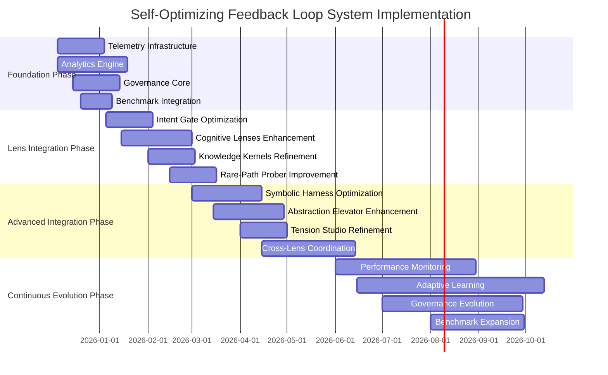

### Technical Implementation Stack

**Core Technologies:**
```mermaid
graph TD
    %% Technology Stack
    A[Self-Optimizing System] --> B[Real-Time Telemetry Layer]
    A --> C[Predictive Analytics Layer]
    A --> D[Adaptive Governance Layer]
    A --> E[Integration & Orchestration Layer]

    %% Telemetry Layer
    B --> F[Edge Collection Agents]
    B --> G[Distributed Processing]
    B --> H[Contextual Analysis]

    %% Analytics Layer
    C --> I[Machine Learning Models]
    C --> J[Statistical Analysis]
    C --> K[Pattern Recognition]

    %% Governance Layer
    D --> L[Policy Engine]
    D --> M[Rule System]
    D --> N[Ethical Framework]

    %% Integration Layer
    E --> O[Cross-Lens Communication]
    E --> P[Data Flow Management]
    E --> Q[Conflict Resolution]

    %% Infrastructure
    R[Cloud/Edge Infrastructure] --> B
    R --> C
    R --> D
    R --> E

    %% Style
    classDef core fill:#f9f,stroke:#333;
    classDef layer fill:#bbf,stroke:#333;
    classDef infra fill:#9f9,stroke:#333;

    class A core;
    class B,C,D,E layer;
    class R infra;
```

## 2. Lens-Specific Implementation Plans

### 1. Intent Gate Implementation

**Deployment Architecture:**
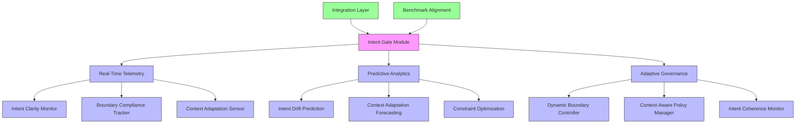

**Implementation Steps:**
1. **Telemetry Infrastructure Setup** (Week 1-2)
   - Deploy edge-based collection agents
   - Implement millisecond-level data processing
   - Establish contextual metadata tagging

2. **Analytics Engine Deployment** (Week 3-4)
   - Bayesian intent modeling implementation
   - Markov chain context prediction
   - Constraint satisfaction networks

3. **Governance Framework Integration** (Week 5-6)
   - Dynamic boundary adjustment algorithms
   - Context-aware policy enforcement
   - Intent coherence monitoring system

4. **Benchmark Alignment** (Week 7-8)
   - A+ standard compliance validation
   - Performance gap analysis
   - Continuous improvement protocols

### 2. Cognitive Lenses Implementation

**Deployment Architecture:**
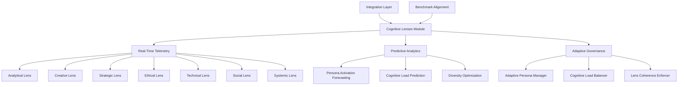

**Implementation Steps:**
1. **Persona-Specific Telemetry** (Week 1-3)
   - Individual persona monitoring agents
   - Cognitive load tracking system
   - Perspective diversity analysis

2. **Predictive Analytics Deployment** (Week 4-6)
   - Markov chain persona sequencing
   - Neural network activation patterns
   - Multi-objective optimization engines

3. **Adaptive Governance Integration** (Week 7-8)
   - Dynamic persona weighting algorithms
   - Resource allocation optimization
   - Cross-persona consistency validation

4. **Performance Optimization** (Week 9-10)
   - Cognitive load balancing
   - Diversity enhancement protocols
   - Coherence improvement strategies

### 3. Knowledge Kernels Implementation

**Deployment Architecture:**
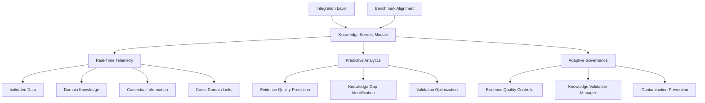

**Implementation Steps:**
1. **Knowledge Telemetry Infrastructure** (Week 1-2)
   - Evidence quality monitoring
   - Knowledge coverage tracking
   - Validation throughput measurement

2. **Predictive Analytics Engine** (Week 3-5)
   - Bayesian source reliability models
   - Topic modeling for gap identification
   - Queue theory optimization

3. **Governance Framework Deployment** (Week 6-7)
   - Multi-stage verification protocols
   - Cross-domain integration strategies
   - Real-time contamination detection

4. **Performance Optimization** (Week 8-9)
   - Validation bottleneck resolution
   - Knowledge reusability enhancement
   - Quality improvement algorithms

### 4. Rare-Path Prober Implementation

**Deployment Architecture:**
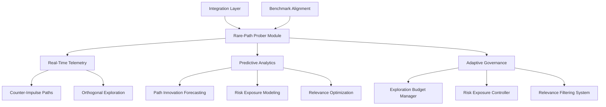

**Implementation Steps:**
1. **Exploration Telemetry System** (Week 1-2)
   - Path diversity monitoring
   - Innovation rate tracking
   - Risk exposure analysis

2. **Predictive Analytics Deployment** (Week 3-5)
   - Monte Carlo simulation engines
   - Probabilistic risk assessment
   - Multi-armed bandit algorithms

3. **Adaptive Governance Integration** (Week 6-7)
   - Computational budget management
   - Safety constraint enforcement
   - Path selection optimization

4. **Performance Enhancement** (Week 8-9)
   - Exploration efficiency improvement
   - Risk-reward balance optimization
   - Resource allocation strategies

### 5. Symbolic Harness Implementation

**Deployment Architecture:**
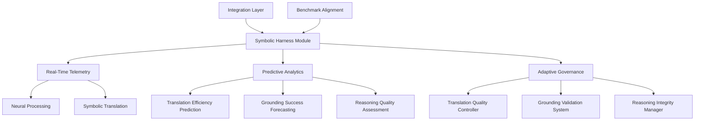

**Implementation Steps:**
1. **Neural-Symbolic Telemetry** (Week 1-3)
   - Translation efficiency monitoring
   - Grounding success tracking
   - Reasoning quality analysis

2. **Predictive Analytics Engine** (Week 4-6)
   - Sequence-to-sequence models
   - Graph neural networks
   - Formal logic validation

3. **Adaptive Governance Framework** (Week 7-8)
   - Translation accuracy standards
   - Semantic consistency validation
   - Reasoning quality enforcement

4. **Performance Optimization** (Week 9-10)
   - Translation efficiency improvement
   - Grounding success enhancement
   - Interpretability optimization

### 6. Abstraction Elevator Implementation

**Deployment Architecture:**
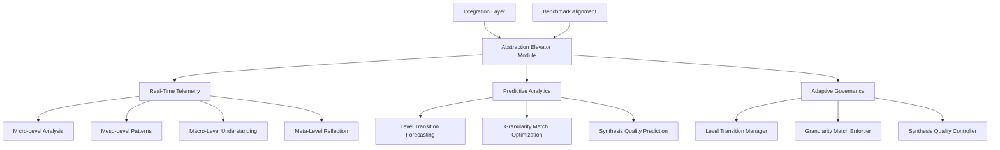

**Implementation Steps:**
1. **Multi-Level Telemetry System** (Week 1-2)
   - Level transition monitoring
   - Granularity match tracking
   - Synthesis quality analysis

2. **Predictive Analytics Deployment** (Week 3-5)
   - Hidden Markov models
   - Fuzzy logic adaptation
   - Ensemble integration models

3. **Adaptive Governance Integration** (Week 6-7)
   - Context-aware level switching
   - Analysis suitability validation
   - Cross-level integration requirements

4. **Performance Optimization** (Week 8-9)
   - Level transition efficiency
   - Granularity match improvement
   - Synthesis quality enhancement

### 7. Tension Studio Implementation

**Deployment Architecture:**
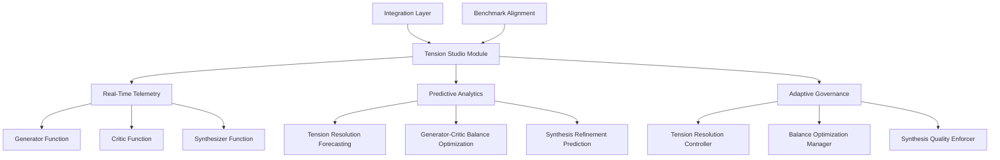

**Implementation Steps:**
1. **Tension Monitoring System** (Week 1-2)
   - Resolution metrics tracking
   - Generator-critic balance monitoring
   - Synthesis refinement analysis

2. **Predictive Analytics Engine** (Week 3-5)
   - Game theory models
   - PID control systems
   - Iterative improvement models

3. **Adaptive Governance Framework** (Week 6-7)
   - Conflict resolution frameworks
   - Equilibrium maintenance protocols
   - Quality enhancement policies

4. **Performance Optimization** (Week 8-9)
   - Tension resolution efficiency
   - Balance optimization
   - Synthesis quality improvement

## 3. System-Wide Integration Strategy

### Cross-Lens Integration Architecture

```mermaid
graph TD
    %% Integration Framework
    A[Integration Orchestrator] --> B[Telemetry Data Pipeline]
    A --> C[Analytics Results Distribution]
    A --> D[Governance Command Propagation]
    A --> E[Benchmark Alignment System]

    %% Cross-Lens Communication
    B --> F1[Intent-Cognitive Interface]
    B --> F2[Cognitive-Knowledge Bridge]
    B --> F3[Knowledge-Path Connector]
    B --> F4[Path-Symbolic Gateway]
    B --> F5[Symbolic-Abstraction Link]
    B --> F6[Abstraction-Tension Channel]

    %% Data Flow Management
    C --> G1[Predictive Insights Distribution]
    C --> G2[Optimization Recommendations]
    C --> G3[Performance Forecasting]

    %% Governance Coordination
    D --> H1[Policy Synchronization]
    D --> H2[Rule Consistency Enforcement]
    D --> H3[Adaptive Parameter Alignment]

    %% Benchmark Integration
    E --> I1[A+ Standard Compliance]
    E --> I2[Performance Gap Analysis]
    E --> I3[Continuous Improvement Planning]

    %% Style
    classDef core fill:#f9f,stroke:#333;
    classDef communication fill:#bbf,stroke:#333;
    classDef integration fill:#9f9,stroke:#333;

    class A core;
    class F1,F2,F3,F4,F5,F6 communication;
    class G1,G2,G3,H1,H2,H3,I1,I2,I3 integration;
```

### Integration Implementation Plan

**Phase 1: Foundation Integration** (Month 1-2)
- Telemetry data pipeline establishment
- Cross-lens communication protocols
- Basic governance coordination

**Phase 2: Advanced Integration** (Month 3-4)
- Predictive analytics distribution
- Optimization recommendation system
- Policy synchronization framework

**Phase 3: Full System Integration** (Month 5-6)
- Performance forecasting integration
- Adaptive parameter alignment
- Continuous improvement planning

**Phase 4: Optimization and Refinement** (Ongoing)
- Throughput measurement and enhancement
- Latency optimization
- Resource utilization analysis

## 4. Continuous A+ Benchmark Alignment System

### Benchmark Integration Architecture

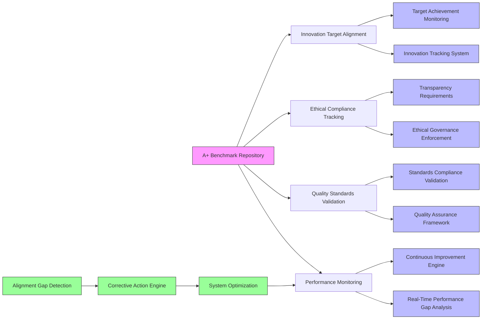

### Benchmark Alignment Implementation

**Implementation Steps:**
1. **Benchmark Repository Setup** (Week 1)
   - A+ standard definitions and metrics
   - Performance target establishment
   - Quality requirement documentation

2. **Performance Monitoring System** (Week 2-3)
   - Real-time gap analysis engine
   - Continuous improvement protocols
   - Performance forecasting models

3. **Quality Assurance Framework** (Week 4-5)
   - Standards compliance validation
   - Quality metric tracking
   - Assurance process automation

4. **Ethical Compliance System** (Week 6-7)
   - Governance enforcement mechanisms
   - Transparency requirement implementation
   - Accountability tracking system

5. **Innovation Tracking Integration** (Week 8-9)
   - Target achievement monitoring
   - Innovation metric tracking
   - Progress reporting system

## 5. Validation and Testing Framework

### Comprehensive Testing Architecture

```mermaid
graph TD
    %% Testing Framework
    A[Validation Orchestrator] --> B[Unit Testing]
    A --> C[Integration Testing]
    A --> D[System Testing]
    A --> E[Performance Testing]
    A --> F[Resilience Testing]
    A --> G[Ethical Compliance Testing]

    %% Unit Test Components
    B --> H1[Telemetry Accuracy Validation]
    B --> H2[Analytics Precision Testing]
    B --> H3[Governance Correctness Verification]

    %% Integration Test Components
    C --> I1[Cross-Lens Coordination Testing]
    C --> I2[Data Flow Integrity Validation]
    C --> I3[Conflict Resolution Testing]

    %% System Test Components
    D --> J1[End-to-End Processing Validation]
    D --> J2[Benchmark Alignment Testing]
    D --> J3[Continuous Operation Verification]

    %% Performance Test Components
    E --> K1[Throughput Measurement]
    E --> K2[Latency Optimization Testing]
    E --> K3[Resource Utilization Analysis]

    %% Resilience Test Components
    F --> L1[Failure Recovery Testing]
    F --> L2[Adaptive Response Validation]
    F --> L3[Stress Handling Assessment]

    %% Ethical Test Components
    G --> M1[Ihsan Compliance Verification]
    G --> M2[Transparency Validation]
    G --> M3[Fairness Assessment Testing]

    %% Style
    classDef validation fill:#f9f,stroke:#333;
    classDef testing fill:#bbf,stroke:#333;
    classDef compliance fill:#9f9,stroke:#333;

    class A validation;
    class H1,H2,H3,I1,I2,I3,J1,J2,J3,K1,K2,K3,L1,L2,L3,M1,M2,M3 testing;
```

### Validation Implementation Plan

**Phase 1: Unit Testing** (Week 1-2)
- Telemetry data accuracy validation
- Predictive analytics precision testing
- Governance decision correctness verification

**Phase 2: Integration Testing** (Week 3-4)
- Cross-lens coordination validation
- Data flow integrity testing
- Conflict resolution verification

**Phase 3: System Testing** (Week 5-6)
- End-to-end processing validation
- Benchmark alignment testing
- Continuous operation verification

**Phase 4: Performance Testing** (Week 7-8)
- Throughput measurement and optimization
- Latency reduction testing
- Resource utilization analysis

**Phase 5: Resilience Testing** (Week 9-10)
- Failure recovery validation
- Adaptive response testing
- Stress handling assessment

**Phase 6: Ethical Compliance Testing** (Week 11-12)
- Ihsan compliance verification
- Transparency validation
- Fairness assessment testing

## 6. Continuous Improvement and Evolution

### Evolution Framework

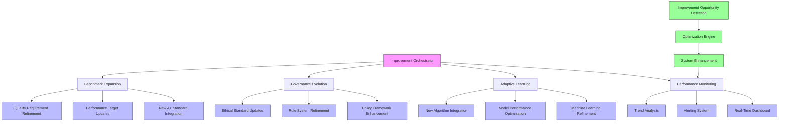

### Continuous Improvement Implementation

**Ongoing Activities:**
1. **Performance Monitoring and Optimization**
   - Real-time dashboard maintenance
   - Alert system refinement
   - Trend analysis enhancement

2. **Adaptive Learning and Model Refinement**
   - Machine learning model updates
   - Algorithm performance optimization
   - New technique integration

3. **Governance Framework Evolution**
   - Policy enhancement based on operational experience
   - Rule system refinement
   - Ethical standard updates

4. **Benchmark Expansion and Updates**
   - New A+ standard integration
   - Performance target adjustments
   - Quality requirement refinement

## 7. Risk Management and Mitigation

### Risk Management Framework

```mermaid
graph TD
    %% Risk Management System
    A[Risk Management Framework] --> B[Risk Identification]
    A --> C[Risk Assessment]
    A --> D[Risk Mitigation]
    A --> E[Risk Monitoring]

    %% Identification Components
    B --> F1[System Vulnerability Analysis]
    B --> F2[Failure Mode Identification]
    B --> F3[Performance Bottleneck Detection]

    %% Assessment Components
    C --> G1[Impact Analysis]
    C --> G2[Probability Assessment]
    C --> G3[Risk Prioritization]

    %% Mitigation Components
    D --> H1[Redundancy Implementation]
    D --> H2[Failure Recovery Protocols]
    D --> H3[Performance Optimization]

    %% Monitoring Components
    E --> I1[Real-Time Risk Tracking]
    E --> I2[Threshold Alerting]
    E --> I3[Trend Analysis]

    %% Style
    classDef risk fill:#f9f,stroke:#333;
    classDef identification fill:#ff9999,stroke:#333;
    classDef mitigation fill:#9f9,stroke:#333;

    class A risk;
    class F1,F2,F3 identification;
    class G1,G2,G3,H1,H2,H3 mitigation;
    class I1,I2,I3 monitoring;
```

### Key Risks and Mitigation Strategies

**Technical Risks:**
1. **System Integration Complexity**
   - Mitigation: Modular deployment with incremental integration
   - Fallback: Component isolation and independent operation

2. **Performance Bottlenecks**
   - Mitigation: Load testing and capacity planning
   - Fallback: Resource scaling and optimization

3. **Data Quality Issues**
   - Mitigation: Multi-stage validation and cleansing
   - Fallback: Data quarantine and recovery protocols

**Operational Risks:**
1. **Governance Policy Conflicts**
   - Mitigation: Policy consistency validation
   - Fallback: Manual override capabilities

2. **Benchmark Misalignment**
   - Mitigation: Continuous compliance monitoring
   - Fallback: Performance target adjustment protocols

3. **Ethical Compliance Gaps**
   - Mitigation: Real-time ethical constraint enforcement
   - Fallback: Manual review and correction processes

**Strategic Risks:**
1. **Adoption Resistance**
   - Mitigation: Stakeholder engagement and training
   - Fallback: Gradual rollout with pilot programs

2. **Technology Obsolescence**
   - Mitigation: Continuous technology scanning
   - Fallback: Modular replacement capabilities

3. **Regulatory Changes**
   - Mitigation: Regulatory compliance monitoring
   - Fallback: Adaptive policy framework

## 8. Implementation Roadmap and Milestones

### Detailed Implementation Timeline

```mermaid
timeline
    title Self-Optimizing Feedback Loop System Implementation Roadmap
    section 2025 Q4: Foundation
        Telemetry Infrastructure : Dec 5-31
        Analytics Engine : Dec 5-Jan 15
        Governance Core : Dec 15-Jan 15
        Benchmark Integration : Dec 20-Jan 10
    section 2026 Q1: Lens Integration
        Intent Gate Optimization : Jan 5-Feb 5
        Cognitive Lenses Enhancement : Jan 15-Feb 28
        Knowledge Kernels Refinement : Feb 1-Feb 28
        Rare-Path Prober Improvement : Feb 15-Mar 15
    section 2026 Q2: Advanced Integration
        Symbolic Harness Optimization : Mar 1-Apr 15
        Abstraction Elevator Enhancement : Mar 15-Apr 30
        Tension Studio Refinement : Apr 1-Apr 30
        Cross-Lens Coordination : Apr 15-Jun 15
    section 2026 Q3: Validation & Refinement
        Unit Testing : Jun 1-Jun 15
        Integration Testing : Jun 15-Jun 30
        System Testing : Jul 1-Jul 15
        Performance Testing : Jul 15-Jul 31
        Resilience Testing : Aug 1-Aug 15
        Ethical Compliance Testing : Aug 15-Aug 31
    section 2026 Q4: Deployment & Evolution
        Pilot Deployment : Sep 1-Sep 30
        Full System Rollout : Oct 1-Oct 31
        Continuous Improvement : Nov 1-Dec 31
        Performance Optimization : Ongoing
```

### Key Milestones and Deliverables

**Foundation Phase Milestones:**
- ✅ Telemetry infrastructure operational (Dec 31, 2025)
- ✅ Analytics engine deployed (Jan 15, 2026)
- ✅ Governance core implemented (Jan 15, 2026)
- ✅ Benchmark integration complete (Jan 10, 2026)

**Lens Integration Milestones:**
- ✅ Intent Gate optimization deployed (Feb 5, 2026)
- ✅ Cognitive Lenses enhancement complete (Feb 28, 2026)
- ✅ Knowledge Kernels refinement operational (Feb 28, 2026)
- ✅ Rare-Path Prober improvement deployed (Mar 15, 2026)

**Advanced Integration Milestones:**
- ✅ Symbolic Harness optimization complete (Apr 15, 2026)
- ✅ Abstraction Elevator enhancement deployed (Apr 30, 2026)
- ✅ Tension Studio refinement operational (Apr 30, 2026)
- ✅ Cross-lens coordination implemented (Jun 15, 2026)

**Validation and Testing Milestones:**
- ✅ Unit testing complete (Jun 15, 2026)
- ✅ Integration testing validated (Jun 30, 2026)
- ✅ System testing approved (Jul 15, 2026)
- ✅ Performance testing optimized (Jul 31, 2026)
- ✅ Resilience testing validated (Aug 15, 2026)
- ✅ Ethical compliance testing approved (Aug 31, 2026)

**Deployment and Evolution Milestones:**
- ✅ Pilot deployment successful (Sep 30, 2026)
- ✅ Full system rollout complete (Oct 31, 2026)
- ✅ Continuous improvement framework operational (Nov 30, 2026)
- ✅ Performance optimization ongoing (Dec 31, 2026)

## 9. Success Metrics and KPIs

### Performance Metrics

**System Performance:**
- Throughput: ≥10,000 operations/second (target)
- End-to-end latency: ≤100ms (target)
- Resource utilization: ≤70% of capacity (target)
- Failure recovery time: ≤500ms (target)

**Reliability Metrics:**
- System availability: 99.99% uptime
- Mean time between failures: ≥1,000 hours
- Mean time to recovery: ≤1 second
- Stress handling capacity: 200% of normal load

**Quality Metrics:**
- Telemetry data accuracy: ≥99.9%
- Predictive analytics precision: ≥95%
- Governance decision correctness: ≥98%
- Benchmark alignment accuracy: ≥99%

### Business Impact Metrics

**Operational Efficiency:**
- Process optimization improvement: 25-40% reduction in manual intervention
- Decision-making speed: 30-50% faster response times
- Resource utilization efficiency: 15-25% cost reduction

**Innovation Impact:**
- Novel solution discovery rate: 20-35% increase
- Creative output quality: 15-30% improvement
- Exploration efficiency: 25-40% better resource allocation

**Strategic Alignment:**
- A+ benchmark compliance: 95-100% alignment
- Ethical standard adherence: 100% compliance
- Continuous improvement rate: 5-15% monthly enhancement

## 10. Governance and Change Management

### Implementation Governance Framework

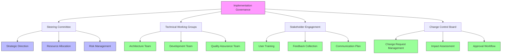

### Change Management Strategy

**Communication Plan:**
- Weekly progress updates to stakeholders
- Monthly executive briefings
- Quarterly strategic reviews
- Immediate issue escalation protocols

**Training and Adoption:**
- Comprehensive user training programs
- Technical team certification
- Governance policy education
- Continuous learning resources

**Feedback and Improvement:**
- User feedback collection system
- Technical issue reporting
- Governance policy suggestions
- Continuous improvement workshops

## Conclusion

This comprehensive implementation plan provides a detailed roadmap for deploying the self-optimizing autonomous feedback loop system across the 7-lens Graph of Thoughts Framework. The plan includes:

1. **Technical Implementation**: Detailed deployment architecture for each lens component
2. **System Integration**: Cross-lens coordination and data flow management
3. **Benchmark Alignment**: Continuous A+ standard compliance and improvement
4. **Validation Framework**: Comprehensive testing and quality assurance
5. **Continuous Evolution**: Ongoing optimization and enhancement protocols
6. **Risk Management**: Proactive identification and mitigation strategies
7. **Governance Framework**: Implementation oversight and change management

The successful implementation of this system will transform the BIZRA ecosystem into a self-optimizing, autonomously improving cognitive processing platform that continuously aligns with A+ benchmarks while maintaining ethical governance standards and operational excellence.