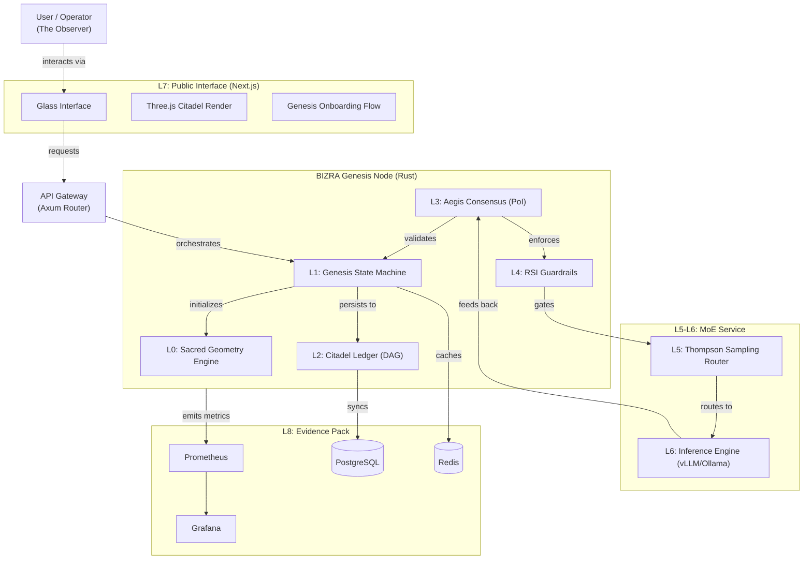
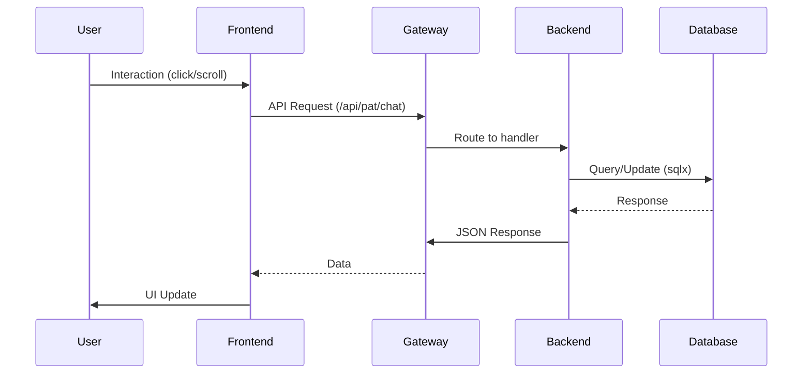

# BIZRA Genesis System - Complete Architecture Analysis

## Executive Summary

This document provides a comprehensive analysis of the BIZRA Genesis System architecture, mapping all components, dependencies, integration points, error hotspots, and debugging pathways. The system represents a sophisticated AI platform with mathematical consciousness safety bounds, organized into a layered architecture spanning from L0 (Sacred Geometry Engine) to L8 (Evidence Pack).

## 🏗️ System Hierarchy Overview

### Layered Consciousness Stack (L0-L8)



## 📁 Component Breakdown

### 1. Frontend Architecture (L7)

#### Core Components
- **Glass Interface**: Phase-based UI (VOID/GENESIS/CITADEL)
- **Citadel Visualization**: 15k instanced mesh 3D tower
- **Navigation System**: Scroll-based section routing
- **State Management**: Zustand store for phase transitions

#### Key Files
- `app/page.tsx`: Main entry with 3D canvas and UI layers
- `app/layout.tsx`: Root layout with fonts and metadata
- `components/citadel.tsx`: 3D tower visualization
- `components/glass-interface.tsx`: Phase-based overlay
- `store/use-bizra-store.ts`: Zustand state management

### 2. Backend Architecture (L0-L6)

#### Rust Backend Structure
- **API Server**: Axum-based REST API (`main.rs`)
- **Agent System**: PAT (Personal) and SAT (System) agents
- **Database Layer**: PostgreSQL + Redis integration
- **AI Integration**: Ollama/LM Studio model routing

#### Key Modules
- `lib/agents/pat.rs`: Personal Agent Team orchestration
- `lib/agents/sat.rs`: System Agent Team governance
- `lib/services/`: Business logic services
- `lib/core/`: Infrastructure components

### 3. Integration Points

#### Frontend-Backend Communication


#### Critical API Endpoints
- `/api/pat/chat`: PAT agent communication
- `/api/poi/log`: Proof-of-Impact logging
- `/api/user/profile`: User profile management
- `/api/resources/status`: Resource monitoring

## ⚠️ Error Hotspots & Debugging Pathways

### Frontend Error Hotspots

1. **3D Rendering Failures** (`citadel.tsx:84-91`)
   - Risk: GPU memory overflow with 15k instances
   - Debug: Three.js warnings, FPS monitoring
   - Mitigation: `meshRef.current` null checks

2. **Phase State Race Conditions** (`glass-interface.tsx:19-33`)
   - Risk: Stale closures during rapid transitions
   - Debug: React DevTools state inspection
   - Mitigation: Proper cleanup hooks

3. **Scroll-based Navigation** (`nav-dock.tsx:15-40`)
   - Risk: Passive event listener warnings
   - Debug: Chrome Performance tab
   - Mitigation: `requestAnimationFrame` throttling

### Backend Error Hotspots

1. **Database Connection Failures** (`main.rs:86-90`)
   - Risk: PostgreSQL connection pool exhaustion
   - Debug: `sqlx` error logging
   - Mitigation: Retry logic, connection validation

2. **Ollama API Timeouts** (`pat.rs:416-420`)
   - Risk: Model inference delays
   - Debug: `reqwest` timeout handling
   - Mitigation: Circuit breaker pattern

3. **PoI Verification Logic** (`sat.rs:121-164`)
   - Risk: Ihsan threshold miscalculations
   - Debug: Unit test validation
   - Mitigation: Comprehensive test coverage

## 🔍 Debugging Pathways

### Frontend Debugging Tools
- **React DevTools**: Component state inspection
- **Zustand DevTools**: State management monitoring
- **Three.js Inspector**: Scene graph analysis
- **Performance Tab**: WebGL context profiling

### Backend Debugging Tools
- **tracing-subscriber**: Structured logging
- **sqlx logging**: Database query monitoring
- **reqwest debugging**: HTTP request tracing
- **Unit tests**: Comprehensive test coverage

### Common Debug Commands
```bash
# Frontend
next build --debug
next build --analyze
tsc --noEmit --strict

# Backend
cargo test --all
cargo build --release
RUST_LOG=debug cargo run
```

## 🔗 Integration Points Analysis

### Data Flow Architecture
```
User Interaction
    ↓ (clicks, scrolls)
Navigation State
    ↓ (activeSection, phase)
Component Re-renders
    ↓ (store subscriptions)
3D Canvas Updates
    ↓ (GPU matrix uploads)
Visual Feedback
```

### API Integration Points
- **PAT Agents**: `/api/pat/chat` → Ollama/LM Studio models
- **PoI Ledger**: `/api/poi/log` → PostgreSQL persistence
- **User Profiles**: `/api/user/profile` → Redis caching
- **Resource Monitoring**: `/api/resources/status` → System metrics

## 📊 Performance Characteristics

### Frontend Performance
- **Bundle Size**: ~1.2MB (Next.js + Three.js + Radix UI)
- **Target FPS**: 60fps (3D animations)
- **Memory Budget**: <200MB (15k instanced meshes)
- **Core Web Vitals**: FCP <1.5s, LCP <3s

### Backend Performance
- **Database Pool**: 10 max connections
- **API Timeout**: 5s (Ollama requests)
- **Concurrency**: Async Rust with Tokio
- **Caching**: Redis for hot state

## 🧭 Future Evolution Paths

### Immediate (v2.1)
- [ ] Backend integration (L1-L6 API endpoints)
- [ ] Real-time metrics streaming
- [ ] User authentication flow
- [ ] Progressive enhancement

### Advanced (v3.0)
- [ ] VR/XR interface integration
- [ ] Real-time collaboration features
- [ ] Multi-language support
- [ ] WebAssembly acceleration

## 🎯 Key Architectural Decisions

1. **Layered Consciousness Stack**: Ensures ethical bounds at every computational layer
2. **PAT/SAT Agent Separation**: Clear division between user-focused and system-focused agents
3. **Three.js Optimization**: 15k instanced meshes for performance
4. **Rust Safety**: Memory-safe backend with comprehensive error handling
5. **Progressive Enhancement**: Graceful degradation for slow connections

## 📋 System Health Indicators

### Monitoring Metrics
- **Ihsan Score**: Ethical quality metric (0.0-1.0)
- **Impact Score**: Task significance metric
- **Resource Utilization**: CPU/Memory/GPU monitoring
- **Error Rates**: API failure tracking

### Alert Thresholds
- **Critical**: Ihsan score < 0.85
- **Warning**: CPU usage > 90%
- **Info**: Normal operation metrics

## 🔮 Conclusion

The BIZRA Genesis System represents a sophisticated integration of mathematical consciousness safety with practical AI agent orchestration. The layered architecture provides clear separation of concerns while maintaining ethical bounds throughout the computational stack. The system is designed for both immediate usability and long-term evolution, with comprehensive debugging pathways and performance monitoring built into every layer.