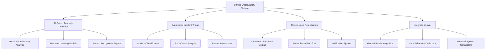
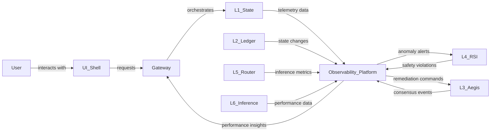
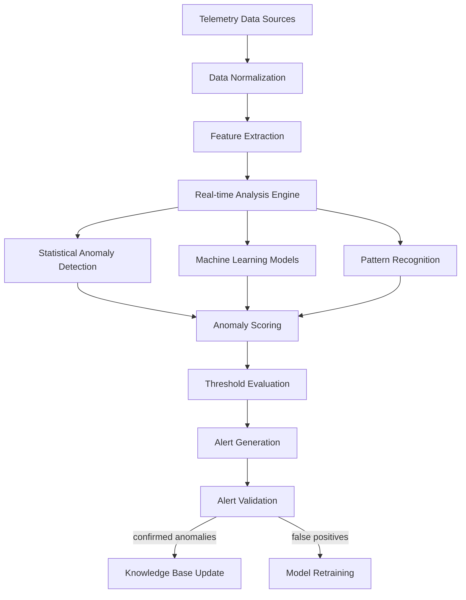
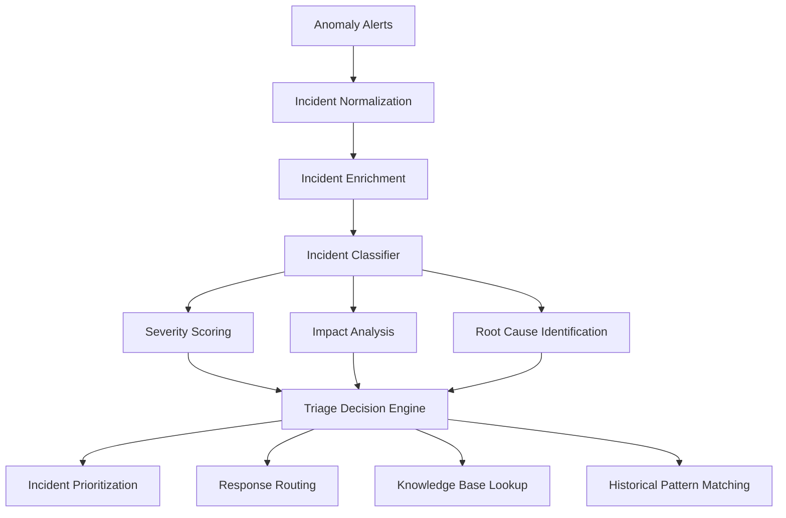
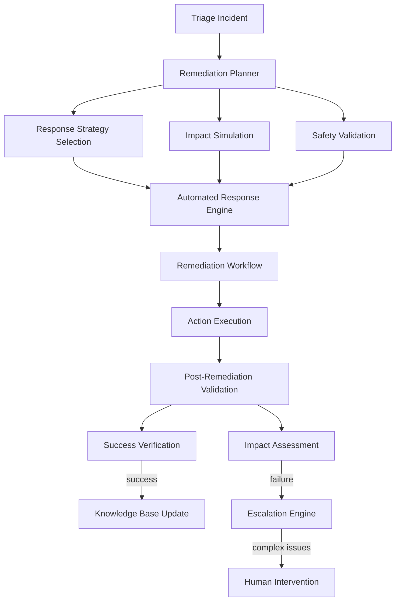
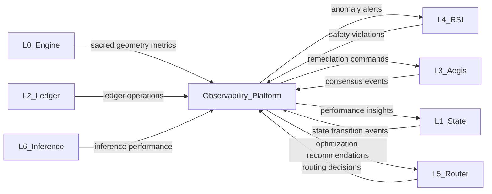
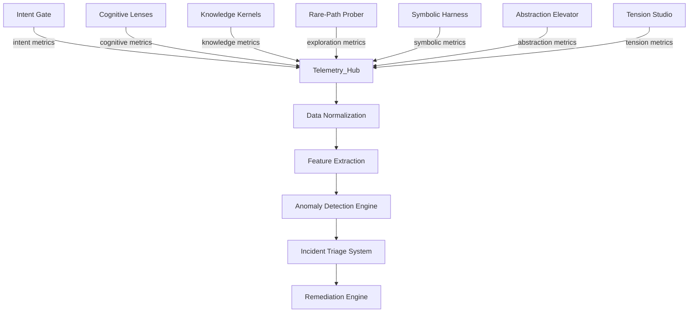

# Unified Observability Platform Architecture

## Executive Summary

This document presents the architecture for a unified observability platform with AI-driven anomaly detection, automated incident triage, and closed-loop remediation. The platform integrates with the existing BIZRA Genesis Node architecture and leverages the multi-dimensional resilience framework.

## 1. Platform Overview

### 1.1 Core Components

### 1.2 Integration with Existing Architecture

## 2. AI-Driven Anomaly Detection System

### 2.1 Architecture

### 2.2 Lens-Specific Anomaly Detection

#### 2.2.1 Intent Gate Lens
- **Telemetry Sources**: Intent clarity metrics, boundary compliance events, context adaptation signals
- **Anomaly Types**: Intent drift, boundary violations, context mismatch
- **Detection Methods**: Bayesian intent modeling, Markov chain context prediction

#### 2.2.2 Cognitive Lenses
- **Telemetry Sources**: Persona activation patterns, cognitive load metrics, lens coherence scores
- **Anomaly Types**: Persona imbalance, cognitive overload, perspective conflicts
- **Detection Methods**: Neural network activation patterns, reinforcement learning adaptation

#### 2.2.3 CI/CD Pipelines Lens
- **Telemetry Sources**: Pipeline health metrics, build/deployment events, resource utilization
- **Anomaly Types**: Pipeline failures, dependency conflicts, performance bottlenecks
- **Detection Methods**: Queue theory optimization, resource allocation models

### 2.3 Implementation Requirements

- **Real-time Processing**: ≤100ms latency for anomaly detection
- **Accuracy Targets**: ≥95% precision, ≥90% recall
- **Scalability**: Handle 10,000+ metrics/second
- **Model Training**: Continuous learning with feedback loop

## 3. Automated Incident Triage System

### 3.1 Architecture

### 3.2 Triage Workflow

1. **Incident Normalization**: Standardize incident format and metadata
2. **Enrichment**: Add contextual information from knowledge bases
3. **Classification**: Categorize by type, severity, and affected components
4. **Root Cause Analysis**: Identify underlying causes using causal analysis
5. **Impact Assessment**: Determine system-wide effects
6. **Prioritization**: Assign urgency based on business impact
7. **Routing**: Direct to appropriate response team/automation

### 3.3 Lens-Specific Triage

#### 3.3.1 Documentation Lens (G8)
- **Incident Types**: Documentation gaps, outdated content, compliance violations
- **Triage Methods**: Knowledge coverage analysis, documentation quality metrics
- **Response**: Automated documentation generation, compliance monitoring

#### 3.3.2 Feedback Loops Lens (G11)
- **Incident Types**: Feedback processing failures, user satisfaction drops
- **Triage Methods**: Feedback pattern recognition, user sentiment analysis
- **Response**: Automated feedback responses, experience prediction

#### 3.3.3 CI/CD Lens (G6)
- **Incident Types**: Pipeline failures, deployment risks, resource constraints
- **Triage Methods**: Pipeline failure analysis, risk assessment models
- **Response**: Automated pipeline recovery, capacity planning

## 4. Closed-Loop Remediation System

### 4.1 Architecture

### 4.2 Remediation Strategies

#### 4.2.1 Automated Responses
- **Self-Healing**: Automatic correction of common issues
- **Configuration Adjustments**: Dynamic parameter tuning
- **Resource Allocation**: Automatic scaling and load balancing

#### 4.2.2 Semi-Automated Responses
- **Guided Remediation**: Step-by-step automated guidance
- **Approval Workflows**: Human-in-the-loop validation
- **Fallback Mechanisms**: Safe rollback procedures

#### 4.2.3 Manual Escalation
- **Complex Incident Handling**: Human expert intervention
- **Emergency Protocols**: Critical system protection
- **Continuous Learning**: Capture manual resolutions for automation

### 4.3 Lens-Specific Remediation

#### 4.3.1 Intent Gate Lens
- **Remediation Actions**: Boundary adjustment, context adaptation, intent realignment
- **Verification**: Intent coherence validation, constraint satisfaction

#### 4.3.2 Cognitive Lenses
- **Remediation Actions**: Persona rebalancing, cognitive load optimization, perspective integration
- **Verification**: Lens coherence scoring, cognitive consistency validation

#### 4.3.3 CI/CD Lens
- **Remediation Actions**: Pipeline recovery, dependency resolution, resource optimization
- **Verification**: Pipeline health monitoring, deployment safety analysis

## 5. Integration Architecture

### 5.1 Genesis Node Integration

### 5.2 Lens Telemetry Collection

## 6. Implementation Roadmap

### 6.1 Phase 1: Foundation (Months 1-3)
- **Telemetry Infrastructure**: Deploy edge-based collection agents
- **Anomaly Detection Core**: Implement statistical and ML-based detection
- **Basic Triage System**: Develop incident classification and routing
- **Simple Remediation**: Build automated response engine

### 6.2 Phase 2: Advanced Capabilities (Months 4-6)
- **AI Model Integration**: Deploy trained anomaly detection models
- **Advanced Triage**: Implement root cause analysis and impact assessment
- **Closed-Loop Automation**: Develop verification and feedback systems
- **Lens-Specific Modules**: Create specialized components for each lens

### 6.3 Phase 3: Full Integration (Months 7-9)
- **Genesis Node Integration**: Connect with all L0-L6 components
- **Cross-Lens Coordination**: Implement system-wide optimization
- **Continuous Learning**: Establish model retraining pipelines
- **Benchmark Alignment**: Ensure A+ standard compliance

### 6.4 Phase 4: Continuous Evolution (Ongoing)
- **Performance Monitoring**: Real-time dashboard and alerting
- **Adaptive Learning**: Continuous model improvement
- **Governance Evolution**: Policy framework enhancement
- **System Optimization**: Ongoing performance tuning

## 7. Validation Framework

### 7.1 Key Validation Metrics
- **Detection Accuracy**: ≥95% precision, ≥90% recall for anomalies
- **Triage Effectiveness**: ≥90% correct classification and prioritization
- **Remediation Success**: ≥85% automated resolution rate
- **System Availability**: 99.99% uptime target
- **Response Time**: ≤5 seconds mean time to remediation

### 7.2 Continuous Monitoring
- Real-time performance dashboards
- Automated compliance validation
- Regular capability assessments
- Continuous improvement planning

## 8. Technical Specifications

### 8.1 Performance Requirements
- **Throughput**: 10,000+ metrics/second processing
- **Latency**: ≤100ms anomaly detection, ≤500ms remediation
- **Availability**: 99.99% system uptime
- **Scalability**: Horizontal scaling across multiple nodes

### 8.2 Integration Requirements
- **Genesis Node**: REST/gRPC APIs for telemetry and control
- **Lens Systems**: Standardized telemetry formats
- **External Systems**: Pluggable connector architecture
- **Data Storage**: Time-series database integration

### 8.3 Security Requirements
- **Authentication**: Mutual TLS for all communications
- **Authorization**: Role-based access control
- **Encryption**: AES-256 for data at rest and in transit
- **Audit**: Comprehensive logging and monitoring

## 9. Conclusion

This unified observability platform architecture provides a comprehensive framework for AI-driven anomaly detection, automated incident triage, and closed-loop remediation. By integrating with the existing BIZRA Genesis Node architecture and leveraging the multi-dimensional resilience framework, the platform ensures robust, maintainable, and continuously improving operational excellence across all system lenses.