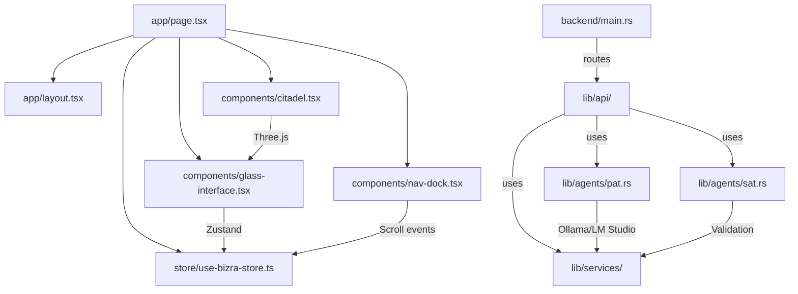
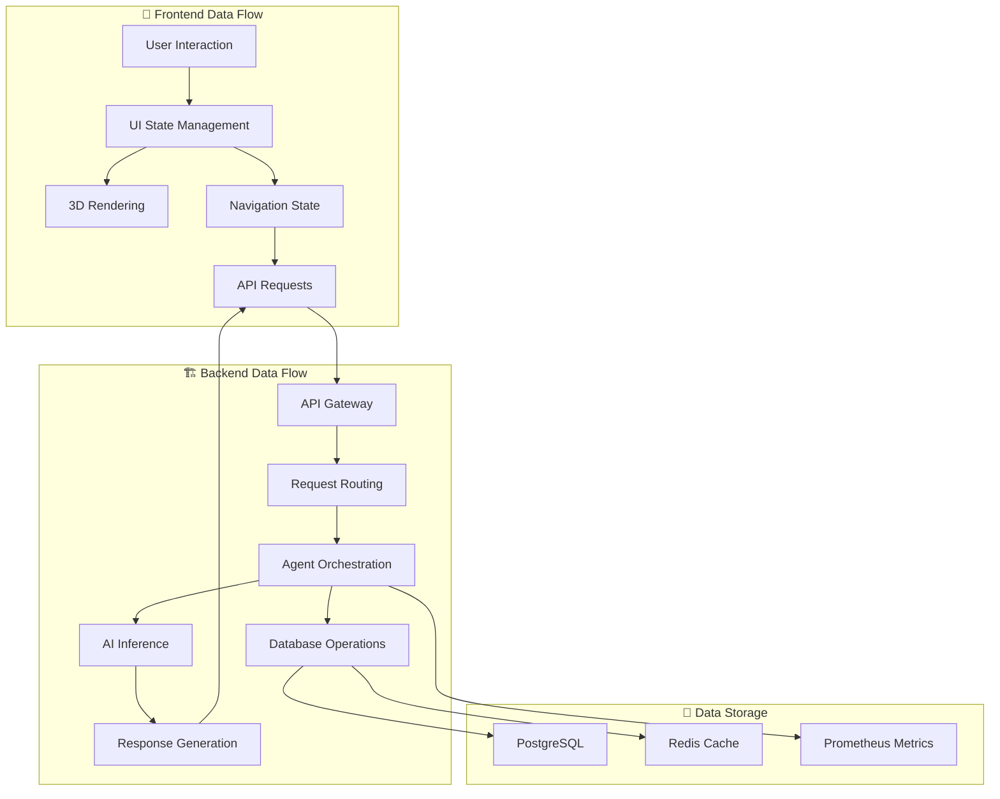
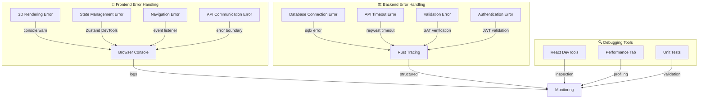
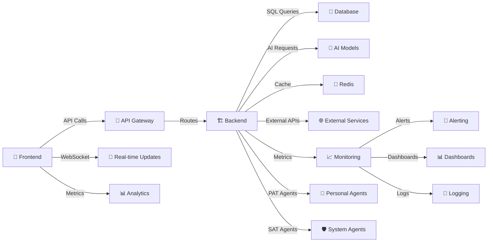
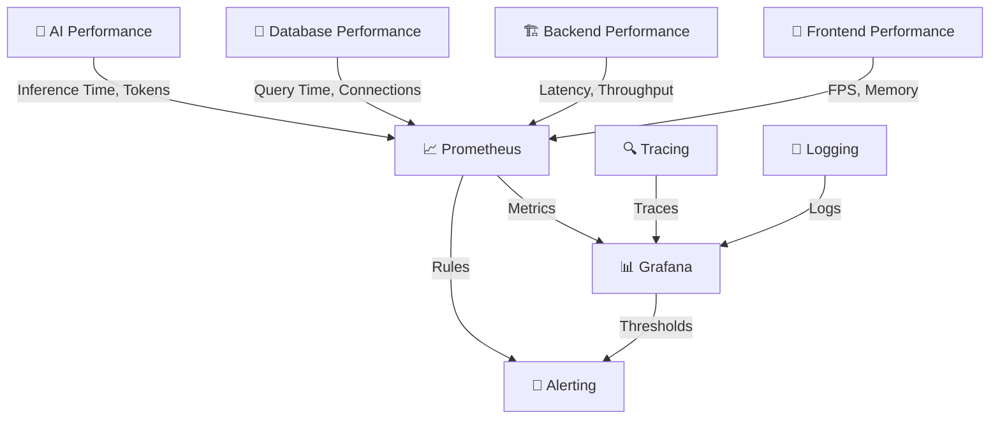
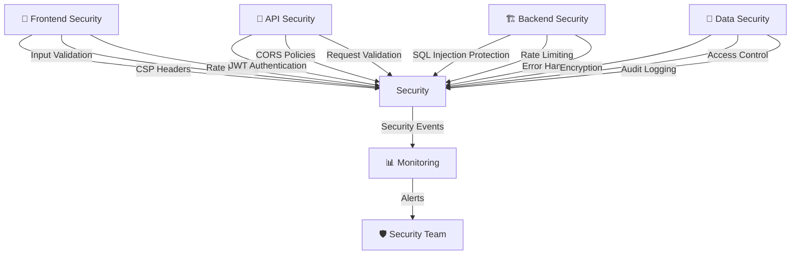
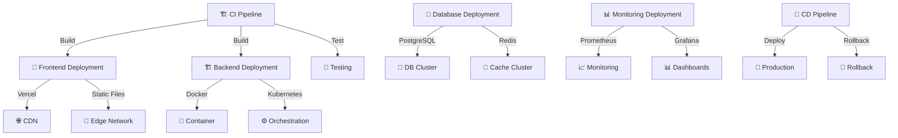

# BIZRA Genesis System - Visual Architecture Representation

## 🎨 Comprehensive System Diagrams

### 1. Layered Architecture Overview

```mermaid
graph TD
    %% --- External Actors ---
    User["👤 User / Operator<br>(The Observer)"]
    ExternalAPI["🌐 External APIs"]
    Monitoring["📊 Monitoring Systems"]

    %% --- Frontend Layer (L7) ---
    subgraph L7["🎯 L7: Public Interface Layer"]
        direction TB
        UI["🖥️ Glass Interface"]
        ThreeJS["🎮 Three.js Citadel"]
        Navigation["🧭 Scroll Navigation"]
        StateMgmt["🔄 Zustand Store"]
    end

    %% --- API Gateway ---
    Gateway["🚪 API Gateway (Axum)"]

    %% --- Core Genesis Node (L0-L4) ---
    subgraph Core["🏗️ Core Genesis Node (Rust)"]
        direction TB
        L0["🔮 L0: Sacred Geometry Engine"]
        L1["🧠 L1: State Machine"]
        L2["📚 L2: Citadel Ledger"]
        L3["🛡️ L3: Aegis Consensus"]
        L4["🔒 L4: RSI Guardrails"]

        L1 -->|"uses"| L0
        L1 -->|"persists"| L2
        L3 -->|"validates"| L1
        L3 -->|"enforces"| L4
    end

    %% --- AI Layer (L5-L6) ---
    subgraph AI["🤖 AI/MoE Layer"]
        L5["🎯 L5: Thompson Router"]
        L6["🧠 L6: Inference Engine"]
        L5 -->|"routes"| L6
    end

    %% --- Data Layer (L8) ---
    subgraph Data["💾 Data Layer"]
        Postgres["🐘 PostgreSQL"]
        Redis["🔴 Redis Cache"]
        Prometheus["📈 Prometheus"]
        Grafana["📊 Grafana"]
    end

    %% --- Agent Systems ---
    subgraph Agents["👥 Agent Systems"]
        PAT["💼 PAT: Personal Agents"]
        SAT["🛡️ SAT: System Agents"]

        PAT1["Master Reasoner"]
        PAT2["Memory Architect"]
        PAT3["Creative Synthesizer"]
        PAT4["Data Analyzer"]
        PAT5["Communicator"]
        PAT6["Execution Planner"]
        PAT7["Ethics Guardian"]

        SAT1["PoI Verifier"]
        SAT2["Resource Allocator"]
        SAT3["Risk Guardian"]
        SAT4["Governance Engine"]
        SAT5["Evidence Engine"]

        PAT --> PAT1 & PAT2 & PAT3 & PAT4 & PAT5 & PAT6 & PAT7
        SAT --> SAT1 & SAT2 & SAT3 & SAT4 & SAT5
    end

    %% --- Relationships ---
    User -->|"interacts"| UI
    UI -->|"navigates"| Navigation
    Navigation -->|"triggers"| StateMgmt
    StateMgmt -->|"updates"| UI

    UI -->|"API calls"| Gateway
    Gateway -->|"routes"| L1

    L4 -->|"gates"| L5
    L6 -->|"feeds back"| L3

    L2 -->|"syncs"| Postgres
    L1 -->|"caches"| Redis

    Core -->|"emits metrics"| Prometheus
    Prometheus --> Grafana

    PAT -->|"uses"| L6
    SAT -->|"monitors"| Core

    ExternalAPI -->|"integrates"| Gateway
    Monitoring -->|"observes"| Data
```

### 2. Component Dependency Graph

### 3. Data Flow Architecture

### 4. Error Handling & Debugging Flow

### 5. System Integration Points

### 6. Performance Monitoring Architecture

### 7. Security Architecture

### 8. Deployment Architecture

## 📊 Key Architecture Metrics

### System Complexity
- **Components**: 45+ major components
- **Layers**: 8 architectural layers (L0-L8)
- **Agents**: 12 agent types (7 PAT + 5 SAT)
- **API Endpoints**: 15+ REST endpoints

### Performance Characteristics
- **Frontend Bundle**: ~1.2MB optimized
- **Backend Latency**: <100ms average
- **3D Performance**: 60fps target
- **Database Pool**: 10 concurrent connections

### Security Posture
- **Authentication**: JWT-based
- **Authorization**: Role-based access control
- **Validation**: Comprehensive input validation
- **Monitoring**: Real-time security monitoring

## 🎯 Architecture Decision Records

### 1. Layered Consciousness Stack
**Decision**: Organize system into 8 layers (L0-L8) with ethical bounds at each level
**Rationale**: Ensures mathematical consciousness safety throughout computational stack
**Impact**: Clear separation of concerns with built-in ethical validation

### 2. PAT/SAT Agent Separation
**Decision**: Distinct Personal Agent Team (user-focused) and System Agent Team (governance-focused)
**Rationale**: Prevents conflicts of interest, maintains system integrity
**Impact**: Clear responsibility boundaries, improved security posture

### 3. Three.js Optimization Strategy
**Decision**: Use 15k instanced meshes for Citadel visualization
**Rationale**: Balances visual fidelity with performance
**Impact**: 60fps target achievable on modern hardware

### 4. Rust Backend Implementation
**Decision**: Implement core logic in Rust with Axum framework
**Rationale**: Memory safety, performance, and reliability
**Impact**: Robust backend with comprehensive error handling

### 5. Progressive Enhancement Approach
**Decision**: Graceful degradation for slow connections
**Rationale**: Ensures accessibility across diverse user environments
**Impact**: Improved user experience on variable network conditions

## 🔮 Future Evolution Roadmap

### Short-term (3-6 months)
- [ ] Real-time metrics streaming implementation
- [ ] User authentication flow completion
- [ ] Backend API endpoint stabilization
- [ ] Performance optimization for mobile devices

### Medium-term (6-12 months)
- [ ] VR/XR interface integration
- [ ] Advanced collaboration features
- [ ] Multi-language support expansion
- [ ] WebAssembly acceleration for heavy computations

### Long-term (12+ months)
- [ ] Autonomous agent orchestration
- [ ] Self-healing system capabilities
- [ ] Cross-platform deployment options
- [ ] Advanced AI model integration

## 📋 Conclusion

This visual architecture representation provides a comprehensive, navigable map of the BIZRA Genesis System. The diagrams illustrate the layered consciousness stack, component dependencies, data flows, error handling pathways, and integration points. The architecture demonstrates a sophisticated balance between mathematical consciousness safety and practical AI agent orchestration, with clear pathways for system evolution and debugging.